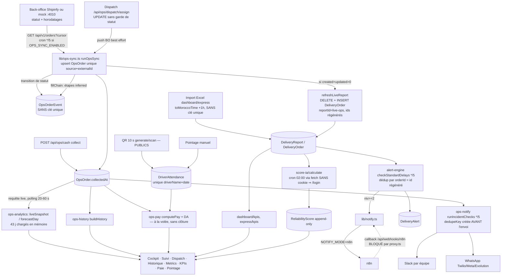
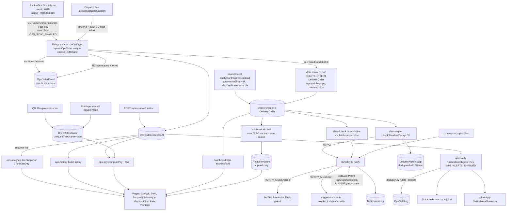

# AUDIT MÉTRIQUES SHIPINFY — Workflows, Sécurité, Data & Benchmark + Roadmap Sprint 17 → 22

> Date : 2026-10-09 · Phase 1 = **lecture seule** (aucun fichier de code modifié, aucune requête vers la production, `.env.local` non lu).
> Méthode : 4 sous-agents en parallèle (A workflows · B sécurité · C data/perf · D benchmark) ; leurs rapports complets sont en **annexes A à D** de ce fichier. Les constats critiques (marqués 🔎) ont été **revérifiés par moi dans le code** avant publication.
> Légende : ✅ vérifié dans le code · ⚠️ supposé / dépend de la config de production · ❌ non trouvé. Sévérité P0 (exploitable ou données fausses en prod) → P3. Effort S (<½ j) / M (1-3 j) / L (>3 j).
> Limites : rien n'a été exécuté (pas de `EXPLAIN`, pas de test runtime, variables Dokploy non lues). `SHIPINFY_SPRINT16_PROMPT.md` est **introuvable** dans le dépôt : les « bugs Sprint 16 » ont été reconstitués depuis `SHIPINFY_MEMORY.md` §22-30. Les chiffres du benchmark (annexe D) sont sourcés quand une URL est indiquée, sinon « connaissance générale » ou hypothèse.

---

## 1. RÉSUMÉ EXÉCUTIF

1. Le cœur **pilotage back-office** (prévisions hub × créneau, dispatch, parcours chronométré, encaissement COD, paie, planning WhatsApp) est solide et cohérent ; ce qui manque, c'est le **terrain et le client** (app livreur, preuve de livraison, tracking client, ETA) et la **boucle de mesure qualité** (OTIF, 1ʳᵉ tentative, ETA MAE, CSAT par livraison).
2. **Sécurité = urgence n°1** : 🔎 `proxy.ts` ne teste que la *présence* d'un cookie ; ~62 routes historiques (sur 115) n'ont aucune garde. Un faux cookie suffit pour lire des données, modifier la paie ou **supprimer un tenant** (`app/api/admin/tenants/[id]`).
3. 🔎 Le **QR de pointage est forgeable** : `qr-generate` / `qr-scan` sans session, secret de repli codé en dur (`'shipinfy-dev-secret'`) → fraude à la paie fixe (jours pointés).
4. **Aucune isolation multi-tenant** effective (aucune route Ops/RH ne filtre `tenantId`, RLS activée sans politique) : acceptable en mono-client, bloquant avant un 2ᵉ client.
5. 🔎 **Bug de données P0** : `refreshLiveReport` supprime/recrée toutes les `DeliveryOrder` LIVE à chaque synchro (nouveaux ids) → la déduplication des alertes (par `orderId`) casse → tempête d'alertes/Slack dès que Slack est branché.
6. 🔎 **Crons morts** : le recalcul Score IA (02 h) et le contrôle d'alertes appellent leur propre API sans cookie ; `proxy.ts` les redirige vers `/login`. Callbacks n8n bloqués de la même façon.
7. **« Retard » a 5 définitions** (Cockpit ≠ Suivi ≠ alertes ≠ KPI ≠ Dispatch) ; l'annulation (CANCELLED) n'est gérée nulle part dans le moteur Ops ; le fuseau est figé à UTC+1 (faux pendant le Ramadan) ; la paie est recalculée à la volée sans clôture.
8. **Performance** : correcte à 1× (2 650 commandes) mais la prévision charge 43 jours en mémoire → **régime « 10× » atteint tout seul d'ici ~6 semaines** (≈26 000 lignes, 35-40 Mo/requête, refresh LIVE 15-40 s) ; index et cache manquent, `connection_limit=1` aggrave.
9. **Benchmark** : meilleurs ratios effort/valeur → jours spéciaux (Ramadan/Aïd) dans la prévision, KPIs OTIF/coût/livraison-h, clôture de caisse COD, tracking client WhatsApp, OTP/photo de preuve.
10. Notes (jugement de l'auditeur) : **Workflows 5/10 · Sécurité 3/10 · Data & perf 5/10 · Maturité vs leaders 4/10.** Sprint 17 = fermer les P0 (sécurité + intégrité des données), puis 4 quick wins produit.

| Axe | Note | Pourquoi (1 ligne) |
|---|---|---|
| Workflows métriques | **5/10** | Parcours/KPIs Ops bien conçus, mais définitions multiples, alertes cassées, crons morts, pas d'annulation ni Express réel |
| Sécurité | **3/10** | Bon périmètre `/api/ops` + `/api/rh`, mais proxy contournable, ~62 routes ouvertes, QR forgeable, SSRF, 30 CVE npm |
| Data & performance | **5/10** | Sain à 1×, fragile dès 10× (copie LIVE, 43 j en mémoire, pas de cache/index, DDL au démarrage) |
| Maturité vs leaders | **4/10** | Contrôle-tour back-office au niveau Bringg « léger » ; terrain/client/mesure qualité absents |

---

## 2. CARTOGRAPHIE DES MÉTRIQUES

Le tableau complet (**25 métriques : formule exacte, source, fréquence, fichier:ligne, consommateurs**) est en **Annexe A §1**. Aperçu des plus structurantes :

| Métrique | Formule | Fichier |
|---|---|---|
| Retard (Cockpit) | `!DONE && now > slotEnd` (READY_PICKUP inclus) | `lib/ops-analytics.ts:180` |
| À risque | `!DONE && status≠START_DELIVERY && slotEnd-now < atRiskMinutes(45)` | `lib/ops-analytics.ts:181-183` |
| À l'heure | `DELIVERED && deliveredAt ≤ slotEnd` (sans tolérance, 7 emplacements) | `lib/ops-analytics.ts:203`, `lib/ops-history.ts:21` |
| Prévu (forecast) | `max(known, round(w·known/p + (1-w)·histAvg))`, `w=min(0.8,p)` | `lib/ops-analytics.ts:130-141` |
| Capacité / saturation | `capacity = livreurs × 3` ; `sature ≥ 1`, `tendu ≥ 0,7` | `lib/ops-analytics.ts:59,142-146` |
| Score IA | `delivery%·0.4 + academy·0.3 + (100-noShow%)·0.3` (renormalisé sans Academy) | `app/api/score-ia/calculate/route.ts:98-112` |
| Paie | `brut = jours payés × tarif ; bonus = Σ max(0, livrées-seuil)·prime + onTime·prime ; net = brut + bonus − retenues` | `lib/ops-pay.ts:27-43` |
| Encaissement | `DELIVERED && collectedAt IS NULL && amount > 0` ; ancienneté >24 h ambre, >48 h rouge | `app/api/ops/cash/route.ts:15` |

### Cycle de vie événement → calcul → stockage → affichage → alerte



---

## 3. CONSTATS WORKFLOWS (priorisés) — détail et preuves en Annexe A

| ID | Sév. | Constat | Preuve (✅/🔎) | Impact business | Horizon |
|---|---|---|---|---|---|
| W1 | **P0** | Pointage + QR sans authentification/rôle ; paie fixe = jours pointés | 🔎 `app/api/pointage/qr-generate/route.ts:21`, `qr-scan/route.ts:35` (aucun `getSession`) ; `lib/ops-pay.ts:28` | Fraude interne : ≈ 23 × 1 j × 120-150 MAD ≈ 3 kMAD/jour exposé, non traçable | QW |
| W2 | **P0** | Dédup d'alertes cassée : `orderId` = id `DeliveryOrder` LIVE régénéré à chaque synchro | 🔎 `lib/ops-live-report.ts:52-53` (deleteMany + createMany sans `id`) ; `lib/alert-engine.ts:49-52` | Dès Slack actif : 1 message par commande en retard toutes les 5 min (50 retards ⇒ 600 msg/h) → canal ignoré, vraies alertes perdues | QW |
| W3 | P1 | Callbacks n8n bloqués par le proxy ; statut `sent_to_n8n` éternel | `proxy.ts:11-19` ; workflow json:101-117 | Mode n8n = fire-and-forget aveugle | QW |
| W4 | P1 | Crons Score IA / alertes appellent leur API sans session + bug de précédence `NEXTAUTH_URL ?? VERCEL_URL ? …` | 🔎 `lib/cron.ts:195-198,230` ; `proxy.ts:38-47` | Score IA jamais rafraîchi la nuit ; alertes KPI jamais évaluées | QW |
| W5 | P1 | Notification Ops échouée jamais rejouée (clé de dédup créée avant l'envoi) | `lib/ops-notify.ts:111-114` | 1 incident d'envoi = alerte perdue pour la journée | QW |
| W6 | P1 | « Retard » : 5 définitions ; « non assigné » : 3 ; « à risque » : 2 → Cockpit et Suivi divergent | `ops-analytics.ts:180` vs `ops/orders/route.ts:34` vs `alert-engine.ts:141-150` vs `dashboard/kpis:145` vs `ops/dispatch/route.ts:44` | Dispatcher et superviseur voient des totaux différents ; commandes oubliées | MT |
| W7 | P1 | CANCELLED non géré (0 occurrence dans `lib/ops-*`) → retards fantômes ; livrées sans montant → « trou noir » (jamais encaissées, hors Suivi/Historique) | `ops-sync.ts:61,138` ; `ops/orders/route.ts:11` ; `cash:15` | KPIs gonflés ; réconciliation impossible | MT |
| W8 | P1 | Fuseau fixe UTC+1 (6 fichiers) → faux ≈30 j/an (Ramadan) ; 2 conventions d'horloge dans `DeliveryOrder` ; `getHours()` serveur | `ops-analytics.ts:36`, `lib/timezone.ts:1-8`, `dashboard/kpis:127,173` | Jour/créneau/pointage décalés d'1 h | MT |
| W9 | P1 | Paie recalculée à la volée au tarif courant, sans clôture ni trace du net payé | `app/api/ops/pay/route.ts:11,38,63` | Litige RH : `applyToAll` change rétroactivement les mois passés | MT |
| W10 | P1 | Rappel shift WhatsApp : 2 envois par shift + décalage TZ | `lib/cron.ts:293-316` | Bruit, livreurs prévenus tard | QW |
| W11 | P2 | Score IA : non versionné, purge `notIn` destructrice, NO_SHOW imputé au livreur, dénominateur incluant l'ouvert, jointure par nom | `score-ia/calculate:99-112,145` | Décisions RH/dispatch contestables | MT |
| W12 | P2 | Doublons Excel (aucune clé unique sur `DeliveryOrder`/`ExpressOrder`) ; data3 = 40 % de lignes en double | `schema.prisma` ; `dashboard/upload/route.ts:105` | COD et taux gonflés ×1,7 si import brut | MT |
| W13 | P2 | Express : 45/80 min = défaut/commentaire, pas de règle ; alertes 45/50/55 no-op ; chrono sans pause/annulation ; picker sans lien paie/pointage | `schema.prisma:~571` ; `alert-engine.ts:191-193` ; `picking/route.ts:37-42` | SLA Express non pilotable en temps réel | MT |
| W14 | P2 | Prévision sans mesure de précision ; capacité = effectif du hub d'origine (pas présences/planning) | `ops-data.ts:88` ; `ops-analytics.ts:119-120` | Sous/sur-staffing non détectés | MT |
| W15 | P2 | Pointage : double scan = check-out immédiat (jour payé, heures ≈ 0), pas de clôture auto, retard jamais calculé, saisie manuelle en pseudo-UTC | `qr-scan:89-94` ; `pointage/page.tsx:302,324` | KPI heures faux, arbitrage RH sans preuve | MT |

Éléments ❌ non trouvés (récap) : règle 45 vs 80 min · alertes Express actives · pause/annulation/re-livraison dans un chrono · gestion CANCELLED · lien picker ↔ paie/pointage · file d'attente/dead-letter des notifications · snapshot/version des scores et paies · clôture de paie · mesure de précision des prévisions · heures calculées côté serveur · détection automatique du retard de pointage · mode hors-ligne · clé unique sur `DeliveryOrder`/`ExpressOrder`/`OpsOrderEvent`.

---

## 4. CONSTATS SÉCURITÉ (priorisés) — détail, inventaire des 115 routes et correctifs en Annexe B

| ID | Sév. | Constat | Preuve | Exploit possible | Correctif | Effort |
|---|---|---|---|---|---|---|
| S1 | **P0** | Proxy contournable : seule la présence d'un cookie/`Authorization` est testée, valeur quelconque | 🔎 `proxy.ts:38-41` | `curl -H "Authorization: x" /api/drivers` | `requireSession(req, role)` dans chaque route + 401 JSON sur `/api/*` + test matrice | M |
| S2 | **P0** | `PATCH/DELETE /api/admin/tenants/[id]` sans garde | 🔎 `app/api/admin/tenants/[id]/route.ts` (0 `getSession`) | Suppression d'un tenant (cascade utilisateurs) | SUPER_ADMIN + soft-delete + audit | S |
| S3 | **P0** | ~62 routes historiques sans garde (drivers, tickets, alerts, dashboard, dispatch, shifts, pointage, remuneration, n8n, slack, express, picking…) | Annexe B §1 (inventaire) | Lecture/écriture de la paie, exfiltration des configs N8N (champ `secret`), relais d'e-mails, envoi WhatsApp facturable | Garde en bloc, d'abord destructives et sensibles | M-L |
| S4 | **P0** | QR pointage forgeable : routes publiques + secret de repli + anti-rejeu en mémoire + aucun GPS/rate limit | 🔎 `qr-generate/route.ts:21`, `qr-scan/route.ts:35` | Faux pointage d'un collègue → jour payé | Session obligatoire, `QR_SECRET` requis, nonce en base, borne de temps bilatérale | M |
| S5 | **P0** | Multi-tenant inexistant : 0 filtre `tenantId` en lecture sur Ops/RH ; RLS activée sans politique, rôle Prisma propriétaire | Annexe B P0-4, P1-1 | IDOR généralisé dès un 2ᵉ tenant | Décision : mono-tenant assumé **ou** `tenantId` partout + extension Prisma + RLS | L |
| S6 | **P0/P1** | SSRF : `slack/config PUT`, `n8n/config`, `n8n/test` appellent une URL saisie, sans auth ; `slack/config` renvoie le corps de réponse ; `n8n/config GET` renvoie les secrets | `app/api/slack/config/route.ts:49-58`, `n8n/test/route.ts:33` | Scan du réseau interne / metadata VPS | Auth + `safeFetch` (https, allow-list, IP privées refusées, timeout) + masquer les secrets | M |
| S7 | P1 | Secrets de repli : `QR_SECRET ?? 'shipinfy-dev-secret'`, `PLANNING_LINK_SECRET \|\| DATABASE_URL \|\| 'shipinfy-planning'`, mot de passe `changeme` | `lib/ops-planning.ts:15` ; `admin/tenants/[id]/users/route.ts:55` | Forge de liens PDF / QR | `requireEnv()` : refuser de démarrer | S |
| S8 | P1 | Clé Evolution en clair dans un fichier **non commité** | `docs/n8n/planning-hebdo/build-workflow.js:8` | Fuite à l'éventuel commit | **Faire tourner la clé**, ne pas committer, credential n8n | S |
| S9 | P1 | Webhook entrant n8n : signature facultative, pas de timestamp, comparaison non constante | `app/api/webhooks/n8n/route.ts:5,17-27` | Falsification de statuts | Secret obligatoire + HMAC horodaté + `timingSafeEqual` | S |
| S10 | P1 | Dépendances : 30 vulnérabilités (2 critiques, 19 hautes) ; Next 16.2.1 (bypass proxy GHSA-26hh-7cqf-hhc6) ; `xlsx` 0.18.5 sans correctif (prototype pollution + ReDoS) et parse des uploads non authentifiés | `package.json:23` ; `npm audit` | DoS / contournement | MAJ Next, remplacer/isoler xlsx, `npm audit fix` | S-M |
| S11 | P1 | Session : cookie sans `Secure`, pas de révocation au changement/reset de mot de passe ni à la désactivation, mot de passe min 6, PBKDF2 100 k, aucun rate limit nulle part | `lib/auth.ts:8,15-24,53-67,81` | Brute force, session fantôme 7 j | Corriger chaque point + `lib/rate-limit.ts` | M |
| S12 | P1 | PII : `GET /api/rh/people` expose CIN/adresse/naissance/permis à tout rôle authentifié ; aucun chiffrement ni rétention ; `fail()` renvoie `e.message` | `app/api/rh/people/route.ts:8-25` ; `lib/ops-auth.ts:22-24` | Fuite de données personnelles, non-conformité 09-08 | DTO par rôle, masquage, rétention, déclaration CNDP | M-L |
| S13 | P2 | `OpsAuditLog` non immuable, routes legacy non auditées ; pas d'en-têtes de sécurité ; pas de `.dockerignore` ; formules dans les exports xlsx non neutralisées | Annexe B §5, §6, §9 | Traçabilité incomplète | Trigger append-only, audit des routes sensibles, headers, `.dockerignore`, préfixe `'` | M |

### TOP 5 À CORRIGER CETTE SEMAINE
1. **Fermer le bypass d'authentification** : helper `requireSession`, garde sur les ~62 routes (d'abord `admin/tenants/[id]`, `drivers/[id]`, `pointage/[id]`, `remuneration/config`, `n8n/*`, `slack/config`, `tickets`, `dashboard/*`, `shifts/*`), 401 JSON dans le proxy, test qui balaie toutes les routes sans cookie.
2. **QR pointage** : authentifier `qr-generate`/`qr-scan`, `QR_SECRET` obligatoire, borne de temps bilatérale, nonce persistant.
3. **Secrets** : supprimer tous les replis, faire tourner la clé Evolution (et le mot de passe DB déjà partagé en chat), ajouter `.dockerignore`.
4. **SSRF + webhooks** : `safeFetch`, auth sur `slack/config` / `n8n/*`, ne plus renvoyer les secrets, signature entrante obligatoire.
5. **Dépendances & session** : MAJ Next, remplacer `xlsx`, cookie `Secure`, révocation de sessions, rate limiting login/forgot/upload.

Points OK vérifiés : `opsAuth` + hiérarchie des rôles correctes sur `/api/ops` et `/api/rh` ; bypass `OPS_DEV_NOAUTH` inactif en production ; SQL brut paramétré (aucun `*Unsafe` dans les routes) ; aucun `dangerouslySetInnerHTML` ; Dockerfile non-root ; aucun `.env` réel dans git ; lien PDF planning signé HMAC avec `timingSafeEqual`.

---

## 5. CONSTATS DATA & PERFORMANCE — détail, SQL d'index et snippets en Annexe C

| ID | Sév. | Constat | Preuve | Effort |
|---|---|---|---|---|
| D1 | **P0** | `refreshLiveReport` relit **toute** `OpsOrder` (aucun `where`), delete+insert de toutes les `DeliveryOrder` LIVE ≈ 288 fois/jour, ids régénérés → bloat, alertes dupliquées | 🔎 `lib/ops-live-report.ts:20,51-54` | S (ids stables) puis M (upsert différentiel) |
| D2 | **P0** | `checkStandardDelays` : 500 `findFirst` non indexés sur `DeliveryAlert` + `take:500` sans `orderBy` | `lib/alert-engine.ts:70-78,130` | S |
| D3 | P1 | Verrou de synchro `running = true` posé **avant** le `try` : un échec de `opsSyncRun.create` bloque la synchro jusqu'au redémarrage ; verrou mono-processus | `lib/ops-sync.ts:92-94` | S |
| D4 | P1 | Courses non protégées : `dispatch/assign`, `dispatch/auto`, `cash/collect` sans garde de statut dans le `WHERE` → double assignation, double encaissement (2 événements) | `assign/route.ts:24-27` ; `cash/route.ts:62` | S |
| D5 | P1 | La synchro écrase le statut local (ASSIGNED → READY_PICKUP) si la poussée BO a échoué : commande avec `driverId` mais invisible dans la file de dispatch | `ops-sync.ts:136` ; `dispatch/route.ts:24` | M |
| D6 | P1 | Aucune lecture ne filtre `source` : au passage à `shipinfy-bo`, les lignes `mock` seront comptées (forecast, live, paie) | `ops-data.ts:58`, `history/route.ts:43` | S |
| D7 | P1 | Forecast/live/planDemand/incidents : 43 j chargés en mémoire à chaque requête, sans cache ; 26 000 lignes (régime établi dès ~6 semaines) ≈ 35-40 Mo/requête ; polling 20-60 s sans pause onglet masqué | `ops/forecast/route.ts:17-19`, `lib/ops-analytics.ts:84-111` | M |
| D8 | P1 | Index manquants : partiels « ouvertes », `READY_PICKUP` sans livreur, encaissements en attente, `DeliveryAlert(orderId,type,level,triggeredAt)`, `OpsOrderEvent(orderId,at)` + unicité, trigram (recherche), `OpsAuditLog` | Annexe C §1.3 (SQL prêt) | S |
| D9 | P1 | `connection_limit=1` (`.env.example`) + `Promise.all` partout + transaction longue du refresh LIVE → file d'attente (P2024) ; 2 `PrismaClient` (`cron.ts` + `lib/prisma`) | `.env.example:8` ; `lib/cron.ts:16` | S |
| D10 | P1 | Démarrage : `run-init-sql.js` rejoue ≈226 instructions à chaque start (`ALTER TABLE` = verrou exclusif sans `lock_timeout`, pas de verrou entre réplicas) ; toute erreur = crash loop | `run-init-sql.js:47-64` | M |
| D11 | P1 | Événements de synchro sans clé unique ; crash entre `update` et insert des événements = étapes perdues à jamais | `ops-sync.ts:134-165` ; `schema.prisma` (`OpsOrderEvent`) | M |
| D12 | P2 | Aucune rétention (OpsOrderEvent, AuditLog, SyncRun, NotifLog, DeliveryAlert, ReliabilityScore) ; `ReliabilityScore` lu entièrement | Annexe C §3.4 | S |
| D13 | P2 | Pas de `/api/health`, pas de logs structurés/latences, durée du refresh LIVE jetée | Annexe C §6 | S-M |

Volumes : 1× ≈ 2 650 commandes (4 jours de mock) ; **10× ≈ 26 000 = régime établi (fenêtre 43 j × ≈650/j)** ; 100× ≈ 260 000 → inexploitable en l'état (≈350 Mo/requête, event loop gelée 1-2 s). Estimations ⚠️ à confirmer par profil.

---

## 6. MATRICE BENCHMARK (extrait) — 14 leaders, 33 features et sources en Annexe D

| Feature | Qui le fait le mieux | Shipinfy ? | Valeur | Effort |
|---|---|---|---|---|
| KPIs OTIF / annulation + motif / coût par livraison / livraisons-heure / utilisation flotte | Amazon, DoorDash, Gopuff | **Partiel / non** (seuls on-time et no-show) | H | S |
| Jours spéciaux dans la prévision (Ramadan, Aïd, fin de mois) | Amazon (fériés), Deputy | **Non** (0 occurrence de `ramadan`) | H | S |
| Rapprochement de caisse COD (écart attendu vs remis, clôture) | Jumia | **Partiel** (encaissement sans contrôle d'écart) | H | S-M |
| Tracking client par lien WhatsApp + notification proactive de retard | Uber, Stuart, Bringg | **Non** | H | M |
| OTP/PIN client + photo de preuve | Uber | **Non** | H | M-L |
| App livreur PWA hors-ligne | Onfleet, Bringg | **Non** | H | L |
| ETA dynamique + mesure MAE | project44 | **Non** | H | M-L |
| Alertes SLA prédictives + réaffectation automatique | Glovo, DoorDash, Bringg | **Partiel / non** | H | M |
| Planning prédictif des shifts (proposé par l'IA, ajusté par le manager) | Deputy | **Partiel** (planning manuel + bandeau) | H | M |
| Gamification livreurs (leaderboard, badges, séries) | Samsara | **Partiel** (bonus seulement) | M | M |
| API publique + webhooks signés + sandbox, white-label | Bringg, Onfleet, Stuart | **Partiel** | H (SaaS) | L |
| i18n FR/AR(RTL)/EN | Glovo, Jumia | **Non** (FR seul) | M-H | M |
| Control tower temps réel | Bringg, FarEye | **Oui (partiel)** | H | — |
| Prévision de la demande | Amazon | **Oui** (sans saisonnalité ni intervalle de confiance) | H | — |

**Constat structurant** : Shipinfy joue dans la catégorie « contrôle-tour + planning + paie » ; les leaders ajoutent l'exécution terrain (app, preuve), l'expérience client (tracking, ETA) et la mesure qualité (OTIF, MAE, CSAT). Le contexte Maroc (COD, WhatsApp-first, adresses informelles, réseau instable, Ramadan/Aïd) renforce les priorités « caisse COD », « lien WhatsApp » et « jours spéciaux ».

---

## 7. NEXT STEP — SPRINT 17 (v16.0 → v17.0) : « Fermer les P0, fiabiliser les données, 4 quick wins »

> Format identique au Sprint 16 : blocs priorisés (P0 sécurité/bugs d'abord, puis features), chemins exacts, snippets, SQL, routes, UI, variables d'environnement, critères d'acceptation testables, plan de parallélisation. **Règles** : commits atomiques par bloc ; `npx tsc --noEmit` vert avant chaque commit ; aucun secret en clair (ni dans le code, ni dans les docs, ni dans les prompts) ; DDL uniquement via `prisma/init-tables.sql` (idempotent) ; ne jamais faire échouer `run-init-sql.js` (toute erreur SQL = crash loop) ; tester `curl` sans cookie sur chaque route modifiée.

### 7.0 Pré-requis hors code (à faire par Amine **avant** le déploiement — ne pas déléguer)
1. **Faire tourner** : clé Evolution API (présente en clair dans `docs/n8n/planning-hebdo/build-workflow.js`, fichier non commité — ne pas le committer), mot de passe de la base Supabase (partagé en conversation), mots de passe par défaut éventuels (`changeme`).
2. **Variables d'environnement à créer dans Dokploy → Environment** (valeurs générées par `openssl rand -hex 32`, jamais committées) :

| Variable | Rôle | Obligatoire |
|---|---|---|
| `QR_SECRET` | HMAC du QR de pointage | ✅ (le serveur refuse de démarrer sans) |
| `PLANNING_LINK_SECRET` | signature des liens PDF planning | ✅ |
| `N8N_WEBHOOK_SECRET` | signature du webhook entrant n8n | ✅ |
| `CRON_SECRET` | en-tête `x-cron-secret` pour les crons internes | ✅ |
| `APP_URL` | base des liens publics (défaut https://metrics.mediflows.shop) | recommandé |
| `OPS_ACTIVE_SOURCE` | `mock` aujourd'hui, `shipinfy-bo` au branchement | ✅ |
| `DATABASE_URL` | ajouter `&connection_limit=5&pool_timeout=20` | ✅ |
| `DIRECT_URL` | connexion directe 5432 (DDL, index `CONCURRENTLY`, advisory locks) | recommandé |

### 7.1 Plan de parallélisation (sous-agents sur jeux de fichiers **disjoints**)

| Agent | Blocs | Fichiers (propriété exclusive) |
|---|---|---|
| **S1 — Auth & proxy** | A1, A2, A3, A8 | `proxy.ts`, `lib/api-guard.ts` (nouveau), `lib/auth.ts`, `lib/rate-limit.ts` (nouveau), tous les `app/api/**/route.ts` listés en Annexe B §1 **sauf** pointage/n8n/slack/ops-live |
| **S2 — QR, secrets, SSRF** | A4, A5, A6 | `app/api/pointage/qr-*`, `lib/qr-blacklist.ts`, `lib/env.ts` (nouveau), `lib/safe-fetch.ts` (nouveau), `app/api/slack/**`, `app/api/n8n/**`, `app/api/webhooks/n8n/route.ts`, `lib/ops-planning.ts` (secret + exp), `.dockerignore` |
| **S3 — Données & synchro** | B1, B2, B3, B4 | `lib/ops-live-report.ts`, `lib/alert-engine.ts`, `lib/ops-sync.ts`, `app/api/ops/dispatch/{assign,auto}/route.ts`, `app/api/ops/cash/route.ts`, `lib/ops-data.ts`, `prisma/init-tables.sql` (section index uniquement) |
| **S4 — Cron, notifs, fuseau** | B5, B6, B7 | `lib/cron.ts`, `lib/ops-notify.ts`, `lib/notify.ts`, `lib/tz.ts` (nouveau) + remplacement de `TZ_MS` dans `ops-analytics.ts`, `ops-slots.ts`, `ops-time.ts`, `ops-history.ts`, `ops/pay/route.ts`, `timezone.ts`, `dashboard/kpis/route.ts` |
| **S5 — Produit (quick wins)** | C1, C2, C3, C4 | `lib/ops-kpis.ts` (nouveau), `lib/ops-config.ts` (+ jours spéciaux), `app/performance/analyse/**`, `app/operations/encaissement/**`, `app/api/health/route.ts`, `lib/obs.ts` |

Ordre : **S1 et S2 en premier** (déblocage sécurité), S3/S4 en parallèle, S5 en dernier. Un agent « intégrateur » (moi) fusionne, lance `tsc`, le script de matrice d'auth (A3) et la checklist §7.4.

### 7.2 BLOCS P0 — Sécurité

#### A1 — Garde d'authentification sur toutes les routes (P0 · M)
**Fichiers** : `lib/api-guard.ts` (nouveau), `proxy.ts`, ~62 routes (liste Annexe B §1).
```ts
// lib/api-guard.ts
import { NextRequest, NextResponse } from 'next/server'
import { getSession, roleAtLeast, type Role, type SessionPayload } from '@/lib/auth'

export async function requireSession(req: NextRequest, min?: Role): Promise<{ session: SessionPayload } | { error: NextResponse }> {
  const session = await getSession(req)
  if (!session) return { error: NextResponse.json({ error: 'Non authentifié' }, { status: 401 }) }
  if (min && !roleAtLeast(session.role, min)) return { error: NextResponse.json({ error: 'Accès refusé' }, { status: 403 }) }
  return { session }
}
// Usage en tête de chaque handler :  const a = await requireSession(req, 'MANAGER'); if ('error' in a) return a.error
```
**Rôles minimaux** : lecture KPI/dashboard `VIEWER` ; `drivers`/`dispatch`/`shifts`/`pointage`/`picking`/`tickets`/`support` écriture `DISPATCHER` ; `remuneration/*`, `alerts/rules` écriture, `dashboard/upload*`/`express/upload*`/`send-report`/`schedule-report` `MANAGER` ; `n8n/*`, `slack/*`, `webhooks` config `ADMIN` ; `admin/*` `SUPER_ADMIN`.
**Proxy** : pour `pathname.startsWith('/api/')` sans cookie/Authorization → `NextResponse.json({error:'Non authentifié'},{status:401})` (au lieu d'une redirection 307) ; restreindre le bypass des « assets statiques » aux préfixes `/_next` et `/public` (le motif `\.(…|html)$` laisse passer `/api/x/anything.js`). Le proxy reste un pré-filtre : **la garde réelle est dans chaque route**.
**Routes debug** : `app/api/debug/*` : remplacer `if (s && !roleAtLeast(...))` par `requireSession(req,'SUPER_ADMIN')` ou supprimer les routes en production.
**Critères d'acceptation** :
- `curl -s -o /dev/null -w "%{http_code}" -X DELETE -H "Authorization: x" $HOST/api/admin/tenants/xxx` → **401**.
- Test automatisé `scripts/test-auth-matrix.mjs` : liste toutes les `app/api/**/route.ts`, appelle chaque méthode sans cookie et avec `Authorization: x`, attend 401/403 sauf liste blanche (`auth/login`, `auth/logout`, `auth/bootstrap`, `auth/forgot-password`, `auth/reset-password`, `planning/pdf`, `webhooks/n8n`) → **0 échec**.
- `npx tsc --noEmit` vert.

#### A2 — `admin/tenants/[id]` (P0 · S)
`app/api/admin/tenants/[id]/route.ts` : `requireSession(req,'SUPER_ADMIN')` ; `DELETE` = soft delete (`active:false`) + `audit()` ; valider `plan ∈ {…}` et `logoUrl` en `https://` seulement.
**Acceptation** : appel sans session → 401 ; avec un ADMIN non-SUPER → 403 ; suppression = `active:false`, utilisateurs conservés.

#### A3 — Test de matrice d'authentification en CI (P0 · S)
`scripts/test-auth-matrix.mjs` (voir A1) + entrée `npm run test:auth`. Échoue si une route est ajoutée sans garde.

#### A4 — QR pointage (P0 · M)
**Fichiers** : `app/api/pointage/qr-generate/route.ts`, `qr-scan/route.ts`, `lib/qr-blacklist.ts`, `prisma/init-tables.sql`, `lib/env.ts`.
```ts
// lib/env.ts
export function requireEnv(name: string): string {
  const v = process.env[name]
  if (!v) throw new Error(`Variable d'environnement obligatoire manquante : ${name}`)
  return v
}
```
```sql
-- prisma/init-tables.sql (idempotent)
CREATE TABLE IF NOT EXISTS "QrScanNonce" (
  "nonce" TEXT NOT NULL PRIMARY KEY, "driverName" TEXT NOT NULL, "usedAt" TIMESTAMP(3) NOT NULL DEFAULT CURRENT_TIMESTAMP
);
CREATE INDEX IF NOT EXISTS "QrScanNonce_usedAt_idx" ON "QrScanNonce"("usedAt");
ALTER TABLE "QrScanNonce" ENABLE ROW LEVEL SECURITY;
```
Règles : (1) `qr-generate` : `requireSession` ; le nom du livreur vient de la **session/fiche** (jamais du body) ; rate limit 6/min/IP+user ; payload `driverCode|ts|role|nonce` (nonce `crypto.randomBytes(8).toString('hex')`) signé HMAC-SHA256 avec `requireEnv('QR_SECRET')` ; (2) `qr-scan` : `requireSession(req,'DISPATCHER')`, `scannedBy` = session ; fenêtre **bilatérale** `Math.abs(Date.now()-ts) <= 10_000` ; nonce inséré dans `QrScanNonce` (clé primaire → un rejeu échoue même après redémarrage/multi-réplica) ; refuser un 2ᵉ scan < `CFG.minWorkMinutes` (défaut 30) après le check-in (anti « check-out immédiat ») ; clé du jour = `attendanceKey(localDay)` (même que `ops-attendance.ts`) ; ne pas écraser un statut saisi (`absent`/`leave`) sans confirmation.
**Acceptation** : `qr-generate` sans session → 401 ; scan du même jeton deux fois → 2ᵉ refus `TOKEN_REPLAYED` (y compris après redémarrage) ; jeton avec `ts` futur de 1 h → refus ; serveur qui démarre **sans** `QR_SECRET` → échec explicite au boot.

#### A5 — Secrets de repli supprimés, liens PDF avec expiration (P0/P1 · S)
`lib/ops-planning.ts` : `signPlan(day, code, exp)` avec `exp` (fin du jour planifié + 24 h) dans le HMAC ; `verifyPlan` refuse un lien expiré ; secret = `requireEnv('PLANNING_LINK_SECRET')`. `planPdfUrl` ajoute `&e=<exp>`. `app/api/planning/pdf/route.ts` : rate limit 30/min/IP ; en-têtes `Cache-Control: private, no-store`, `X-Robots-Tag: noindex`.
`.dockerignore` (nouveau) : `.git`, `.env*`, `docs`, `mock-backoffice`, `node_modules`, `.next`, `*.md`.
`admin/tenants/[id]/users/route.ts:55` : plus de mot de passe par défaut → lien de réinitialisation à usage unique.
**Acceptation** : lien expiré → 403 ; app sans `PLANNING_LINK_SECRET` → échec au boot ; `docker build` n'embarque aucun `.env*` (vérifier `docker history`).

#### A6 — SSRF & webhooks (P0/P1 · M)
```ts
// lib/safe-fetch.ts
import { lookup } from 'dns/promises'
import net from 'net'
const ALLOWED = (process.env.OUTBOUND_ALLOWED_HOSTS ?? 'hooks.slack.com').split(',')
const isPrivate = (ip: string) => net.isIP(ip) === 4
  ? /^(10\.|127\.|169\.254\.|172\.(1[6-9]|2\d|3[01])\.|192\.168\.|0\.)/.test(ip)
  : /^(::1|fc|fd|fe80)/i.test(ip)
export async function safeFetch(rawUrl: string, init: RequestInit = {}, extraHosts: string[] = []) {
  const u = new URL(rawUrl)
  if (u.protocol !== 'https:') throw new Error('URL https obligatoire')
  if (![...ALLOWED, ...extraHosts].includes(u.hostname)) throw new Error('Hôte non autorisé')
  const { address } = await lookup(u.hostname)
  if (isPrivate(address)) throw new Error('Adresse interne refusée')
  return fetch(u, { ...init, redirect: 'manual', signal: AbortSignal.timeout(8000) })
}
```
Appliquer à : `app/api/slack/config/route.ts`, `app/api/n8n/config/route.ts`, `app/api/n8n/test/route.ts`, `lib/n8n-bridge.ts`, `lib/notify.ts`, `lib/ops-notify.ts` (hôte n8n ajouté via `N8N_HOST` en `extraHosts`). **Auth** `ADMIN` sur `slack/*` et `n8n/*`. `n8n/config GET` : `select` sans `secret`. `slack/config PUT` : ne jamais renvoyer le corps de réponse.
`app/api/webhooks/n8n/route.ts` : secret **obligatoire** ; signature `HMAC(timestamp + '.' + body)` avec en-tête `X-Timestamp` (fenêtre 5 min) et comparaison `timingSafeEqual` ; ajouter `/api/webhooks/n8n` à `PUBLIC_PATHS` (le workflow `docs/n8n/shipinfy-notifications.workflow.json` doit signer son callback — ajouter un nœud « Code » qui calcule l'en-tête).
**Acceptation** : `webhookUrl = http://169.254.169.254/` → 400 ; URL `https://evil.example` → 400 ; callback sans signature → 401 ; callback signé valide → 200 et statut `delivered` (plus de `sent_to_n8n` éternel).

#### A7 — Dépendances & exports (P1 · S-M)
`next` → dernière 16.x corrigée (vérifier GHSA-26hh-7cqf-hhc6 et les DoS) ; remplacer `xlsx` 0.18.5 par `exceljs` (écriture des exports) **ou** SheetJS ≥ 0.20 depuis le CDN officiel ; pour les **uploads** : limite 10 Mo, MIME/signature `PK`, authentification (A1) et quota. `npm audit fix` hors breaking ; CI : `npm audit --omit=dev --audit-level=high`.
`lib/xlsx-response.ts` : neutraliser les formules :
```ts
const danger = /^[=+\-@\t\r]/
const safe = (v: unknown) => (typeof v === 'string' && danger.test(v) ? `'${v}` : v)   // appliqué aux cellules texte
```
**Acceptation** : `npm audit --omit=dev` → 0 critique, 0 haute ; un export contenant `=HYPERLINK(...)` s'ouvre en texte.

#### A8 — Sessions, mots de passe, PII (P1 · M)
`lib/auth.ts` : cookie `Secure` (production) ; `getSession` refuse si `user.active === false` ; `change-password` et `reset-password` appellent `prisma.session.deleteMany({ where: { userId } })` ; min 12 caractères ; stocker un **hash SHA-256** du token de session ; PBKDF2 ≥ 210 000 itérations (ou argon2id/scrypt) avec `timingSafeEqual` ; hash factice sur utilisateur inconnu.
`lib/rate-limit.ts` (fenêtre glissante en mémoire — suffisant tant qu'il y a un seul conteneur ; noter la limite multi-réplica) :
```ts
const hits = new Map<string, number[]>()
export function rateLimit(key: string, max: number, windowMs: number): boolean {
  const now = Date.now(); const arr = (hits.get(key) ?? []).filter(t => now - t < windowMs)
  arr.push(now); hits.set(key, arr); return arr.length <= max
}
```
Limites : `auth/login` 5/15 min par IP+email ; `forgot-password` 3/h ; `qr-*` 6/min ; `planning/pdf` 30/min ; `dashboard/upload*` 5/h.
`app/api/rh/people/route.ts` : DTO selon rôle — sous `ADMIN`, masquer `cin`, `address`, `birthDate`, `licenseNo` ; `lib/ops-auth.ts:fail()` : ne plus renvoyer `e.message` (message générique + `x-request-id`).
**Acceptation** : 6ᵉ tentative de login → 429 ; désactiver un utilisateur invalide sa session immédiatement ; un VIEWER ne reçoit plus le CIN.

### 7.3 BLOCS P0/P1 — Intégrité des données et workflows

#### B1 — Rapport LIVE à ids stables + upsert différentiel (P0 · S puis M)
`lib/ops-live-report.ts` : `id: \`live-${o.externalId}\`` à la création de chaque ligne ; `refreshLiveReport(changedExternalIds?: string[])` ne relit que `where: { source, externalId: { in } }` ; upsert par lots de 500 (limite Postgres 32 767 paramètres : ne **pas** monter à 1 000) ; suppression des lignes disparues une fois par jour. `lib/ops-sync.ts` passe la liste des commandes créées/modifiées ; la durée est renvoyée dans `OpsSyncRun.liveRefreshMs`.
**Acceptation** : deux synchros successives sans changement → `DeliveryOrder` live **inchangées (mêmes ids)** ; durée du refresh < 500 ms à 2 650 commandes avec 10 changements.

#### B2 — Dédup d'alertes + index (P0 · S)
```sql
CREATE INDEX IF NOT EXISTS "DeliveryAlert_dedupe_idx" ON "DeliveryAlert" ("orderId","type","level","triggeredAt" DESC);
CREATE INDEX IF NOT EXISTS "DeliveryAlert_open_idx" ON "DeliveryAlert" ("createdAt" DESC) WHERE "acknowledged" = false;
```
`lib/alert-engine.ts` : `orderBy: { deliveryTimeEnd: 'asc' }` sur le `findMany` ; `createDeliveryAlert` retourne un booléen (créée ou non) et `created++` seulement si créée ; Slack uniquement pour les alertes **réellement créées** ; fenêtre de dédup 2 h pour un même niveau.
**Acceptation** : 3 synchros avec 50 commandes en retard → **50 alertes au total** (pas 150), 1 message Slack par alerte de niveau ≥ 2.

#### B3 — Atomicité dispatch / encaissement (P1 · S)
```ts
// dispatch/assign — first-claim, événements d'après RETURNING
const claimed = await prisma.$queryRaw<{ id: string }[]>`
  UPDATE "OpsOrder" SET "driverId"=${driver.id}, "courierRef"=${driver.code}, status='ASSIGNED', "assignedAt"=${now}
  WHERE id = ANY(${ids}) AND status='READY_PICKUP' AND "driverId" IS NULL
  RETURNING id`
await prisma.opsOrderEvent.createMany({ data: claimed.map(r => ({ orderId: r.id, fromStatus: 'READY_PICKUP', toStatus: 'ASSIGNED', at: now, source: 'dispatch' })) })
```
Même schéma pour `dispatch/auto` et pour `cash/collect` (`UPDATE … WHERE status='DELIVERED' AND "collectedAt" IS NULL RETURNING id`) ; `revert` crée un événement `COLLECT_REVERTED`. Réponse API : `{ updated, skipped }` (les commandes déjà prises ne sont pas silencieusement « réussies »).
**Acceptation** : deux requêtes `assign` simultanées sur la même commande → exactement **1 événement ASSIGNED** ; deux `collect` simultanés → **1 événement COLLECTED**.

#### B4 — Synchro robuste (P1 · M)
`lib/ops-sync.ts` : (1) déplacer `opsSyncRun.create` **dans** le `try/finally` ; (2) verrou par ligne `OpsSyncRun` (`finishedAt IS NULL AND startedAt > now() - interval '10 min'`) au lieu de `running` mémoire ; (3) **ne jamais rétrograder** un statut : si `RANK[source] < RANK[local]` et `driverId` posé par notre dispatch → conserver le statut local et empiler la poussée dans une table `OpsOutbox` rejouée à la synchro suivante ; (4) filtre de source : constante `ACTIVE_SOURCE = process.env.OPS_ACTIVE_SOURCE ?? 'mock'` appliquée dans `ops-data.ts`, `ops/orders`, `ops/dispatch`, `ops/cash`, `ops/history`, `ops/pay`, `ops/live` ; (5) validation de chaque `BoOrder` (dates valides, `slotStart < slotEnd`) → les lignes invalides vont dans `OpsSyncReject` (table de quarantaine) au lieu de faire échouer 1 000 commandes ; (6) événements : index unique + `skipDuplicates`.
```sql
-- dédoublonner AVANT de créer l'unique (sinon l'index échoue et le conteneur boucle)
DELETE FROM "OpsOrderEvent" a USING "OpsOrderEvent" b
  WHERE a.ctid < b.ctid AND a."orderId" = b."orderId" AND a."toStatus" = b."toStatus" AND a."at" = b."at";
CREATE UNIQUE INDEX IF NOT EXISTS "OpsOrderEvent_dedupe_key" ON "OpsOrderEvent" ("orderId","toStatus","at");
CREATE INDEX IF NOT EXISTS "OpsOrderEvent_order_at_idx" ON "OpsOrderEvent" ("orderId","at");
```
> ⚠️ Le `DELETE … USING` puis `CREATE UNIQUE INDEX` doit être testé sur une copie avant de rejouer `init-tables.sql` en production.
**Acceptation** : base indisponible au démarrage d'une synchro → la synchro suivante repart ; deux synchros simultanées (2 conteneurs) → une seule s'exécute ; une commande avec date invalide est mise en quarantaine, les 999 autres passent.

#### B5 — Crons, notifications rejouables (P1 · M)
`lib/cron.ts` : appeler **directement** les fonctions (`calculateScores()`, `runAlertCheck()`) au lieu d'un `fetch` sans session (extraire la logique des routes dans `lib/score-ia-engine.ts` et `lib/alert-check.ts`) ; si un appel HTTP reste nécessaire, en-tête `x-cron-secret: $CRON_SECRET` accepté par `requireSession` via `isCron(req)` ; corriger la précédence (`(process.env.NEXTAUTH_URL ?? process.env.VERCEL_URL) ? … : …`) ; décaler `*/5` en `1-59/5` (alertes), `2-59/5` (sync), `3-59/5` (incidents) ; rappel de shift : fenêtre `0 < diffMin <= 15` + clé de dédup `shift:<id>:<date>` ; un seul `PrismaClient` partagé.
`lib/ops-notify.ts` : ajouter `attempts INT DEFAULT 0` et `nextRetryAt` à `OpsNotifLog` ; créer la ligne **après** l'envoi (ou la marquer `ok=false` et la rejouer) ; job `retryFailedNotifs()` : 3 tentatives (1, 5, 15 min) puis statut `dead` visible dans `/parametres/notifications` ; l'aggravation (2 → 15 retards) est renotifiée quand le compteur double.
**Acceptation** : le recalcul Score IA de 02:00 produit des lignes `ReliabilityScore` (vérifier `calculatedAt`) ; un webhook Slack indisponible 2 min → alerte livrée à la tentative suivante ; aucun rappel de shift en double.

#### B6 — Fuseau Africa/Casablanca réel (P1 · M)
`lib/tz.ts` (voir Annexe C §4.4) : `localParts(ms)`, `offsetMs(ms)`, `dayStartUtc(day)`, basé sur `Intl.DateTimeFormat('en-CA',{timeZone:'Africa/Casablanca',hourCycle:'h23'})` ; remplacer chaque `TZ_MS` (6 fichiers) ; `dashboard/kpis` et `cron.ts` n'utilisent plus `getHours()`/`setHours()` ; `Dockerfile` : `ENV TZ=Africa/Casablanca`. **Test unitaire** (`scripts/test-tz.mjs`) avec une date de Ramadan (vérifier via `Intl`, p. ex. 2027-02-20 et 2027-03-20) et une date hors Ramadan.
**Acceptation** : pour une commande à 00:30 locale en période Ramadan, `localDay` renvoie bien le jour local ; `canonicalSlot` identique entre Cockpit et Suivi.

#### B7 — Définitions uniques des métriques (P1 · M)
`lib/ops-defs.ts` (nouveau, fonctions pures) : `isLate(o, now)`, `isAtRisk(o, now)`, `isUnassigned(o)`, `isOnTime(o)`, `isOpen(o)`, avec les règles : retard = non terminé et créneau dépassé, avec **CANCELLED exclu** ; le traitement des commandes non assignées (READY_PICKUP) dépend de la réponse à la question 2 du §9 — en attendant, appliquer partout la règle du Cockpit (non assignées incluses) et afficher le sous-total « dont non assignées » ; importer ces fonctions dans `ops-analytics.ts`, `ops/orders`, `ops/dispatch`, `ops-notify.ts`, `ops-history.ts`. Gérer `CANCELLED` : ajouter au `RANK` et à `DONE_LIKE` ; ne jamais compter dans les retards ni la capacité ; compter dans `cancelRate`. Commandes livrées sans montant : état `NO_COLLECTION` (visible dans Historique, hors Encaissement).
**Acceptation** : test `scripts/test-defs.mjs` sur un jeu fixe de 12 commandes → mêmes totaux dans Cockpit, Suivi et Dispatch (script qui interroge les 3 API et compare).

### 7.4 BLOCS FEATURES — 4 quick wins (après les P0)

#### C1 — Jours spéciaux dans la prévision et le planning (RICE 14,4 · S)
```sql
CREATE TABLE IF NOT EXISTS "OpsSpecialDay" (
  "day" TEXT NOT NULL PRIMARY KEY, "label" TEXT NOT NULL, "kind" TEXT NOT NULL DEFAULT 'event', -- ramadan | aid | payday | promo | event
  "factor" DOUBLE PRECISION NOT NULL DEFAULT 1, "createdAt" TIMESTAMP(3) NOT NULL DEFAULT CURRENT_TIMESTAMP
);
ALTER TABLE "OpsSpecialDay" ENABLE ROW LEVEL SECURITY;
```
`lib/ops-analytics.ts` : après le calcul de `expected`, `expected = Math.round(expected * factorOf(day))` (facteur composé si plusieurs) ; l'historique exclut les jours spéciaux de la moyenne (`useDays`) ; badge « Jour spécial : <label> ×1,4 » sur Cockpit → Prévisions et Planning. Page `/parametres/calculs` : section « Jours spéciaux » (CRUD, ADMIN) ; pré-remplir le **vendredi de fin de mois** et la période du Ramadan.
**Acceptation** : un jour avec facteur 1,4 → les prévisions du jour augmentent de 40 % (arrondi) et le bandeau Planning signale « manque N » en conséquence ; test unitaire sur `forecastDay`.

#### C2 — KPIs de référence manquants (RICE 7,2 · S)
`lib/ops-kpis.ts` (pur) : `otif` (livrée dans le créneau **et** complète — champ `missingItems` optionnel), `cancelRate` + motif, `costPerDelivery = (paie + carburant + entretien) / livrées` (sources `ops-pay`, `OpsFuelLog`, `OpsMaintenance`), `deliveriesPerHour = livrées / heures pointées`, `fleetUtilization = jours-véhicule actifs / véhicules`, `firstAttemptSuccess` (via `attemptCount`). Exposés dans `GET /api/ops/history` (`kpis`) et affichés dans Performance → Metrics (cartes + tendance 30 j). Ajouter `missingItems INT` et `cancelReason TEXT` à `OpsOrder` (`ALTER TABLE … ADD COLUMN IF NOT EXISTS`).
**Acceptation** : valeurs identiques à un calcul manuel sur 20 commandes de test ; chaque carte indique sa formule au survol.

#### C3 — Clôture et écart de caisse COD (RICE 5,6 · S-M)
```sql
CREATE TABLE IF NOT EXISTS "OpsCashClose" (
  "id" TEXT NOT NULL PRIMARY KEY, "day" TEXT NOT NULL, "hubCode" TEXT NOT NULL, "driverCode" TEXT,
  "expected" DOUBLE PRECISION NOT NULL, "declared" DOUBLE PRECISION NOT NULL, "gap" DOUBLE PRECISION NOT NULL,
  "note" TEXT, "closedBy" TEXT, "closedAt" TIMESTAMP(3) NOT NULL DEFAULT CURRENT_TIMESTAMP
);
CREATE UNIQUE INDEX IF NOT EXISTS "OpsCashClose_day_hub_driver_key" ON "OpsCashClose"("day","hubCode","driverCode");
ALTER TABLE "OpsCashClose" ENABLE ROW LEVEL SECURITY;
```
`POST /api/ops/cash/close` (DISPATCHER) : attendu = somme des commandes livrées du jour/hub/livreur ; déclaré = montant remis ; écart = déclaré − attendu ; écart au-delà de `CFG.cashGapAlert` (MAD, défaut 50) → alerte Slack « équipe managers » ; page Encaissement : onglet « Clôture du jour » avec saisie par livreur, historique des écarts, export Excel. Totaux de la page calculés par `aggregate` (et non plus sur les 1 500 premières lignes).
**Acceptation** : une clôture avec écart 120 MAD crée l'enregistrement, l'alerte (dédupliquée) et apparaît dans l'historique ; une 2ᵉ clôture du même jour/hub/livreur est refusée (409).

#### C4 — Santé, observabilité, index, cache (P1/P2 · S-M)
`app/api/health/route.ts` (public, sans données) : `SELECT 1` (ms), âge de la dernière synchro OK, alerte si > 15 min ; brancher le healthcheck Dokploy. `lib/obs.ts` : `withMetrics(name, handler)` (durée, statut, `x-request-id`, ligne JSON) appliqué aux routes `/api/ops/*` ; `OpsSyncRun` enrichi (`durationMs`, `liveRefreshMs`, `pages`). Index d'Annexe C §1.3 (partiels « ouvertes », `READY_PICKUP` sans livreur, encaissements en attente, trigram) via `scripts/apply-sql.js` en `CONCURRENTLY`. `lib/ops-cache.ts` (`cached()` single-flight, invalidation par `bumpOpsEpoch()` après synchro/assign/collect) sur forecast, live, dispatch, orders, cash ; hook client `usePolling` (pause onglet masqué, pas de chevauchement). `run-init-sql.js` : hash de version (`_schema_version`), `lock_timeout`, retry avec backoff.
**Acceptation** : `GET /api/health` < 100 ms ; 20 onglets ouverts sur Dispatch = 1 requête SQL/15 s côté base (single-flight) ; démarrage du conteneur < 3 s quand le schéma est inchangé.

### 7.5 Checklist d'acceptation globale Sprint 17 (« Définition de fini »)
- [ ] Les 8 variables de §7.0 sont définies dans Dokploy ; l'ancienne clé Evolution et le mot de passe DB ont été renouvelés.
- [ ] `scripts/test-auth-matrix.mjs` : 0 route ouverte hors liste blanche.
- [ ] QR : rejeu refusé, `ts` futur refusé, génération sans session refusée, boot sans `QR_SECRET` refusé.
- [ ] SSRF : URL interne/HTTP/hors liste refusée ; secrets n8n jamais renvoyés par l'API.
- [ ] `npm audit --omit=dev` : 0 critique / 0 haute ; `xlsx` 0.18.5 retiré.
- [ ] Rapport LIVE : ids stables, 50 retards → 50 alertes (pas 150), refresh < 500 ms en régime stable.
- [ ] Concurrence : 2 `assign` simultanés → 1 événement ; 2 `collect` simultanés → 1 événement.
- [ ] Cron Score IA de 02:00 : lignes `ReliabilityScore` du jour présentes ; callbacks n8n signés → statut `delivered`.
- [ ] Fuseau : tests Ramadan/hors Ramadan verts ; mêmes totaux Cockpit/Suivi/Dispatch.
- [ ] `/api/health` OK ; index appliqués ; temps de démarrage < 3 s.
- [ ] Jours spéciaux, KPIs de référence, clôture de caisse livrés avec tests.
- [ ] `npx tsc --noEmit` vert ; déploiement Dokploy « Done » ; contrôle post-déploiement : login 200, route publique `planning/pdf` avec jeton invalide 403, route `admin/tenants/x` sans cookie 401.
- [ ] `SHIPINFY_MEMORY.md` mis à jour (nouvelle section) et commit atomique par bloc.

---

## 8. NEXT DEV — ROADMAP SPRINTS 18 → 22 (priorisée RICE)

RICE = Reach (1-10) × Impact (0,25 / 0,5 / 1 / 2 / 3) × Confidence (0-1) ÷ Effort (jours-homme, S=1, M=5, L=15). Les valeurs de Reach, Impact, Confidence et Effort sont des **hypothèses de l'auditeur** (annexe D pour les sources de bonnes pratiques). Les sprints respectent d'abord les dépendances (sécurité avant exposition client), puis le score RICE.

| Sprint | Objectif | Features principales | R | I | C | E | RICE | Justification du score (1 ligne) |
|---|---|---|---|---|---|---|---|---|
| **S18** — Données sûres & conformité | Rendre le produit multi-client et conforme | `tenantId` NOT NULL partout + extension Prisma `$extends` + RLS (rôle applicatif non propriétaire) ; chiffrement/masquage PII (CIN, adresse, naissance) + rétention + journal des lectures ; `OpsAuditLog` immuable (trigger + REVOKE) ; déclaration CNDP ; `DriverAttendance` rattaché à `OpsDriver.id` ; paie : clôture mensuelle `OpsPayRun` (snapshot) ; archivage/rétention ; DST testé | 10 | 3 | 0,8 | 15 | **1,6** | Prérequis de tout 2ᵉ client et de la conformité ; Reach maximal, effort élevé |
| S18 (volet PII/CNDP, à traiter en premier) | Conformité données personnelles | (déjà inclus dans S18 ; score isolé) | 10 | 2 | 0,7 | 8 | **1,75** | Risque réglementaire réel (géoloc, santé), correctifs courts |
| **S19** — Client : tracking & proactivité | Réduire appels/réclamations et litiges COD | Page de suivi publique par **lien WhatsApp signé** (statut, créneau, livreur, bouton « appeler ») ; notification proactive de retard ; **OTP/PIN client** à la remise (sans app) ; CSAT par livraison (1 clic dans le message) ; `OpsCustomerNotif` (journal) ; ETA v1 (médiane historique hub × créneau × distance) + suivi MAE quotidien | 9 | 2 | 0,7 | 5 | **2,5** | Leader RICE : 9 clients/jour touchés, réutilise le mécanisme de lien signé déjà en place |
| **S20** — Terrain : app livreur PWA | Preuve de livraison et hors-ligne | PWA offline-first (file d'actions locale, sync différée, accept/refus, scan colis) ; photo de preuve + géofence ; pointage par géolocalisation ; i18n **arabe/RTL** pour l'interface livreur et les messages WhatsApp | 9 | 3 | 0,6 | 15 | **1,1** | Gros levier (preuve, litiges, réseau instable) mais effort structurel ; dépend de S19 (OTP) |
| **S21** — Pilotage intelligent | Passer de l'alerte à l'action | Réaffectation automatique (retard/no-show) via `autoAssign` ; alertes SLA prédictives (vitesse réelle, charge restante) ; **règles Express 45/80 min** + pickers (pointage, paie, Score) ; planning auto-proposé type Deputy (prévu → équipes) ; gamification (leaderboard par hub, badges, séries) ; scorecards hebdomadaires envoyées sur WhatsApp | 7 | 2 | 0,6 | 5 | **1,7** | Transforme les alertes en gain de SLA ; gamification ≈ 1,2 (R6 I1 C0,6 E3) |
| **S22** — Plateforme | Ouvrir à d'autres enseignes | API publique + clés par client + webhooks sortants signés HMAC + sandbox (réutiliser `mock-backoffice`) ; white-label (logo/couleurs par tenant) ; exports planifiés ; observabilité avancée (Sentry, métriques Prisma, tableau technique) ; agrégats pré-calculés (`OpsSlotStat`) ; i18n EN | 5 | 1 | 0,8 | 10 | **0,4** | Valeur SaaS à terme, faible urgence tant qu'il n'y a qu'un client |

Dépendances clés : S17 → S18 (sécurité + données) → S19 (le lien client réutilise le jeton signé et l'index) → S20 (OTP → preuve photo) → S21 (nécessite données de terrain : acceptation, position) → S22.
Risques : (1) back-office réel non encore branché → statuts réels inconnus (CANCELLED, re-livraison) ; (2) charge de la prévision à 10× avant le cache ; (3) adoption terrain (réseau, langue) pour S20 ; (4) coût WhatsApp (messages client) → prévoir plafonds et modèles approuvés ; (5) conformité CNDP (géolocalisation, santé) avant S20.
Quick wins hors sprint (< 1 jour) à glisser à tout moment : `/api/health`, jours spéciaux, neutralisation des formules d'export, `.dockerignore`, `connection_limit=5`, décalage des crons.

---

## 9. HYPOTHÈSES ET QUESTIONS OUVERTES POUR AMINE (max 5)

1. **Multi-client** : prévoyez-vous un 2ᵉ client (autre enseigne) dans les 6 mois ? Sinon on assume le mono-tenant (on désactive la création de tenants et on reporte S18), sinon S18 devient prioritaire.
2. **Définition de « retard »** : une commande **non assignée** dont le créneau est dépassé doit-elle compter comme retard (Cockpit actuel) ou seulement les commandes assignées/en cours (Suivi actuel) ? Et le chrono Express 45/80 min : quel événement le démarre (commande reçue, début de picking) et qui décide 45 vs 80 (type de magasin : supermarché / hyper) ?
3. **Back-office réel** : à quelle date l'API Shipinfy sera-t-elle disponible, et quels statuts émet-elle réellement (CANCELLED, re-livraison, montant des commandes prépayées) ? Cela fixe les règles de B7/W7.
4. **Paie** : faut-il une **clôture mensuelle** (tarifs figés, validation RH/ADMIN, trace du net payé) ? Qui valide ?
5. **WhatsApp & conformité** : quel fournisseur retenez-vous (Evolution / Meta Cloud / Twilio) et quel numéro ? La déclaration CNDP (géolocalisation, données de santé) a-t-elle été déposée, et l'hébergement à Paris (Supabase eu-west-3) est-il accepté ?

Hypothèses retenues faute de réponse : mono-tenant tolérable jusqu'à S18 ; retard = non terminé et créneau dépassé (non assignés inclus) ; WhatsApp Evolution déjà disponible dans l'infra ; tarifs de paie figés au moment de la clôture.

---

## 10. CHECKLIST « DÉFINITION DE FINI » DE CET AUDIT
- [x] Aucun fichier de code modifié pendant l'audit (phase 1 lecture seule) ; seule création : ce fichier.
- [x] Chaque constat cite `chemin:ligne` (annexes) ; constats critiques revérifiés par l'auditeur (🔎 : `tenants/[id]`, QR, `ops-live-report`, `alert-engine`, `cron.ts`, `proxy.ts`).
- [x] Cartographie des métriques (25) + cycle de vie Mermaid.
- [x] Contrôles demandés traités (définitions, SLA/fuseau, pickers, Score IA, idempotence, fire-and-forget, backfill, pointage, notifications, qualité des données).
- [x] Sécurité OWASP/ASVS : multi-tenant, authN/Z, QR, webhooks, secrets, validation, rate limit, PII (09-08/RGPD), audit trail, dépendances, logs ; inventaire des 115 routes.
- [x] Data/perf : index, N+1, volumétrie 1×/10×/100×, cache, partitionnement/rétention, intégrité, pooler, démarrage, observabilité.
- [x] Benchmark : 14 leaders, matrice de 33 features, 10 recommandations RICE.
- [x] Sprint 17 complet (blocs, snippets, SQL, env, acceptation, parallélisation) + roadmap S18-S22 avec RICE justifié + 5 questions.
- [ ] À valider par Amine : réponses aux 5 questions ; GO pour l'exécution du Sprint 17 (aucun correctif n'a été appliqué).
- ⚠️ Non couvert : exécution réelle (profil, `EXPLAIN`, tests d'intrusion), variables de production, comportement réel de Traefik/Supabase, vérification des sources primaires Delivery Hero.

---

# ANNEXES (rapports complets des 4 sous-agents, non édités)


---

# ANNEXE A — Workflows métriques (rapport complet du sous-agent)

# AUDIT A — Workflows métriques Shipinfy (lecture seule) — 2026-10-09

Périmètre lu : SHIPINFY_MEMORY.md (§22-30), lib/ops-*.ts, lib/cron.ts, lib/notify.ts, lib/n8n-bridge.ts, lib/whatsapp.ts, lib/alert-engine.ts, app/api/{score-ia,ops,pointage,dashboard/kpis,express,picking,remuneration,alerts,webhooks/n8n,notifications}, proxy.ts, prisma/schema.prisma, mock-backoffice/server.js (grep), docs/n8n/*.
Légende : ✅ vérifié dans le code (lu) · ⚠️ supposé (dépend de l'env d'exécution / non testé) · ❌ NON TROUVÉ.
`SHIPINFY_SPRINT16_PROMPT.md` : ❌ NON TROUVÉ (fichier absent du dépôt). Les « bugs Sprint 16 » ont été reconstitués depuis SHIPINFY_MEMORY.md §22.
Aucun test d'exécution réel n'a été fait (lecture seule) : tout ce qui touche au comportement runtime (proxy, TZ conteneur) est ⚠️ sauf mention.

---------------------------------------------------------------------------------------------------
## 0. Mode Express / SLA 45 min / 80 min / picker — état réel

| Élément | Résultat |
|---|---|
| Mode Express « dual mode » | ✅ présent côté **import Excel** (ExpressReport/ExpressOrder, `app/api/express/*`, `app/api/picking/*`). Absent du module Opérations temps réel (OpsOrder) : ❌ aucune notion express/picker dans `lib/ops-*.ts` ni `mock-backoffice/`. |
| SLA 45 min | ✅ valeur par défaut seulement : `prisma/schema.prisma:~571` `slaTarget Int @default(45)` ; `app/api/express/upload/route.ts:94-95` `isNaN(n) ? 45 : n`; `app/api/picking/route.ts:40` `o.slaTarget ?? 45`. |
| SLA 80 min | ⚠️ uniquement un **commentaire** `schema.prisma` « // 45 ou 80 (minutes) ». ❌ Aucune règle de code ne choisit 45 vs 80 (ex. supermarché vs hypermarché) : la valeur vient de la colonne Excel `sla_minutes`. `bySla` (`express/kpis/route.ts:96-105`) ne fait que regrouper par `storeType`. |
| Seuil « 80 % du SLA » | ✅ = alerte d'UI à 36 min (0,8×45), pas 80 min : `app/api/picking/route.ts:42` `(elapsedMin / slaTarget) > 0.8`. |
| Alertes Express 45/50/55 | ❌ non branchées : `lib/alert-engine.ts:40-44` `EXPRESS_THRESHOLDS` jamais utilisé ; `checkExpressDelays()` `alert-engine.ts:191-193` = `return { checked: 0, created: 0 }` (no-op), jamais appelé par `lib/cron.ts`. |
| Picker | ✅ `Driver.role` ('LIVREUR'/'PICKER'), `DriverAttendance.role`, `ExpressOrder.pickerId` (chaîne libre). ❌ Aucun lien `pickerId` ↔ table Driver/pointage ; ❌ picker absent de la paie (`lib/ops-pay.ts`, `ops/pay`), du Score IA, du planning, du dispatch. |

---------------------------------------------------------------------------------------------------
## 1. Cartographie des métriques

Notation : `OO` = OpsOrder, `DO` = DeliveryOrder (rapport LIVE ou Excel), `DA` = DriverAttendance. « Fréquence » = quand le calcul tourne.

| # | Métrique | Formule exacte | Source | Fréquence | fichier:ligne | Consommateurs |
|---|---|---|---|---|---|---|
| 1 | **Retard (late) – Cockpit** | `!DONE.has(status) && now > slotEnd` (DONE = DELIVERED, NO_SHOW) — inclut READY_PICKUP | OO via loadOrders | à chaque requête (refresh UI 30 s) | `lib/ops-analytics.ts:180` | `/api/ops/live`, page /operations, `liveSnapshot` totals/hubs/drivers |
| 2 | **Retard – Suivi** | ligne : `!done && slotEnd<now` ; compteur/filtre `late=1` : `status NOT IN (DONE,'READY_PICKUP') && slotEnd<now` | OO | requête | `app/api/ops/orders/route.ts:34,44,59` | /operations/suivi |
| 3 | **Retard – alertes terrain** | `notDone && slotEnd < now` (inclut READY_PICKUP, aussi reliquat des jours précédents) | OO | cron */5 (si `OPS_ALERTS_ENABLED`) | `lib/ops-notify.ts:139-140` | Slack équipes, WhatsApp chauffeur |
| 4 | **Retard – moteur d'alertes legacy** | `ratio=(now-start)/(deadline-start)`, `start=assignedAt ?? orderSent`; ≥0,8 → niveau 1 ; ≥0,9 → 2 ; ≥1 → 3 « delay_confirmed » | DO du rapport actif | cron */5 | `lib/alert-engine.ts:33-37,133-183` | DeliveryAlert in-app, Slack (niv ≥2), `/api/alerts` |
| 5 | **Retard – KPI Dashboard (« lateCount »)** | `lateCount = deliveredCount - onTimeCount` → uniquement les **livrées en retard**, pas les ouvertes | DO | requête | `app/api/dashboard/kpis/route.ts:141-145` | /kpis, camembert onTimeDistribution |
| 6 | **À risque** | `!DONE && status!=='START_DELIVERY' && now<=slotEnd && slotEnd-now < CFG.atRiskMinutes*60000` (défaut 45) | OO | requête / cron */5 | `ops-analytics.ts:181-183` ; `ops/orders/route.ts:60` ; `ops/dispatch/route.ts:61` ; `ops-notify.ts:139` ; `ops-config.ts:34` | Cockpit, Suivi, Dispatch, Slack/WhatsApp |
| 7 | **Livré à temps (onTime)** | `status==='DELIVERED' && deliveredAt <= slotEnd` (sans tolérance) ; taux = onTime / delivered | OO ou DO | requête | `ops-analytics.ts:203` ; `ops-history.ts:21` ; `ops/history/route.ts:33` ; `dashboard/kpis/route.ts:141-144` ; `ops-pay` via `ops/pay/route.ts:40` ; `lib/cron.ts:40` ; `alerts/check/route.ts:30-34` ; `remuneration/calculate/route.ts:72-77` | Cockpit, Historique, Metrics, KPIs, Paie, rapports planifiés, AlertRule |
| 8 | **Taux de livraison** | `delivered / total` (total inclut en cours, non assignés ET précommandes futures) ×100, 1 décimale | DO / OO | requête | `dashboard/kpis/route.ts:138` ; `ops-history.ts:24` (`deliveryRate`) ; `cron.ts:42` ; `alerts/check/route.ts:39` ; Score IA `calculate/route.ts:99` | /kpis, /hubs, /livreurs, AlertRule, Score IA, rapports email |
| 9 | **% terminé (pctDone)** | `(DELIVERED+NO_SHOW)/total` du périmètre jour + reliquat | OO | requête | `ops-analytics.ts:208,229` | Cockpit Live |
| 10 | **NO_SHOW (taux/compte)** | `status==='NO_SHOW'` ; taux = noShow/total ; Score IA : `status.includes('NO_SHOW'|'NOSHOW')` | OO/DO | requête / Score IA | `dashboard/kpis/route.ts:139` ; `ops-history.ts:22-24` ; `score-ia/calculate/route.ts:75,100` | KPIs, Score IA, paie (pénalité), Slack (15 min) |
| 11 | **Charge livreur** | par livreur : `active` = nb commandes non DONE (jour + reliquat), `done`, `late` (non-DONE & slotEnd<now) | OO | requête | `ops-analytics.ts:217-222` ; `ops/dispatch/route.ts:39-51` (⚠️ `lateBy` sans filtre de jour, l.44) | Cockpit, Dispatch live |
| 12 | **Prévision attendu (expected)** | `p=max(knownShare(slot,lead),0.02)`, `w=min(0.8,p)`, `expected=max(known, round(w·known/p + (1-w)·histAvg))` ; si créneau commencé `expected=known` | OO (42 j) | requête (UI 60 s) | `ops-analytics.ts:130-141` ; `ops/forecast/route.ts:19-21` | /operations Prévisions, Planning (bandeau), Slack saturation |
| 13 | **Capacité / charge / saturation** | `capacity = nDrivers·perDriverPerSlot (défaut 3)` ; `load=expected/capacity` ; `sature ≥1`, `tendu ≥0,7` ; `needed=ceil(expected/perDriver)` ; `gap=max(0, maxNeeded-nDrivers)` | OO + OpsDriver(chauffeur actif, hub d'origine) | requête / cron (≥17 h) | `ops-analytics.ts:59,142-146,151` ; `ops-data.ts:88` ; `ops-config.ts:32` | Cockpit, Slack « hub_saturation » |
| 14 | **Score IA** | `delivery%·0.4 + academy·0.3 + (100-noShow%)·0.3` (coeffs tenant) ; si pas de données Academy : coeffs renormalisés `d/(d+n)`, `n/(d+n)` ; `<3 commandes` ignoré ; `<60` critique (alerte), `≥80` excellent | DO du rapport actif (LIVE par défaut) | cron 02:00 (⚠️ cassé, §3-e), bouton manuel | `score-ia/calculate/route.ts:98-112,116,125` ; `ops-config.ts:35-36` ; schéma `schema.prisma:263-275` | /livreurs (onglet scoring), dispatch legacy, `runPredictiveAlerts` |
| 15 | **Paie – jours payés** | `paidDays = present + late + (paidLeave ? leave : 0)` d'après DA | DA | requête (mois) | `lib/ops-pay.ts:27-28` ; `ops/pay/route.ts:35,39` | /rh/paie, CSV/xlsx |
| 16 | **Paie – brut / bonus / retenues / net** | `brut=paidDays·dailyRate` ; `bonus=Σ_jours max(0,livrées-seuil)·bonusPerOrder + onTime·onTimeBonus` ; `retenues=noShow·noShowPenalty + (delivered-onTime)·latePenalty` ; `net=brut+bonus-retenues` | DA + OO(driverId) | requête (aucun gel) | `ops-pay.ts:38-43` | /rh/paie, /parametres/paie |
| 17 | **Paie legacy (par livraison)** | `brut=deliveries·baseRate(15) ; bonus=onTime·bonusRate(5) ; pénalité=noShows·penaltyRate(5)` | DO (rapport) | POST manuel | `remuneration/calculate/route.ts:80-83,20-24` | API/page /remuneration (retirée du menu mais API active) |
| 18 | **Pointage présent/retard/absent** | statut texte `present|late|absent|leave` saisi à la main ; QR → toujours `present` ; ❌ aucun calcul automatique du retard vs heure de shift | DA | à l'évènement | `ops/attendance/route.ts:7,47` ; `pointage/qr-scan/route.ts:70-80` | /pointage, /operations/pointage, Paie |
| 19 | **Heures travaillées** | `max(0, checkOut-checkIn)` en minutes, calcul **côté client** uniquement ; pas de checkOut ⇒ 0 | DA | affichage | `app/pointage/page.tsx:43-46,340-346` ; export CSV `api/pointage/export/route.ts` (ratios, pas d'heures) | /pointage (KPIs heures livreurs/pickers) |
| 20 | **Encaissement COD** | `pending = DELIVERED && collectedAt IS NULL && amount>0` ; `collect` copie `collectedAmount = amount` ; ancienneté >24 h ambre, >48 h rouge | OO | requête / action | `ops/cash/route.ts:15,57-64,36` | /operations/encaissement, Historique |
| 21 | **Total COD KPIs** | `Σ paymentOnDeliveryAmount` sur toutes les commandes filtrées (livrées ou non) | DO | requête | `dashboard/kpis/route.ts:147` | /kpis, /hubs, /livreurs |
| 22 | **Parcours / délais d'étape** | délai = ms(étape)-ms(précédente) ; vert/ambre/rouge selon `LIMITS` (ASSIGNED 15/30, IN_TRANSPORT 10/20, START_DELIVERY 30/60, DELIVERED 45/90, COLLECTED 120/480) ; étapes `inferred` non colorées | OpsOrderEvent | requête | `lib/ops-steps.ts:8-15,29-39` ; `ops-chain.ts:18-38` | Suivi, Historique |
| 23 | **Metrics / Historique (consulting)** | agrégats par jour/hub/créneau/livreur : `onTimeRate=onTime/delivered`, `noShowRate=noShow/total`, matrice jour×créneau, courbe d'arrivée `% connu à H-24/12/6/3/0` | OO (30 j) | requête | `lib/ops-history.ts:19-57` ; `ops/history/route.ts:43-49` | /performance/analyse, /operations/historique |
| 24 | **Express SLA** | `slaRate = slaRespected(true)/slaKnown` où `slaRespected` vient de la colonne Excel `sla_ok` (non calculé) ; côté picking : `elapsedMin <= slaTarget` (picking seul) | ExpressOrder | requête | `express/kpis/route.ts:53-55` ; `picking/route.ts:79` | /kpis (mode Express), /picking (retiré du menu) |
| 25 | **Délais moyens (timing)** | `avgMinutes(diff(a,b))` en excluant `diff<=0` ; orderToAssign, assignToTransport, transportToStart, startToDelivered, totalDuration | DO | requête | `dashboard/kpis/route.ts:48-52,155-161` | /kpis |

---------------------------------------------------------------------------------------------------
## 2. Cycle de vie événement → alerte (Mermaid)



---------------------------------------------------------------------------------------------------
## 3. Contrôles

### (a) Métriques à définitions multiples

1. **« Retard » = 5 définitions** (✅) :
   - Open & dépassé, READY_PICKUP inclus : `lib/ops-analytics.ts:180` `!DONE.has(o.status) && nowMs > t(o.slotEnd)`.
   - Idem mais READY_PICKUP **exclus** pour le compteur/filtre Suivi : `app/api/ops/orders/route.ts:34` `status: { notIn: [...DONE, 'READY_PICKUP'] }, slotEnd: { lt: ... }` et `:44` (`lateCount`). Même écran, ligne par ligne `:59` inclut tout non-DONE. ⇒ le Cockpit et le Suivi peuvent afficher deux totaux de retards différents le même instant (les commandes non assignées en retard ne comptent que dans le Cockpit).
   - Ratio de fenêtre depuis assignation/création : `lib/alert-engine.ts:141-150` `ratio = elapsedMs / windowMs ... ratio >= CRITICAL(1.00)`. Pour une précommande la fenêtre démarre à la création (`dateTimeWhenAssigned ?? dateTimeWhenOrderSent`, l.138), donc le niveau 1/2/3 n'a aucun rapport avec « il reste < 45 min ».
   - « Retard » KPI = livrées en retard seulement : `dashboard/kpis/route.ts:145` `lateCount = deliveredCount - onTimeCount` (une commande ouverte et dépassée n'y figure pas).
   - Retard par livreur sans filtre de jour : `app/api/ops/dispatch/route.ts:44` `status: { notIn: DONE }, slotEnd: { lt: new Date(now) }` (tout l'historique) vs `lib/ops-analytics.ts:219-221` (périmètre jour + reliquat).
2. **« À risque » = 2 définitions** (✅) : `slotEnd-now < 45 min` (`ops-analytics.ts:181-183`) vs paliers 80/90/100 % de la fenêtre (`alert-engine.ts:33-37`). Les alertes Slack « Risque retard » et le badge ambre du Cockpit ne se déclenchent pas aux mêmes moments.
3. **« Non assigné » = 3 définitions** (✅) : `status==='READY_PICKUP'` seul (`ops-analytics.ts:229`) vs `READY_PICKUP && driverId null` (`ops/dispatch/route.ts:24`, `ops-notify.ts:163`). Après `dispatch/assign`, si la push au back-office échoue, la synchro suivante réécrit `status` depuis la source (`ops-sync.ts:136` `data` contient `status: o.status`) tandis que `driverId` est conservé (`:136` `...(prev.driverId ? {} : {driverId: bind})`) ⇒ commande READY_PICKUP **avec** livreur : comptée « non assignée » au Cockpit, invisible dans la file Dispatch (filtre `driverId: null`). Nom de la dérive : divergence silencieuse.
4. **« À l'heure »** (✅ cohérent) : `livré <= slotEnd` partout (sept emplacements listés en §1 ligne 7), sans tolérance. Variante : le dénominateur ignore les livrées sans `deliveredAt` côté `cron.ts:40` / `alerts/check:30-34` (`&& o.dateTimeWhenDelivered && o.deliveryTimeEnd`), mais `ops-history.ts:21` les met au dénominateur sans les compter à l'heure — même effet net. ⚠️ Risque faible.
5. **Taux de livraison** (✅) : pondéré (`dashboard/kpis:138`) vs moyenne **non pondérée** des taux de hubs (`app/hubs/page.tsx:80` `hubs.reduce((s,h)=>s+h.deliveryRate,0)/hubs.length`) vs `pctDone` (livrées+NO_SHOW, `ops-analytics.ts:208`). Le dénominateur inclut les commandes futures/en cours dans tous les cas ⇒ sur le rapport LIVE (copie de tout OpsOrder, `ops-live-report.ts:20`) le taux est mécaniquement bas la journée et ne reflète pas la performance. Les AlertRule `delivery_rate` (`alerts/check:39`) s'appuient dessus.
6. **Paie : deux systèmes** (✅) : `lib/ops-pay.ts` (fixe/jour + bonus, source OpsOrder+DA) vs `app/api/remuneration/calculate/route.ts` (par livraison, source DO) — paramètres, tables (`OpsPayConfig` vs `PayConfig`) et résultats différents, l'ancien non retiré côté API.
7. **« Heures travaillées »** : une seule définition (client) mais deux conventions d'horloge, voir (h).
8. **Date/heure : 2 conventions dans la même table DeliveryOrder** (✅) : imports Excel via `toMoroccoTime` = `utc + 1h` (heure locale stockée comme UTC, `lib/timezone.ts:1-8`) ; rapport LIVE = vrais instants UTC (`ops-live-report.ts:30-33`, copie de OpsOrder). Or `dashboard/kpis/route.ts:127,173` utilisent `getHours()` (heure du serveur, UTC en Docker ⚠️ car `Dockerfile` n'a aucun `TZ`) et `toISOString().slice(0,10)` (`:150,253`). Conséquence : créneaux `byCreneau` (`:163-169`) corrects pour Excel mais décalés d'1 h pour LIVE (un créneau 09-12 local = 08-11 UTC → les commandes de 08 h UTC tombent hors du bucket 09-12 ; le bucket 20-23 chevauche 18-21) ; jours par `dateTimeWhenOrderSent` décalés pour les commandes 00h-01h locales. `alert-engine.ts:133` compare `Date.now()` (vrai UTC) à des échéances Excel +1 h ⇒ sur un rapport Excel actif le ratio est faussé d'1 h.

### (b) SLA / chrono / fuseau
- Chrono **Express** (picking seulement, pas de bout en bout) : démarre sur PATCH manuel `status='en_cours'` (`api/picking/[orderId]/route.ts:35-37` `pickingStartAt = now` si absent), s'arrête sur PATCH `pret` (`:38-40`). ❌ **Pause** : inexistante. ❌ **Annulation** : le statut CANCEL n'arrête pas le chrono (`picking/route.ts:37` `elapsedMin = (end ?? now) - start` continue à courir ; `slaWarn` exclut seulement `recupere`, l.42). ❌ **Re-livraison/échec** : n'existe pas pour Express. `a_picker` n'est pas dans `VALID` (`:8`) ⇒ pas de retour arrière. Aucun contrôle d'ordre (on peut passer `pret` sans `en_cours` : `pickingEndAt` sans `pickingStartAt` ⇒ ligne ignorée des KPI).
- Deux définitions du « SLA respecté » Express : `express/kpis/route.ts:53-55` (colonne Excel `sla_ok`, de bout en bout probable) vs `picking/route.ts:79` (`elapsedMin <= slaTarget`, picking seul).
- Standard (Ops) : le « SLA » = fenêtre promise `slotEnd` (`ops-sync.ts:124-125`) ; ❌ aucun chrono 45/80 min. Pas de pause ni d'annulation : le statut `CANCELLED` n'est géré nulle part dans `lib/ops-*.ts`/`api/ops` (grep CANCEL = 0 résultat). Une commande annulée côté BO arriverait avec `RANK[status] = undefined` (`ops-sync.ts:61,138`), serait stockée telle quelle et comptée **non terminée** ⇒ retard permanent dans `isLate` (`ops-analytics.ts:180`) et alertes quotidiennes (`ops-notify.ts:129-131` reliquat). Le legacy alert-engine exclut CANCELLED (`alert-engine.ts:117`), pas le moteur Ops. ⚠️ (dépend de ce que le vrai BO émet ; le mock n'émet jamais CANCELLED).
- Re-livraison : `attemptCount` stocké (`ops-sync.ts:126`) mais jamais utilisé dans un calcul (✅ grep). La promesse reste le `slotEnd` initial.
- **Fuseau** : `TZ_MS = 3_600_000` fixe UTC+1 dans `ops-analytics.ts:36`, `ops-slots.ts:12`, `ops-time.ts:2`, `ops-history.ts:11`, `ops-notify.ts:64`, `ops/pay/route.ts:8`, `ops/cash/route.ts:5`, `timezone.ts:2`. ⚠️ Le Maroc repasse en UTC+0 pendant le Ramadan (pas de test possible ici, règle publique) : jours/créneaux/clé de pointage/`hour>=17` seraient décalés d'1 h pendant ~30 jours/an. Incohérent : les crons utilisent l'IANA `timezone: 'Africa/Casablanca'` (`cron.ts:177,224,238,248,…`) qui, lui, suivrait ce changement, alors que les calculs restent à +1. Pas de DST autre (Maroc hors DST classique). Prochaine occurrence : ⚠️ Ramadan 2027.

### (c) Pickers vs drivers
Séparation **partielle** : colonne `role` sur `Driver`/`DriverAttendance` (✅ `schema.prisma` + `qr-scan/route.ts:59`) mais ❌ aucune entité picker côté Ops (`OpsDriver.jobType` = chauffeur|helper uniquement, `ops-pay.ts` ne connaît pas picker). `app/api/ops/attendance/route.ts:47` force `role: 'LIVREUR'` pour tous (bulk) ; `lib/ops-attendance.ts:26` aussi ⇒ un picker pointé via /operations/pointage devient « LIVREUR » (heures comptées dans `livreurMins`, `pointage/page.tsx:340-343`). `ExpressOrder.pickerId` libre (aucune FK) ⇒ pas de rattachement aux heures/paie.

### (d) Score IA
- Rapport utilisé : `calculate/route.ts:39-51` = `bodyReportId` sinon `findFirst({isActive:true}, orderBy uploadedAt desc)`. ✅ Le LIVE `live-ops` gagne tant que sa `uploadedAt` est la plus récente (`ops-live-report.ts:45` la remet à `now()` à chaque synchro modifiante). Fenêtre de bascule : un import Excel plus récent que la dernière synchro devient « actif » (les import ne désactivent pas les autres : aucun `isActive:false` hors `schedule-report`), jusqu'à la synchro suivante (≤5 min). ⚠️ Le cron nocturne n'envoie pas `reportId`.
- **Le cron Score IA est probablement mort** (⚠️ forte probabilité, ✅ lecture) : `cron.ts:230` fait un `fetch(.../api/score-ia/calculate, {method:'POST'})` sans cookie ni header Authorization ; `proxy.ts:38-47` redirige toute requête sans cookie/Authorization vers `/login` (la route n'est pas dans `PUBLIC_PATHS`, l.11-19) ⇒ la réponse est la page HTML 200 de login, `res.json()` (`cron.ts:233`) jette, `console.error('[cron] Score IA recalculation failed')`. Idem `runAlertCheck`. Même si ça passait, `getSession(req)` serait `null` ⇒ coefficients tenant ignorés (`calculate:18`).
- Explicable : partiellement — stocke `deliveryRate/academyScore/noShowRate/score/recommendation` (`schema.prisma:263-275`) mais ❌ ni `reportId`, ni coefficients effectifs, ni version, ni nb de commandes, ni fenêtre de dates. Après renormalisation (pas d'Academy) l'UI affiche toujours « ACADEMY ×0.3 » (SHIPINFY_MEMORY §25 F19, non corrigé : ⚠️ non revérifié dans le .tsx).
- Versionné : ❌ ; table append-only (`prisma.reliabilityScore.create`, `calculate:120`) sans purge ⇒ `GET /api/score-ia` charge **toute** la table puis dédoublonne en mémoire (`score-ia/route.ts:9-18`).
- Purge dangereuse : `deleteMany({driverName: {notIn: created}})` (`calculate:145`) supprime tout l'historique des livreurs absents du rapport utilisé : calculer sur un vieux rapport Excel efface les scores LIVE (et inversement).
- Biais/validité : taux = delivered/total (`calculate:99`) incluant commandes futures, en cours, ou assignées mais pas encore dues ⇒ score bas en journée ; NO_SHOW (absence client) imputé au livreur (`:100,112`) ; « à l'heure » absent du score ; aucun contrôle zone/créneau/hub (un livreur affecté aux hubs saturés ou aux créneaux du soir, ex. Marjane Morocco Mall 49,5 % de livraison selon MEMORY §25, est pénalisé). Jointure par nom en texte (Academy ↔ DO, `calculate:88-107`, F18-name-match) ; dispatch legacy affiche `scoreIA: scoreByName.get(driverName) ?? 0` (`dispatch/drivers-status/route.ts:62`) ⇒ score 0 faux pour tout écart de nom/casse (F19-dispatch-score0 non résolu).
- Alerte « Score IA critique » : dédoublonnage par `title: { contains: name }` (`calculate:126-128`) ⇒ homonymes partiels (« Ali » ⊂ « Ali Ben ») écrasent/masquent.

### (e) Idempotence
| Événement rejoué | Verdict | Preuve |
|---|---|---|
| Sync (ré-exécution même page) | ✅ commandes idempotentes (`createMany skipDuplicates` + upsert) ; **évènements non** : `OpsOrderEvent` sans contrainte unique (`schema.prisma:715-728`) ; doublons possibles si `createMany` ignore un doublon (course) puis insère quand même les events (`ops-sync.ts:146,134,162`). Inversement, crash entre `update` (`:147`) et insert events (`:162`) ⇒ évènements **perdus** à jamais (statut déjà à jour, plus de diff). Curseur uniquement écrit en fin de run (`:177`). |
| Sync concurrente | ⚠️ verrou `running` en mémoire de process (`ops-sync.ts:66,91`) : inopérant multi-réplica. |
| Cash `collect` rejoué | ✅ protégé : filtre `collectedAt: null` (`cash/route.ts:57`) ; ⚠️ course entre 2 requêtes simultanées (findMany puis update sans clause `collectedAt:null` dans l'update, `:62`) ⇒ 2 évènements COLLECTED possibles. |
| Notifications Ops | ✅ clé `ruleId|dedupeKey` unique (`ops-notify.ts:111`), période = jour/semaine (`today`, `week`, `tomorrow`). Mais voir (f) : un envoi **échoué n'est jamais rejoué**. Effet inverse : « slot_at_risk »/« order_late » = **1 message/jour/hub/créneau** (clé `…|${today}`, `ops-notify.ts:146`) ⇒ l'aggravation (2 → 15 retards) n'est jamais renotifiée. |
| Alertes legacy (alert-engine) | ❌ **dédoublonnage cassé avec le rapport LIVE** : la dédup se fait sur `orderId = DeliveryOrder.id` (`alert-engine.ts:50-58`) alors que `refreshLiveReport` fait `deleteMany` + `createMany` (`ops-live-report.ts:51-54`) ⇒ **nouveaux cuid à chaque synchro** (`schema.prisma:102` `@default(cuid())`) ⇒ chaque retard recrée un `DeliveryAlert` toutes les 5 min, et pour le niveau ≥2 un `notify()` Slack (+ ligne `NotificationLog`) à chaque fois. Même sans refresh, un retard reste alerté toutes les 30 min indéfiniment (fenêtre 30 min, cron */5, `take: 500` sans `orderBy`, `alert-engine.ts:130`). Aggravé par `created++` incrémenté même quand la dédup supprime (l.160-182 : `createDeliveryAlert` renvoie void). Gravité conditionnée à `OPS_SYNC_ENABLED=true` + Slack/SMTP configurés (en prod Slack/SMTP « non configurés », MEMORY §25) ⇒ aujourd'hui = inflation de `DeliveryAlert`/`NotificationLog` (fichier de preuve : volumétrie à vérifier en base ⚠️).
| `alerts/check` | ✅ dédup 6 h sur `ruleId` + statut ouvert (`alerts/check/route.ts:60-66`) mais conditionné à un `taux de livraison` biaisé (§(a)5) ⇒ re-déclenchement toutes les 6 h tant que l'alerte n'est pas résolue manuellement. |
| Rappel shift WhatsApp | ❌ **doublons garantis** : job */15 min, fenêtre `0 < diffMin <= 30` (`cron.ts:315`) ⇒ chaque shift est « due » à 2 passages (T-30..T-15, T-15..T-0) ; aucune clé de dédup, `DeliveryAlert` créé à chaque fois (`:336-344`). |
| Rapports planifiés | ⚠️ multi-réplica : chaque instance exécute son `node-cron` ⇒ envois dupliqués (aucune clé/verrou, `cron.ts:174,369`). |
| Callback n8n | ✅ remplace le résultat par canal (`notify.ts:236-237`) ⇒ idempotent ; mais rejouable sans anti-rejeu ni horodatage (HMAC sur le corps seul, `webhooks/n8n/route.ts:24-26`, comparaison `!==` non temps-constant). |
| QR | ✅ usage unique en mémoire (`qr-blacklist.ts`), perdu au redémarrage/multi-réplica ⚠️ (documenté §22). `markUsed(token)` avant l'écriture DB (`qr-scan:54`) ⇒ en cas d'erreur DB le jeton est brûlé (10 s de validité, impact faible). |
| Planning WhatsApp (`planning/send`) | ⚠️ aucune garde « déjà envoyé » ⇒ un re-clic renvoie à tous (`planning/send/route.ts:55-60`). |
| Paie | calcul à la volée, **aucune écriture** ⇒ pas de double paiement possible dans l'app, mais ❌ aucun gel : voir (g). Legacy `DriverPay` est upsert (`remuneration/calculate:88-92`) ⇒ écrase des montants déjà « validés » (`payValidated`, `remuneration/validate/route.ts:19-25`) car `calculate` ne vérifie jamais le drapeau. |

### (f) Fire-and-forget / catch silencieux (✅ tous cités)
- `lib/notify.ts:197` `triggerN8N(...).catch(() => {})` puis `:199-202` met `sent_to_n8n` même si n8n est injoignable (triggerN8N avale tout : `n8n-bridge.ts:118-121`) ⇒ jamais `failed`, pas de timeout « n8n n'a pas rappelé », pas de retry (la route retry ne s'applique qu'aux `failed/partial`).
- `n8n-bridge.ts:79-101` : écrit `N8NLog.status='success'` **même si `!res.ok`** (seulement un `console.warn`) ⇒ observabilité trompeuse.
- `lib/notify.ts:217-220,245` `update(...).catch(() => {})` ; `lib/whatsapp.ts:85-92` log `.catch(() => {})`, un seul `eventType: 'whatsapp_shift'` pour tous les messages (incidents compris), sans destinataire.
- `lib/ops-notify.ts:111-114` : la ligne `OpsNotifLog` est créée **avant** l'envoi ; en cas d'échec Slack/WhatsApp (`ok:false`) la clé reste occupée ⇒ `catch { st.skipped++ }` au passage suivant ⇒ **jamais de nouvel essai** (aucun job de relance de `ok=false`). Exemple : numéro de téléphone mal formaté ou webhook indisponible 1 min = alerte perdue pour la journée.
- `lib/ops-sync.ts:172` `catch(e){console.warn}` si le rapport LIVE n'est pas rafraîchi : l'écran Performance reste périmé tout en marquant la synchro `ok:true` (`:174-177`) ; `:182` `.catch(() => {})` sur l'écriture d'échec de run.
- `lib/ops-settings.ts:25` `catch {}` : en cas d'indisponibilité base, les **défauts** remplacent silencieusement les paramètres métier (seuils, créneaux, perDriver) ; `loadedAt` non mis à jour ⇒ réessai à la requête suivante, mais le calcul courant utilise des valeurs par défaut (⚠️ CFG mutable global partagé entre requêtes).
- `ops/dispatch/assign/route.ts:34-39` push vers le BO en `catch { /* indisponible */ }` : l'écart (affecté chez nous, pas chez le BO) n'est ni tracé ni rejoué (`pushed` seulement renvoyé au client) ⇒ cause de la dérive §(a)3.
- `cron.ts:113-117,336-345,296-351` : `.catch(console.error)` partout, aucun compteur d'échecs ni alerte « cron en échec ».
- Alert-engine : `notify().catch(console.error)` (`:100`) — echec d'un seul message n'est pas rejoué.
- Observabilité n8n : `docs/n8n/shipinfy-notifications.workflow.json:96,112,128,178,194` `onError: continue*` (le workflow ne plante pas) ; **les URL de callback** `https://metrics.mediflows.shop/api/webhooks/n8n` sont envoyées **sans cookie, sans Authorization, sans `X-N8N-Signature`** ⇒ voir (i).

### (g) Backfill / recalcul historique
- Possible partiellement : `scripts/backfill-steps.mjs` (étapes inférées, idempotent selon MEMORY §30) ; `POST /api/ops/sync?full=1` rejoue tout (`ops/sync/route.ts`, `ops-sync.ts:96` ignore le curseur) — mais rejoue sans dédup d'événements (cf. (e)).
- **Dérive garantie** :
  - KPIs/Score/Alertes se calculent sur le rapport LIVE reconstruit à chaque synchro (`ops-live-report.ts:51-54`) : les ids changent, pas d'historisation des snapshots ⇒ impossible de reproduire un chiffre passé.
  - Paie : calculée à la volée avec le **tarif courant** (`ops/pay/route.ts:38` `dailyRate: d.dailyRate`) et la config courante (`getConfig`, `:11`) ; `PUT … applyToAll` (`:63`) change rétroactivement les mois passés ; aucune table de paie figée ni statut « clôturé ». ❌ pas de trace du net réellement payé.
  - Prévision : le calcul n'est pas stocké ⇒ ❌ pas de mesure de précision (prévu vs réalisé) alors que `histAvg`/`knownShare` dépendent de `CFG.historyDays=42`, `minDayOrders=20` (`ops-config.ts:32`).
  - Pointage mensuel : `status` modifiable via `PATCH /api/pointage/[id]` / `DELETE` sans historique d'audit (le journal `OpsAuditLog` n'est écrit que par `/api/ops/*`).
  - Paramètres : changement d'un seuil (`atRiskMinutes`, créneaux) recalcule tout l'historique avec la nouvelle règle (aucune version de CFG sur les lignes).

### (h) Pointage (QR, hors-ligne, horloge)
- QR : token `driverName|ts|role|hmac` (HMAC-SHA256 `QR_SECRET`, repli **`'shipinfy-dev-secret'`** si absent, `qr-generate/route.ts:21`, `qr-scan/route.ts:35`) ⇒ si `QR_SECRET` oublié, jetons forgeables ; ✅ `QR_SECRET` défini en prod d'après MEMORY §22 (valeur non vérifiée ici).
- Validité 10 s mesurée **uniquement côté serveur** (`qr-scan:46` `Date.now() - ts > 10_000`) ⇒ l'horloge du téléphone n'intervient pas (bon) ; ❌ mais `ts` futur n'expire jamais — non exploitable sans le secret.
- **Pas d'authentification/autorisation sur `qr-generate`/`qr-scan`/`pointage`** (✅ aucun `getSession` dans `app/api/pointage/route.ts`, `[id]/route.ts`, `qr-generate`, `qr-scan` ; seul `export` en a un) : le proxy ne vérifie que la **présence** d'un cookie (`proxy.ts:38-47`). `scannedBy` est un champ libre du body (`qr-scan:14`). Tout compte connecté peut générer le QR de n'importe quel `driverName` et le scanner lui-même ⇒ pointage sans présence physique ; `POST/PATCH/DELETE /api/pointage*` sans contrôle de rôle ⇒ modification de jours payés (`paidDays` dépend de DA, `ops-pay.ts:28`). Impact paie direct.
- Double scan : 1er scan = check-in, 2e scan (nouveau QR) = **check-out immédiat** (`qr-scan:89-94`) sans durée minimale ; 3e = `already-complete`. Résultat : heures ≈ 0 mais `status='present'` ⇒ jour payé. ❌ pas de seuil minimal ni de confirmation.
- Oubli de check-out : `minutesWorked` = 0 si pas de `checkOut` (`pointage/page.tsx:43-46`) ; ❌ pas de clôture automatique en fin de journée ; la paie, elle, ne dépend pas des heures (jours payés), donc pas de perte financière mais KPI « heures livreurs/pickers » faux.
- Clé du jour : `qr-scan:58` jour **UTC** vs `attendanceKey(day)` jour **local** (`ops-time.ts:22`, `ops-attendance.ts`) ⇒ scan entre 00:00 et 01:00 local = jour précédent ; ✅ incohérence entre les deux chemins de pointage.
- Écrasement de statut : la branche check-in écrit toujours `status:'present'` en `update` (`qr-scan:81-87`) ⇒ un « absent/retard/congé » saisi à la main avant le scan est écrasé ; le retard n'est jamais calculé automatiquement (❌ pas de comparaison à l'heure de départ du planning `OpsPlanLine`).
- Saisie manuelle : `app/pointage/page.tsx:302` `${date}T${fCheckIn}:00.000Z` (heure locale tapée stockée comme UTC) vs check-out `new Date().toISOString()` (`:324`, vrai UTC) ⇒ durée sous-estimée d'1 h et affichage décalé (`fmtTime` `toLocaleTimeString`, `:38-41`).
- Hors-ligne : ❌ aucun mode hors-ligne/file d'attente côté scan (appel réseau direct) ; le jeton expirant en 10 s rend un scan différé impossible. Horloge décalée : ✅ non pertinent côté serveur, mais ⚠️ conteneur sans NTP/TZ explicite.
- Persistance anti-rejeu en mémoire (`qr-blacklist.ts`) : redémarrage = fenêtre de 10 s rejouable seulement ; ⚠️ multi-réplica = contournable.
- `qr-scan` refuse un nom contenant `|` (`split('|').length !== 4`, `:28-31`) ⇒ `TOKEN_INVALID`.

### (i) Notifications SMTP / Slack / WhatsApp / N8N
- **Callback n8n bloqué par le proxy** (✅ code, ⚠️ non exécuté) : `proxy.ts:11-19` ne liste ni `/api/webhooks/n8n` ; le workflow livré poste sans cookie/Authorization (`shipinfy-notifications.workflow.json:101-117,183`). Redirection vers /login ⇒ `applyN8nResult` jamais appelé ⇒ tous les `NotificationLog` n8n restent `sent_to_n8n`. Si `N8N_WEBHOOK_SECRET` est défini, le workflow (qui n'envoie aucune signature) serait de toute façon rejeté 401 (`webhooks/n8n/route.ts:21-27`). Et sans secret, la route est ouverte à tout appelant ayant un en-tête `Authorization` quelconque (le proxy ne valide pas sa valeur).
- File d'attente/retry/dead-letter : ❌ aucun. Seul `POST /api/notifications/[id]/retry` manuel (statuts failed/partial uniquement, rapport renvoyé **sans PDF** — MEMORY F17-retry-nopdf) ; payload stocké tronqué à 4000 caractères (`notify.ts:265` `.slice(0,4000)`) ⇒ JSON potentiellement invalide → `safeParse` renvoie `null` → retry avec payload vide (✅ `retry/route.ts:21-25,41-47`).
- `notify.ts:140-147` (modification non commitée) : WhatsApp « delivered » si **au moins un** destinataire réussit (échecs listés seulement dans `error`) ⇒ statut trompeur.
- Slack `notify` direct : un seul webhook global (premier `SlackConfig.active`, `notify.ts:78`) ≠ `OpsNotifChannel` par équipe (`ops-notify.ts:84-89`) : deux systèmes de canaux distincts.
- État réel des bugs Sprint 16 (MEMORY §22/§25/§28, vérifié dans le code actuel) :
  - SMTP : code robuste (timeouts, Resend) ✅ mais prod **non configurée** (secrets absents, MEMORY §25/§28) ⇒ aucun mail réel ; ❌ aucune alerte quand `verifySmtpConnection` échoue (juste un `console.warn`, `instrumentation.ts`).
  - Slack : `AbortSignal.timeout(8000)` ✅ présent (`notify.ts:86`, `ops-notify.ts:96`) ; prod sans webhook ⇒ chaque alerte `failed` (journalisé).
  - N8N : timeout 10 s ✅ (`n8n-bridge.ts:77`) ; webhookUrl en DB peut être invalide (MEMORY §28 : « une adresse e-mail avait été saisie ») ⇒ aucune validation d'URL à la sauvegarde (⚠️ non relu, route `app/api/n8n/config`) ; callbacks bloqués (cf. ci-dessus).
  - WhatsApp : provider `evolution` ajouté (`whatsapp.ts:70-74`) ; ❌ `to` non normalisé (E.164 attendu : `to.replace('+','')` seulement) ; échec non rejoué (cf. (f)).
- Observabilité : `N8NLog` mélange events WhatsApp/N8N, `payload` tronqué à 500 (`n8n-bridge.ts:59`)/200 (`whatsapp.ts:90`) ; pas de métrique de latence ni de taux d'échec exposé (la page /notifications a `successRate`, mais les envois Ops (`OpsNotifLog`) n'y figurent pas — ⚠️ non vérifié dans l'UI).
- Secrets en clair dans la doc : `docs/n8n/planning-hebdo/README.md` contient un fragment de clé Evolution et l'ID de feuille Google (à purger/rotater) — non reproduit ici.

### (j) Qualité des données
- **Doublons Excel** : `DeliveryOrder`/`ExpressOrder` n'ont **aucune clé unique** (`schema.prisma:101-…` seuls `@@index` ; `ExpressOrder` `:552-575`) ⇒ `skipDuplicates: true` (`dashboard/upload/route.ts:105`, `…/batch/route.ts:50`, `express/upload/route.ts:~120`) est sans effet. `data3.xlsx` = 4 304 lignes pour 2 591 expéditions (MEMORY §26) ⇒ ≈40 % de lignes en double si importé tel quel dans le flux Excel ⇒ tous les KPI doublonnés (COD, taux, Score IA).
- `ExpressOrder.orderId`/`driverName` acceptent `''` (`express/upload/route.ts:97-99`) ⇒ F19-express-junk (4 304 lignes sans id) ; `/api/picking` sans pagination (`picking/route.ts:25-28`).
- Nulls : `ops-sync` accepte `slotStart/slotEnd` invalides (`new Date(o.slotStart)` → Invalid Date ⇒ erreur Prisma qui fait échouer **toute la page** de 1 000 commandes, `ops-sync.ts:124`) ; `deliveredAt` nul avec statut DELIVERED ⇒ non compté « à l'heure », ni dans `ops/pay` (`deliveredAt: {gte}` exclut) ⇒ livraison **non payée en bonus et non comptée** ; ❌ aucune file de quarantaine/rapport de rejets.
- Horodatages incohérents (livraison avant assignation) : `diffMinutes` renvoie `null` si ≤ 0 (`dashboard/kpis:48-52`) mais ❌ aucune alerte ; `ops-steps.ts:33` borne à `Math.max(0, …)`.
- Montants : `amount: o.amount ?? null` ; `cash` ignore `amount = 0/null` ⇒ ces commandes (prépayées) ne peuvent **jamais** passer à « Encaissée » ⇒ ne sortent jamais du parcours : disparaissent du Suivi (`NOT_IN_SUIVI` contient DELIVERED, `orders/route.ts:11`), absentes d'Encaissement (`amount > 0`, `cash:15`) et de l'Historique (`collectedAt >=` , `history:24`) — « trou noir » de parcours ✅ code.
- Aberrants : ❌ aucune borne (montant négatif, délai de 3 jours…) ; `perDriverPerSlot`, seuils : `saveSettings` accepte tout nombre fini ≥ 0 (`ops-settings.ts:33`) ⇒ `perDriverPerSlot=0` ⇒ division/`Infinity` évitée seulement par `capacity>0 ?` (`ops-analytics.ts:143`), `needed = ceil(expected/0)=Infinity` (l.145) ⇒ `gap` Infinity (✅ potentiel).
- Identité des livreurs par **nom** : DA, Score IA, Academy, `byName` de la paie (`ops/pay/route.ts:33`) ⇒ homonymes fusionnés / écarts d'orthographe = jours non payés ou score 0.
- Interprétation du statut : `score-ia/calculate:74` `status.includes('LIVRE')` accepte « LIVRE_… » ; `dashboard/kpis` utilise l'égalité stricte ⇒ divergence potentielle sur imports Excel avec statuts libres.
- Mock vs réel : ⚠️ le mock ne produit jamais CANCELLED, re-livraison, ni ordre d'événements inversé; le contrat réel du BO n'est pas validé par schéma (aucun zod/validation de `BoOrder`, `ops-sync.ts:106` cast `as`).

---------------------------------------------------------------------------------------------------
## 4. Écarts, impact business estimé, sévérité

Hypothèses chiffrées explicitement ⚠️ (le tarif `dailyRate` réel et le volume réel ne sont pas dans le code lu ; les montants sont des ordres de grandeur). Prod actuelle : Slack/SMTP non configurés, sync/alertes opt-in (MEMORY §25-28) — la sévérité tient compte de l'activation future.

| ID | Sév. | Écart | Preuve | Impact business estimé |
|---|---|---|---|---|
| E1 | **P0** | Pointage sans authentification/rôle + QR forgeable par tout compte connecté ⇒ la paie fixe (jours payés) est manipulable | `api/pointage/*` sans `getSession` ; `qr-scan:14` ; `ops-pay.ts:28` | Fraude interne : 1 jour fictif × tarif/jour × nb livreurs (23 en org de test) ; ⚠️ ex. 23 × 1 j × ~100-150 MAD ≈ 2-3,5 kMAD/jour de paie exposé ; aucun audit trail (hors `/api/ops`) ⇒ non détectable |
| E2 | **P0** | Dédup d'alertes legacy cassée par le rapport LIVE (ids régénérés) ⇒ tempête d'alertes/Notifs toutes les 5 min | `alert-engine.ts:50-58` + `ops-live-report.ts:51-54` | Dès Slack activé : spam par commande en retard (ex. 50 retards ⇒ 600 messages/h) ⇒ canal ignoré ⇒ vraies alertes perdues ; inflation DB `DeliveryAlert`/`NotificationLog` ; perte de confiance client interne (SLA non surveillé) |
| E3 | **P1** | Callbacks n8n bloqués par `proxy.ts` ; statut `sent_to_n8n` éternel ; aucun échec détectable | `proxy.ts:11-19` ; workflow json:101-117 | Mode `NOTIFY_MODE=n8n` = « fire and forget » : rapports/alertes perdus sans signal ; impossible d'auditer l'envoi |
| E4 | **P1** | Notifs Ops échouées jamais rejouées (clé `OpsNotifLog` créée avant l'envoi) | `ops-notify.ts:111-114` | 1 incident d'envoi (webhook/numéro) = alerte de retard/NO_SHOW perdue pour la journée ⇒ retard client non traité ; amende/pénalité SLA ⚠️ selon contrat |
| E5 | **P1** | Crons Score IA et alertes horaires inopérants (appel HTTP sans session) + bug de précédence `runAlertCheck` | `cron.ts:195-198` (`NEXTAUTH_URL ?? VERCEL_URL ? https://${VERCEL_URL}`  ⇒ `https://undefined` quand NEXTAUTH_URL est défini), `cron.ts:230`, `proxy.ts:38-47` | Score IA jamais rafraîchi la nuit (décision RH/dispatch sur données périmées) ; alertes seuils KPI jamais évaluées automatiquement |
| E6 | **P1** | Paie recalculée à la volée avec tarif/config courants, sans clôture ; pas de trace du net payé | `ops/pay/route.ts:11,38,63` | Litige RH possible : changement de `dailyRate` altère rétroactivement les mois passés ; ⚠️ écart = Δtarif × jours déjà payés |
| E7 | **P1** | Commandes livrées sans montant jamais « encaissées » : sortent du parcours (trou noir Suivi/Encaissement/Historique) | `ops/orders/route.ts:11` ; `cash:15` ; `history:24` | Perte de visibilité sur commandes prépayées livrées ; réconciliation impossible ; si BO envoie `amount=null` pour une part notable des commandes ⇒ KPI Historique sous-comptés |
| E8 | **P1** | Divergence « non assigné » / READY_PICKUP avec `driverId` après échec de push BO ; « retard » avec/sans non assignées | `ops-analytics.ts:229` vs `ops/dispatch/route.ts:24` ; `ops-sync.ts:136` ; `ops/orders/route.ts:34` | Dispatcher et superviseur voient des chiffres différents ⇒ commandes oubliées (retard client) ; erreur de pilotage en heure de pointe |
| E9 | **P1** | Statut CANCELLED/annulation non géré dans le moteur Ops ⇒ retards fantômes et alertes quotidiennes | `ops-sync.ts:61,138` ; `ops-analytics.ts:180` ; grep CANCEL=0 | ⚠️ dépend du BO réel : chaque annulation gonfle « en retard », Slack quotidien, taux à l'heure dégradé ⇒ perte de confiance dans les KPIs |
| E10 | **P1** | Fuseau fixe UTC+1 : faux pendant le Ramadan (⚠️) ; deux conventions d'horloge dans DeliveryOrder (Excel +1h vs LIVE UTC) + serveur sans `TZ` | `ops-analytics.ts:36`, `lib/timezone.ts:1-8`, `dashboard/kpis:127,173`, `Dockerfile` | ≈30 j/an créneaux et jours décalés d'1 h (mauvais bucket de prévision/pointage/retard) ; KPI par créneau faux sur le rapport LIVE toute l'année (⚠️ si conteneur en UTC) |
| E11 | **P1** | Rappel shift WhatsApp : doublons (2 envois/shift) et décalage TZ (shift interprété à l'heure du serveur) | `cron.ts:293-316` | Livreurs avertis après le début du shift (⚠️ conteneur UTC) + double message : bruit ⇒ désensibilisation |
| E12 | **P2** | Score IA : base de calcul biaisée (dénominateur incl. commandes non terminées, NO_SHOW imputé au livreur), non versionné, purge destructrice, jointure par nom | `calculate:99-112,145` ; `schema.prisma:263` | Décisions de formation/dispatch injustes ; contestation RH impossible à documenter (pas de snapshot des coeffs/rapport) |
| E13 | **P2** | Doublons Excel sans clé unique (40 % de lignes en double sur data3) | `schema.prisma:101-…`, `upload/route.ts:105` | COD et taux gonflés de ~1,7× si l'Excel brut est importé ; décision commerciale/facturation faussée |
| E14 | **P2** | Prévision sans suivi de précision ; capacité = effectif du hub d'origine, pas présences ni planning | `ops-data.ts:88` ; `ops-analytics.ts:119-120,142` | Sous-/sur-staffing : chaque chauffeur en trop ≈ 1 `dailyRate` ; chaque créneau saturé non anticipé = retards (SLA) ; perDriver=3 non calibré sur données réelles |
| E15 | **P2** | Sync : évènements sans clé unique, perte possible entre update et insert events ; verrou `running` mono-process ; aucun schéma de validation du BO | `ops-sync.ts:61,66,134-165` ; `schema.prisma:715` | Historique de parcours (délais colorés) faux ou en double ; une seule ligne invalide fait échouer 1 000 commandes de la page |
| E16 | **P2** | Express : chrono sans pause/annulation, deux définitions de SLA, alertes 45/50/55 non branchées, picker sans lien paie/pointage | `picking/route.ts:37-42` ; `alert-engine.ts:191` | SLA Express non pilotable en temps réel ; paie pickers hors outil ⇒ mission « Express » non mesurable aujourd'hui |
| E17 | **P2** | Heures travaillées uniquement client, double scan ⇒ heures ≈ 0 mais jour payé, pas de clôture auto, saisie manuelle en pseudo-UTC | `pointage/page.tsx:43-46,302,324` ; `qr-scan:89-94` | KPI heures faux ; arbitrage RH sans preuve |
| E18 | **P2** | Observabilité N8NLog trompeuse (`success` sur non-2xx), payload retry tronqué à 4000 car., WhatsApp « delivered » partiel | `n8n-bridge.ts:79-101` ; `notify.ts:265,139-147` | Faux sentiment de bon fonctionnement du canal |
| E19 | **P3** | Webhook n8n non anti-rejeu, comparaison non temps-constant, ouvert si secret absent | `webhooks/n8n/route.ts:21-30` | Falsification de statuts de notification (faible impact financier) |
| E20 | **P3** | Doublons de systèmes (paie legacy vs Ops, Slack global vs par équipe, 2 chemins de pointage) | `remuneration/calculate`, `ops-pay.ts`, `notify.ts:78` vs `ops-notify.ts:84` | Dette ; risque de confusion de chiffres entre écrans |
| E21 | **P3** | `perDriverPerSlot=0` ⇒ `gap=Infinity` ; paramètres sans bornes max | `ops-settings.ts:33` ; `ops-analytics.ts:145` | Affichage aberrant ; faible |

---------------------------------------------------------------------------------------------------
## 5. Ce qui est vérifié OK (✅ points positifs)
- Idempotence des commandes de synchro (upsert unique `[source, externalId]`, `skipDuplicates`), curseur avancé après insertion, `fillChain` n'invente jamais un horodatage « mesuré » (flag `inferred`, `ops-steps.ts:31-35`).
- `onTime` cohérent sur 7 emplacements (`deliveredAt <= slotEnd`), créneau promis jamais modifié (`ops-slots.ts:4-5`).
- Notifs Ops : dédup par clé unique, dryRun, rule-driven, timeout 8 s Slack ; `notify()` ne throw jamais ; routes `/api/ops/*` protégées par `opsAuth` avec rôle min (MANAGER pour la paie, DISPATCHER pour cash/attendance/assign) et journal `OpsAuditLog`.
- QR : HMAC SHA-256 + `timingSafeEqual`, expiration 10 s côté serveur, usage unique (mono-process).

## 6. Éléments NON TROUVÉS (récapitulatif)
❌ SHIPINFY_SPRINT16_PROMPT.md · ❌ règle de code 45 vs 80 min · ❌ alertes Express actives · ❌ pause/annulation/re-livraison dans un chrono · ❌ gestion CANCELLED dans lib/ops-* · ❌ lien picker ↔ paie/pointage/planning · ❌ file d'attente / dead-letter / retry automatique des notifications · ❌ snapshot/version des scores et des paies · ❌ clôture de paie dans le flux Ops · ❌ mesure de précision des prévisions · ❌ heures travaillées calculées côté serveur · ❌ détection automatique du retard de pointage · ❌ mode hors-ligne du scan QR · ❌ clé unique sur DeliveryOrder/ExpressOrder/OpsOrderEvent.


---

# ANNEXE B — Sécurité (rapport complet du sous-agent)

# AUDIT SÉCURITÉ (Agent B) — Shipinfy Metrics / Opérationnel
Date : 2026-10-09 — Mode lecture seule. Aucun secret reproduit. Référentiels : OWASP Top 10, API Security Top 10 2023, ASVS L2.
Légende : ✅ vérifié dans le code | ⚠️ supposé / à confirmer | ❌ non trouvé. Sévérité P0 (exploitable en prod) → P3. Effort S/M/L.

## 0. SYNTHÈSE EXÉCUTIVE
Le périmètre « Opérations / RH » (`app/api/ops/**`, `app/api/rh/**`) est correctement gardé (opsAuth + rôle minimum). En revanche **~62 des 115 routes API (les routes historiques : drivers, tickets, alerts, dashboard, dispatch, shifts, pointage, remuneration, n8n, slack, express, picking, support, score-ia…) n'ont AUCUNE garde d'authentification dans le code de la route**. Le seul rempart est `proxy.ts`, qui ne teste que la **présence** d'un cookie ou d'un en-tête `Authorization` (valeur quelconque). Un attaquant non authentifié envoyant `Cookie: shipinfy_session=x` (ou `Authorization: x`) accède donc à ces routes, y compris `PATCH/DELETE /api/admin/tenants/[id]` (suppression d'un tenant et cascade des utilisateurs). Aucune isolation multi-tenant effective : `tenantId` n'est filtré dans **aucune** route Ops et seulement dans 10 fichiers de routes (admin/auth/shifts/score config). Pas de RLS utile (le rôle Prisma est propriétaire/bypass).

---
## 1. ISOLATION MULTI-TENANT

### [P0-1] Contournement total de l'authentification via `proxy.ts` (cookie bidon)
- Description : le proxy laisse passer toute requête portant n'importe quelle valeur de cookie `shipinfy_session` ou n'importe quel en-tête `Authorization`. Les routes sans `getSession()` sont alors ouvertes au monde.
- Preuve : `proxy.ts:38-41` `const hasSession = Boolean(req.cookies.get(COOKIE_NAME)?.value ?? req.headers.get('Authorization'))` ; `proxy.ts:49-50` « API routes do their own auth — skip them here » (faux pour ~62 routes) ; en-tête de fichier : « Proxy checks cookie presence ».
- Exploit : `curl -H "Authorization: x" https://<host>/api/drivers` → liste des chauffeurs (téléphone, email). `curl -X DELETE -H "Authorization: x" https://<host>/api/admin/tenants/<id>`.
- Correctif : (a) ajouter dans chaque route legacy `getSession` + `roleAtLeast` (créer un helper `requireSession(req, minRole)` réutilisé partout, idéalement un wrapper `withAuth`) ; (b) dans le proxy, ne traiter qu'en « pré-filtre » ; renvoyer 401 JSON (et non redirect 307) pour `/api/*` ; (c) test automatisé qui itère sur toutes les routes sans cookie et exige 401/403 sauf liste blanche. Effort : M (mécanique mais 62 fichiers).

### [P0-2] Routes d'administration sans garde : `PATCH/DELETE /api/admin/tenants/[id]`
- Preuve : `app/api/admin/tenants/[id]/route.ts:7-26` — aucun `getSession`, `prisma.tenant.update/delete({ where:{ id } })`, commentaire « hard delete (cascades users) ». Les routes sœurs (`tenants/route.ts`, `users/route.ts`) exigent SUPER_ADMIN, donc l'oubli est local.
- Exploit : suppression/désactivation de n'importe quel tenant, changement de `plan`/`active` (déni de service multi-client, destruction de comptes).
- Correctif : garde SUPER_ADMIN + validation (`plan` ∈ liste) + audit ; ne pas autoriser le hard delete (soft delete `active=false`). Effort : S.

### [P0-3] Inventaire des routes SANS garde d'auth dans le code (à corriger en bloc)
Lecture/écriture de données métier et PII, sans session ni rôle ni tenant :
`alerts` (GET/POST/PATCH), `alerts/check`, `alerts/predict`, `alerts/delivery`(+`[id]/ack`), `alerts/rules` (GET/POST/PATCH/DELETE), `courses` (GET), `dashboard/{kpis,reports,report/[id] DELETE,upload,upload/init,upload/batch,upload/status,schedule-report,send-report}`, `dispatch`, `dispatch/{assign,bundles,drivers-status}`, `drivers` (GET/POST), `drivers/[id]` (GET/PATCH/DELETE), `express/{kpis,reports GET/DELETE,upload,upload/status}`, `guide-feedback`, `n8n/config` (GET/POST), `n8n/config/[id]` (PATCH/DELETE), `n8n/test`, `notifications`(+retry), `picking`(+`[orderId]` PATCH), `pointage` (GET/POST), `pointage/[id]` (PATCH/DELETE), `pointage/qr-generate`, `pointage/qr-scan`, `previsions`, `realtime`, `remuneration` (GET), `remuneration/calculate`, `remuneration/config` (GET/POST), `score-ia`, `score-ia/[driverName]`, `shifts` (GET/POST), `shifts/[id]` (PATCH/DELETE), `shifts/[id]/assign`, `shifts/available`, `shifts/notify-whatsapp`, `shifts/rebalance`, `slack/config` (GET/POST/PUT), `support` (GET/POST), `support/[id]` (PATCH), `support/[id]/satisfaction`, `tickets` (GET/POST/PATCH/DELETE), `tickets/[id]/comments`, `webhooks/n8n` (signature facultative, cf. §4).
Légitimement publiques : `auth/login`, `auth/logout`, `auth/bootstrap` (one-shot), `auth/forgot-password`, `auth/reset-password`, `planning/pdf` (lien signé).
Conséquences concrètes : fuite des tarifs de paie (`remuneration`), modification des barèmes (`remuneration/config POST` = upsert sans garde), suppression de pointages (`pointage/[id]` DELETE), lecture/exfiltration de l'URL du webhook Slack et des configs N8N **y compris le champ `secret`** (`n8n/config GET` renvoie `findMany` brut), envoi de rapports par email à des destinataires arbitraires (`dashboard/send-report`, `schedule-report`) = relais d'email/spam depuis le domaine de l'entreprise.
Effort : M-L.

### [P0-4] Aucun filtrage `tenantId` dans le périmètre Ops (isolation multi-tenant inexistante)
- Preuve : `grep tenantId` → routes `app/api/ops/**` et `app/api/rh/**` : 0 occurrence ; `lib/*` (hors auth/notify/ops-auth) : 0 occurrence de filtre. `lib/ops-auth.ts:30` n'utilise `tenantId` que pour **écrire** `OpsAuditLog`. `OpsDriver`, `OpsOrder`, `OpsHub`, `OpsVehicle`, `OpsAuditLog` ont une colonne `tenantId String?` (`prisma/schema.prisma:586,604,630,669,750`) mais elle n'est jamais utilisée en lecture ; `OpsAttendance`, `OpsPayConfig`, `OpsFuelLog`, `OpsMaintenance`, `OpsMission`, `OpsNotif*`, `OpsSetting`, `OpsPlanDay/Line`, `OpsOrderEvent`, `OpsSyncRun` **n'ont pas de tenantId**. Les modèles legacy (`Driver`, `DeliveryReport`, `DeliveryOrder`, `Ticket`, `Alert*`, `DriverAttendance`, `DriverPay`, `SupportTicket`, `SlackConfig`, `N8NConfig`, `PayConfig`…) n'ont aucun tenantId. Seuls `ShiftSlot`, `User`, `NotificationLog`, `Express*` en ont.
- Exploit : dès qu'un 2ᵉ tenant existe (le modèle `Tenant`/`User.tenantId` existe et `admin/tenants` permet de les créer), tout utilisateur authentifié voit et modifie toutes les données de tous les tenants (BOLA généralisé : `/api/rh/people` expose CIN/adresse de tous). `opsAuth` bypass dev renvoie `tenantId:null`.
- Correctif : décision d'architecture : soit assumer mono-tenant (désactiver la création de tenants), soit (recommandé) ajouter `tenantId NOT NULL` à tous les modèles, extension Prisma `$extends` imposant `where.tenantId = session.tenantId` sur read/update/delete et injectant à la création, + RLS (voir P1-1) en défense en profondeur. Effort : L.

### [P1-1] RLS PostgreSQL : activée sans politique, et contournée par la connexion applicative
- Preuve : `prisma/init-tables.sql:878-882, 949-958…` `ALTER TABLE … ENABLE ROW LEVEL SECURITY` pour les tables Ops ; recherche `CREATE POLICY` : ❌ aucune politique. Prisma se connecte via `DATABASE_URL` (rôle `postgres` Supabase, propriétaire → bypass RLS).
- Effet : RLS = protège seulement contre l'API PostgREST/anon de Supabase (bien : deny-all par défaut), mais n'apporte aucune isolation entre tenants côté application. ⚠️ Vérifier que les tables legacy (Driver, Ticket, etc.) ont aussi RLS activée : elles sont exposées par PostgREST avec la clé `anon` si non.
- Correctif : activer RLS sur TOUTES les tables ; rôle applicatif non-propriétaire (`app_user`) + `SET LOCAL app.tenant_id` par transaction + policies `USING (tenantId = current_setting('app.tenant_id'))`. Effort : L.

### [P1-2] IDOR/BOLA sur ressources par id/code
- Preuve : `pointage/[id]` (`prisma.driverAttendance.update({ where:{ id } })`), `drivers/[id]`, `shifts/[id]`, `tickets`, `support/[id]`, `rh/people/[code]` (code global `@unique`, pas de tenant), `ops/orders/[id]`, `admin/users/[id]` (SUPER_ADMIN, mais `prisma.user.update({where:{id}})` sans vérifier le tenant : un SUPER_ADMIN de tenant A modifie les users de B — ⚠️ SUPER_ADMIN est peut-être global par conception). Aucune vérification d'appartenance.
- Correctif : voir P0-4 ; en attendant, `findFirst({ where:{ id, tenantId } })` avant mutation. Effort : M.

### [P2-1] SQL brut
✅ Seuls `$executeRaw`/`$queryRaw` en template tagué (paramétrés) : `auth/login`, `forgot-password`, `reset-password`, `login-logs`, `remuneration/validate`. ❌ Aucun `$queryRawUnsafe`/`$executeRawUnsafe`. Pas de risque d'injection SQL détecté. (Note : tables `LoginLog`, `PasswordReset` hors schéma Prisma → pas d'extension tenant possible ; migrer dans le schéma.)

### Jobs cron / N8N / exports
- `lib/cron.ts:198,230` : le cron appelle en HTTP `/api/alerts/check` et `/api/score-ia/calculate` **sans secret** → ces routes doivent rester ouvertes pour fonctionner = faille (P1-3). Correctif : appeler la fonction directement (import), ou en-tête `X-Cron-Secret`. Effort : S.
- Les jobs cron/aggrégations ne sont pas scopés par tenant (cohérent avec P0-4).
- Exports : `ops/audit`, `pointage/export`, `remuneration/export` ont des gardes (ADMIN/COORDINATOR/MANAGER) mais pas de filtre tenant.

---
## 2. AUTHN / AUTHZ

| Constat | Sév. | Preuve | Correctif | Effort |
|---|---|---|---|---|
| Cookie de session sans `Secure` | P1 | `lib/auth.ts:81` `HttpOnly; SameSite=Lax; Path=/; Max-Age=` (pas de `Secure`, pas de préfixe `__Host-`) | Ajouter `Secure` (si NODE_ENV=production) | S |
| Session 7 jours fixes, sans rotation ni sliding ni limite de sessions | P2 | `lib/auth.ts:8` | TTL 8-12 h + renouvellement, rotation à la connexion/élévation | M |
| Pas de révocation à la déconnexion globale / changement ou reset de mot de passe | P1 | `change-password/route.ts` et `reset-password/route.ts` n'appellent pas `session.deleteMany({userId})` ; `PATCH admin/users/[id] active=false` ne révoque pas non plus (`getSession` ne teste pas `user.active` : `lib/auth.ts:53-67`) → un utilisateur désactivé garde sa session 7 j | Supprimer les sessions de l'utilisateur à ces événements ; tester `user.active` dans `getSession` | S |
| Token de session stocké en clair en base | P2 | `lib/auth.ts:38-40` (`token` en clair, `@unique`) | Stocker SHA-256 du token | S |
| Politique de mot de passe faible (min 6) | P2 | `change-password:24`, `reset-password:14` (bootstrap 8) ; admin `changeme` par défaut `admin/tenants/[id]/users/route.ts:55` | ≥ 12 car., liste de mots de passe courants, jamais de défaut statique (forcer reset) | S |
| PBKDF2-SHA512 100 000 itérations, comparaison non constant-time (`hash === storedHash`) | P2 | `lib/auth.ts:15-24` | ≥ 600 000 itérations (OWASP 2023 PBKDF2-SHA512 = 210 000 minimum) ou argon2id/scrypt ; `timingSafeEqual` | S |
| Pas de rate limit / verrouillage sur login (brute force) ni forgot/reset | P1 | `auth/login/route.ts` (seulement un LoginLog) ; ❌ aucun limiteur dans le dépôt | Limiteur par IP+email (ex. 5/15 min), délai croissant, verrouillage temporaire, alerte | M |
| Énumération de comptes par timing (user inconnu = retour immédiat sans PBKDF2) | P3 | `login/route.ts:20-29` | Hash factice | S |
| IP via `x-forwarded-for` non fiable (journal login) | P3 | `login:15` | N'utiliser que l'IP du proxy de confiance (Traefik/Dokploy), prendre la dernière valeur | S |
| `bootstrap` ouvert tant qu'aucun user | P2 | `auth/bootstrap/route.ts:9-14` (race au 1er déploiement) | Protéger par secret d'installation (env) ; désactiver après usage | S |
| Hiérarchie `roleAtLeast` OK mais strictement linéaire ; rôles inconnus → index −1 donc refusés | ✅ | `lib/auth.ts:95-100` | — | — |
| Cookie `shipinfy_role` non signé, utilisé par `proxy.ts:51-52` pour le routage UI | P3 | `proxy.ts:51` ; falsifiable (UI seulement). Inoffensif tant que les API se protègent (ce qui n'est pas le cas, cf. P0-1) | Retirer, lire le rôle côté serveur | S |
| BFLA : `GET /api/rh/people` (VIEWER+) renvoie CIN, adresse, date de naissance, n° permis | P1 | `rh/people/route.ts:8-25` (`opsAuth(req)` sans rôle) | Masquer CIN/adresse/naissance sous ADMIN/RH ; DTO par rôle | S |
| Autres BFLA : `ops/attendance` GET, `ops/fleet` GET, `ops/missions` GET, `ops/planning` GET ouverts à tout rôle authentifié | P2 | grep opsAuth(req) sans rôle | Définir une matrice de rôles par ressource | M |
| Pas de contrôle « self » : un SUPER_ADMIN peut se rétrograder/désactiver, pas de garde-fou dernier admin | P3 | `admin/users/[id]` | Garde-fous | S |
| `proxy.ts` : `PUBLIC_PATHS` autorise `/api/auth/bootstrap`, `/api/planning/pdf` (OK) ; le filtre statique laisse passer tout chemin se terminant par `.html/.js/.css…` | P3 | `proxy.ts:26-28` regex `\.(…|html)$` → `/api/x/anything.js` contourne le test de cookie. À combiner avec P0-1 : même sans cookie bidon, une route dynamique `[id]` avec suffixe `.js` passe | Restreindre le bypass aux répertoires `/_next`, `/public` ; ne pas appliquer à `/api/` | S |
| ⚠️ Vulnérabilité Next.js « Middleware/Proxy bypass via segment-prefetch routes » (GHSA-26hh-7cqf-hhc6) listée par npm audit pour next ≤ 16.3.7 (installé 16.2.1) | P1 | `package.json:23` `"next": "16.2.1"` | Monter Next sur la dernière 16.x corrigée ; ne pas dépendre du proxy seul | S |

### Bypass dev `OPS_DEV_NOAUTH`
✅ Ne peut pas s'activer en production **si** `NODE_ENV=production` : `lib/ops-auth.ts:10` `process.env.NODE_ENV !== 'production' && (OPS_DEV_NOAUTH==='1' || OPS_DIRECT==='1')` ; le Dockerfile fixe `ENV NODE_ENV=production` (ligne 22 de l'étape runner). P3 : si l'image est lancée avec `NODE_ENV` écrasé (Dokploy/compose) le bypass revient avec rôle SUPER_ADMIN ; ajouter un `throw` au démarrage (instrumentation) si ces variables sont définies hors dev. Note : `.env.local` (non lu) contient ces variables d'après grep → vérifier qu'elles ne sont pas copiées dans Dokploy. Le bypass n'est présent que dans `opsAuth`, pas dans `getSession` (OK).

---
## 3. QR POINTAGE

### [P0-5] `POST /api/pointage/qr-generate` est PUBLIC → n'importe qui fabrique un QR valide pour n'importe quel chauffeur
- Preuve : `qr-generate/route.ts:9-36` aucun `getSession` ; ni `qr-scan` (`qr-scan/route.ts:11`). Le proxy est contourné via cookie bidon (P0-1).
- Exploit : l'attaquant (ou un livreur) appelle qr-generate avec `driverName` d'un collègue puis qr-scan immédiatement (fenêtre 10 s) → faux pointage d'arrivée/départ de n'importe qui → fraude à la paie (jour pointé = 150 MAD/jour, `OpsDriver.dailyRate`). Les deux endpoints publics sont aussi interrogeables sans scanner physique.
- Correctif : qr-generate réservé à la session du livreur (ou kiosque authentifié) et le nom pris dans la session, jamais dans le body ; qr-scan réservé à un rôle « scanner » (superviseur) ; lier le QR à un identifiant stable (`driverId`) et non au nom. Effort : M.

### [P1-4] Détails de la mécanique QR
- Algorithme : ✅ HMAC-SHA256 hex complet (64 car.), comparaison `timingSafeEqual` après contrôle de longueur (`qr-scan:38-41`).
- Secret : ❌ repli codé en dur `process.env.QR_SECRET ?? 'shipinfy-dev-secret'` (`qr-scan:35`, `qr-generate:21`) : si `QR_SECRET` n'est pas défini en prod, n'importe qui forge un token hors-ligne (valeur connue dans le code source). Secret unique global, pas par tenant. Correctif : échouer au démarrage si absent ; secret par tenant (ou dérivé HKDF). Effort : S.
- Séparateur `|` : le nom du chauffeur est dans le payload `driverName|ts|role` et le split se fait sur `|` (`qr-scan:26-29`) ; un `driverName` contenant `|` produit 5 parties donc refus (pas d'injection exploitable), mais attention aux noms avec `|`.
- Expiration 10 s ✅ (`qr-scan:46`) ; contrôle `Date.now() - ts > 10_000` mais **pas de borne si ts est dans le futur** : un token avec ts lointain dans le futur reste valide indéfiniment → P1 (nécessite le secret ; combiné au secret par défaut = exploitable). Correctif : `Math.abs(now-ts) <= 10s`.
- Anti-rejeu : ⚠️ liste noire **en mémoire** (`lib/qr-blacklist.ts`, Map 60 s) — perdue au redémarrage, non partagée entre instances (cluster/replicas). Nonce non inclus dans le token. Correctif : nonce aléatoire dans le payload + table DB unique (`qrScanId` unique) ; la colonne `qrScanId = token.slice(0,32)` est le début du base64 (identique pour un même nom — pas un vrai nonce). Effort : M.
- Anti-fraude : ❌ aucun GPS, ❌ aucune photo, ❌ aucune vérification d'appareil/lieu/hub, `scannedBy` est du texte libre du client (`qr-scan:15`, non authentifié, donc falsifiable). Correctif : exiger la session du scanner, enregistrer GPS + précision + géofence du hub, signature d'appareil. Effort : M.
- Rate limit : ❌ aucun sur qr-scan/qr-generate.
- Écriture : `upsert` sur `driverName_date` — le nom est la clé (collision homonymes ; aucun lien avec `OpsDriver.code`). Les pointages « Ops » (`ops/attendance`) sont séparés des pointages QR (`DriverAttendance`) : double source de vérité.
- PIN 6 chiffres généré avec `Math.random()` et jamais vérifié (`qr-generate:26`) : P3, supprimer ou utiliser `crypto.randomInt`.

---
## 4. WEBHOOKS ENTRANTS / SORTANTS

| Constat | Sév. | Preuve | Correctif | Effort |
|---|---|---|---|---|
| Webhook entrant N8N : signature **facultative** (si `N8N_WEBHOOK_SECRET` absent, tout est accepté) | P1 | `webhooks/n8n/route.ts:5,17-27` ; comparaison `sig !== expected` non constant-time ; pas de timestamp ni nonce (rejeu) | Refuser si secret absent ; `timingSafeEqual` ; en-tête `X-Timestamp` signé avec fenêtre 5 min ; `notificationId` à usage unique | S |
| Effet du callback : `applyN8nResult(notificationId, channel, 'delivered'|'failed')` modifie l'état de n'importe quelle notification | P2 | `lib/notify.ts` | Vérifier le tenant et l'état courant | S |
| SSRF sortant : `webhookUrl` N8N/Slack saisi par l'utilisateur et `fetch` direct sans liste blanche | P1 | `slack/config/route.ts:49` (PUT test, sans auth), `n8n/config` POST (sans auth) + `n8n/test/route.ts:33` (sans timeout, renvoie status), `lib/n8n-bridge.ts:73`, `lib/notify.ts:82`, `lib/ops-notify.ts:96`, `debug/slack-test:20` | Valider `https:` uniquement, hôtes autorisés (`hooks.slack.com`, domaine N8N), résolution DNS refusant IP privées/loopback/link-local (169.254.169.254), pas de redirection, timeout | M |
| Combinaison P0-1 + SSRF : un attaquant non authentifié enregistre une `N8NConfig` avec `secret`/URL internes puis déclenche `n8n/test` → le serveur appelle l'URL (réseau interne Dokploy, metadata VPS) et renvoie code HTTP (SSRF aveugle semi-visible) ; `slack/config PUT` renvoie `await res.text()` en erreur → **SSRF avec lecture de réponse** | P0 | `slack/config/route.ts:49-58` | idem | S |
| Secrets N8N (`N8NConfig.secret`) stockés en clair et renvoyés par l'API de liste | P1 | `n8n/config GET` `findMany` complet | `select` sans secret, chiffrement applicatif (AES-GCM, clé en env) | S |
| Signature sortante HMAC `X-Shipinfy-Signature` : sans horodatage (rejeu possible côté N8N) | P3 | `n8n-bridge.ts:68-71` | Ajouter `timestamp` dans le payload signé | S |
| Secret en dur dans un workflow N8N | P1 | `docs/n8n/planning-hebdo/build-workflow.js:8` `const EVO_APIKEY = '<valeur présente>'` (clé Evolution API en clair dans un fichier **non encore commité** — `git status` : `?? docs/n8n/planning-hebdo/`). À régénérer si déjà partagée et NE PAS commiter ; lire via variable d'environnement n8n (`$env`) | Retirer, faire tourner la clé Evolution, credential n8n | S |
| Liens/identifiants WhatsApp (Twilio/Meta/Evolution) lus depuis l'env | ✅ | `lib/whatsapp.ts` (variables env uniquement) ; URL Evolution (`EVOLUTION_API_URL`) pilotée par env (non utilisateur) → pas de SSRF | — | — |
| Injection HTML dans l'email de réinitialisation (`${user.name}` non échappé, nom contrôlé par admin) | P3 | `forgot-password/route.ts:48` | Échapper | S |
| Lien de reset construit avec `NEXTAUTH_URL ?? 'http://localhost:3000'` | P3 | `forgot-password:27` | Exiger la variable, interdire repli | S |
| Token de reset en clair en base, longueur 256 bits ✅, durée 1 h ✅, usage unique ✅ mais les anciens tokens de l'utilisateur ne sont pas invalidés à l'émission ; sessions non révoquées après reset | P2 | `reset-password/route.ts` | Hacher le token (SHA-256), invalider les autres tokens et sessions | S |

### Lien PDF public signé (`/api/planning/pdf`)
- ✅ HMAC-SHA256 tronqué à 24 hex (96 bits) sur `jour|code`, comparaison `timingSafeEqual` (`lib/ops-planning.ts:16-19`). Résistant au brute force raisonnable.
- **[P1-5]** Repli du secret : `PLANNING_LINK_SECRET || DATABASE_URL || 'shipinfy-planning'` (`ops-planning.ts:15`) → si la variable manque, la signature dérive de `DATABASE_URL` (secret DB réutilisé : mauvaise pratique ; compromission croisée) ou, pire, d'une constante publique dans le code → forge de liens pour tous les chauffeurs (PII : nom, téléphone, hub, véhicule/plaque dans le PDF). Correctif : échouer si `PLANNING_LINK_SECRET` absent. Effort : S.
- Jeton sans expiration (valable à vie pour un jour donné, jour passé inclus), pas de révocation ; le PDF contient téléphone/plaque. Correctif : inclure `exp` signé (J+1), rate limit. P2.
- Pas de rate limit ni de journal d'accès (énumération `c=` impossible sans le secret ; OK).
- Pas d'injection de `Content-Disposition` : `d` validé par regex, mais `c` (code) est injecté tel quel dans `filename="planning_${d}_${c}.pdf"` — `c` doit passer `verifyPlan` donc seulement des codes signés ; risque nul sauf fuite du secret.

---
## 5. SECRETS & CONFIG
- ✅ `.env`, `.env.local` ignorés (`.gitignore`), seul `.env.example` est suivi. `git log` : `.env.example` modifié 3 fois ; valeurs de type exemple (`[PROJECT-REF]`, mot de passe placeholder). ❌ aucun `.env*` réel, `.pem` ou clé privée trouvé dans l'historique (94 commits, recherche sur noms de fichiers ajoutés).
- ⚠️ `.env.local` existe sur le poste et contient une URL postgres et des variables OPS_DEV_NOAUTH (grep a signalé le fichier, non lu) : ne pas copier dans l'image ; le `.dockerignore` est **absent** du dépôt (aucun fichier listé) → `COPY . .` (Dockerfile, builder) embarque `.env.local` dans la couche du builder (non dans l'image finale, qui copie sélectivement). P2 : ajouter `.dockerignore` (`.env*`, `.git`, `docs`, `mock-backoffice`). Effort S.
- Dockerfile : ✅ utilisateur non-root (`USER nextjs`), multi-stage, `DATABASE_URL` factice au build (`ARG` avec valeur dummy ; pas de secret). ⚠️ `COPY node_modules` complet (devDependencies incluses → surface + `prisma` CLI), `npm ci --ignore-scripts`. Pas de `HEALTHCHECK`. `run-init-sql.js` exécute `init-tables.sql` à chaque démarrage via le client Prisma (idempotent `IF NOT EXISTS`), avec le rôle applicatif propriétaire.
- Repli de secrets codés en dur : `QR_SECRET ?? 'shipinfy-dev-secret'` (P0/P1 cf. §3), `PLANNING_LINK_SECRET || DATABASE_URL || 'shipinfy-planning'` (cf. §4), mot de passe par défaut `'changeme'` (`admin/tenants/[id]/users/route.ts:55`).
- `next.config.ts` : ❌ aucun en-tête de sécurité (CSP, HSTS, X-Frame-Options, X-Content-Type-Options, Referrer-Policy, Permissions-Policy), ❌ `poweredByHeader` non désactivé. P2. Effort S.
- ⚠️ `lib/prisma.ts`: client unique, pas d'extension tenant (cf. P0-4).
- Variables sensibles listées dans `.env.example` : SMTP_PASS, Twilio/Meta/Evolution, RESEND, N8N_WEBHOOK_SECRET — placeholders, ✅.

---
## 6. VALIDATION D'ENTRÉE / UPLOAD / XSS / EXPORTS
- Validation : ❌ **zod absent** (le seul « zod:1 » détecté est du `.parse` natif). Validation manuelle minimale (`as {…}` de TypeScript sans contrôle runtime) sur la quasi-totalité des routes ; exemples : `alerts POST` écrit `body.severity/title…` tels quels, `pointage/[id] PATCH` écrit `status/notes/hub` libres, `n8n/config POST` stocke `webhookUrl` non validé, `tenants/[id] PATCH` accepte `plan/primaryColor/logoUrl` libres (logoUrl → `` : `javascript:`/tracking). Correctif : schémas zod par route + helper `parseBody`. Effort : L.
- Mass assignment limité (champs listés), mais `rh/people/[code] PATCH` – à vérifier (⚠️ non audité ligne à ligne).
- XSS : ✅ aucun `dangerouslySetInnerHTML` dans `app/` ni `components/`. Emails HTML (`forgot-password`, `lib/email-template.ts`) interpolent des données (nom, titres d'alertes) sans échappement : P3 (réception par email seulement). 
- **[P1-6] Injection CSV/Excel (formules)** : `lib/xlsx-response.ts` convertit le CSV en cellules en conservant les chaînes commençant par `= + - @` (seule la détection numérique `NUM`, lignes 24-28 ; aucune neutralisation). Les exports (`ops/audit` avec `payload`/`actor`, `pointage/export`, `remuneration/export`, ops history/pay) contiennent des champs saisis par des utilisateurs/chauffeurs/clients (nom, notes, adresse). Avec `XLSX.utils.aoa_to_sheet`, une valeur `=HYPERLINK(...)` en type `s` reste texte (le type string n'est pas évalué comme formule par SheetJS), donc risque **plus faible qu'en CSV** ; ⚠️ mais le fichier est souvent réexporté en CSV ensuite. Correctif : préfixer `'` (ou tabulation) toute cellule texte débutant par `= + - @ \t \r`. Effort : S.
- Upload : `dashboard/upload*`, `express/upload` : fichier XLSX parsé dans un Worker avec `sheetRows: 200000` ; ❌ pas d'auth (P0-3), pas de limite de taille explicite détectée, pas de contrôle MIME/signature, pas de quota. `xlsx@0.18.5` : prototype pollution (GHSA-4r6h-8v6p-xvw6) + ReDoS (GHSA-5pgg-2g8v-p4x9), **aucun correctif npm** → exposition directe car fichiers non fiables non authentifiés. Correctif : remplacer par `exceljs`/`xlsx` depuis le CDN officiel SheetJS (≥0.20.x), ou isoler + limiter la taille (≤10 Mo) + auth. P1. Effort : M.
- PDF (pdfkit) : contenu texte généré depuis la base ; pas d'exécution ; `maps.google.com/?q=lat,lng` lien interne (nombres) ✅.

---
## 7. RATE LIMITING / ABUS
❌ Aucun limiteur dans tout le dépôt (ni middleware, ni lib). Endpoints à risque : `auth/login` (brute force), `auth/forgot-password` (bombardement d'emails + spam de la table `PasswordReset`), `auth/reset-password`, `auth/bootstrap`, `planning/pdf` (génération PDF CPU), `pointage/qr-*`, `dashboard/upload*` (parse XLSX CPU/mémoire, DoS), `dashboard/send-report` (relais d'email), `shifts/notify-whatsapp` (envoi WhatsApp facturable, sans auth → coût financier + spam). P1 global. Correctif : limiteur par IP/identité (Upstash/Redis ou Traefik `rateLimit` middleware sur Dokploy) + quotas d'envoi. Effort : M.

---
## 8. DONNÉES PERSONNELLES (Loi 09-08 / CNDP, RGPD)
- Données traitées : `OpsDriver` : nom, téléphone, **CIN**, adresse, date de naissance, n° et catégorie de permis, visites médicales (donnée de santé, sensible), taux de paie ; `DriverAttendance`/`OpsAttendance` (présences, bientôt GPS) ; géolocalisation prévue ; logs de connexion (IP, user-agent) dans `LoginLog`.
- Constats :
  - Stockage **en clair** (CIN, adresse, permis, naissance) — `schema.prisma:645-653` ; aucun chiffrement applicatif des champs ni masquage. P1/P2 selon exposition (cf. P0-4 + BFLA `rh/people`).
  - Accès : `rh/people GET` ouvert à tout compte authentifié (VIEWER) ; contrat PDF MANAGER (`rh/people/[code]/contract`). Pas de journal de consultation des fiches (lecture non auditée). 
  - Les PDF planning publics (lien signé non expirant) contiennent téléphone et plaque.
  - ❌ Aucune base légale/consentement, mention d'information, durée de conservation, purge, registre de traitement, ni procédure d'accès/rectification/effacement dans le code (⚠️ supposé géré hors code). La loi 09-08 impose déclaration/autorisation CNDP (surtout pour géolocalisation, données de santé) et information des personnes ; transfert hors Maroc (Supabase région **eu-west-3 Paris**, `.env.example`) → déclaration de transfert CNDP/clauses.
  - PII dans les logs : `fail()` renvoie `e.message` au client (`lib/ops-auth.ts:22-24`) — fuite d'erreurs Prisma/SQL (noms de tables/colonnes) ; `console.error` d'objets d'erreur complets ; `OpsAuditLog.payload` stocke un JSON libre (⚠️ peut inclure CIN/téléphone sur `rh.people.*`) sans minimisation.
  - `Driver` (legacy) et `OpsDriver` dupliquent les données personnelles.
- Correctifs : chiffrer CIN/permis/naissance (AES-GCM, clé hors DB) ou au minimum restreindre à ADMIN/RH + journaliser les lectures ; politique de rétention (ex. 5 ans après départ, logs 12 mois) + job de purge ; DTO minimal pour les écrans non-RH ; déclarer le traitement à la CNDP ; retirer `e.message` des réponses. Effort : L.

---
## 9. AUDIT TRAIL
- `OpsAuditLog` (`schema.prisma:748-763`) : champs at/actor/action/entity/payload + `tenantId`. ✅ Aucune route ne modifie/supprime ces lignes (grep `opsAuditLog.update|delete` → 0). ❌ Mais **pas immuable** : le rôle applicatif (propriétaire) peut `UPDATE/DELETE` ; pas de trigger ni d'append-only ni de chaînage de hachage. `audit()` « n'échoue jamais » : les erreurs sont avalées (`ops-auth.ts:31`) → trous silencieux.
- `actor` = nom ou email (texte libre) — pas d'`userId` FK ; pas d'IP ni user-agent, pas de before/after.
- Couverture : routes Ops appellent `audit(...)` (dispatch, attendance, pay.config, fleet, rh, settings, cash). ❌ **Aucun audit** pour toutes les routes legacy (pointage PATCH/DELETE, remuneration/config & validate, drivers, tickets, shifts, n8n/slack config, tenants/users admin, exports, lecture CIN, contrat généré). `ops/audit` GET réservé ADMIN ✅ ; export 20 000 lignes sans lui-même être audité.
- Qui peut modifier/supprimer : via SQL direct seulement (propriétaire DB) ; ⚠️ `prisma.opsAuditLog` n'a pas de route de suppression (✅).
- Correctifs : trigger Postgres `BEFORE UPDATE OR DELETE` qui raise ; `REVOKE UPDATE, DELETE` pour le rôle applicatif ; hash chaîné ; audit de tous les endpoints sensibles (paie, KPI, pointage manuel, export, contrat, accès PII) ; logger l'échec d'audit en alerte. P2. Effort : M.

---
## 10. DÉPENDANCES
`npm audit --omit=dev` : **30 vulnérabilités (2 critiques, 19 hautes, 7 modérées, 2 basses)**.
- `next` 16.2.1 : critique (DoS Server Components GHSA-q4gf-8mx6-v5v3 / GHSA-8h8q-6873-q5fj ; **bypass Middleware/Proxy via segment-prefetch** GHSA-26hh-7cqf-hhc6) — plage « jusqu'à 16.3.7 ». Mettre à jour vers la dernière 16.x (P1, S).
- `xlsx` 0.18.5 (« * », aucun correctif npm) : prototype pollution + ReDoS (P1, cf. §6).
- `proxy-addr` (critique, IP spoofing) ; `source-map-js` (high, DoS) ; `uuid` <11.1.1 / `node-cron` 3.x (modéré) ; `sharp` (high, transitif Next) — `npm audit fix` possible hors breaking.
- Prisma 5.22 (ancienne ligne, 5.x → 6/7 ; pas de CVE signalée par audit), `pdfkit` 0.15.2, `nodemailer` ^6.9.16 (vérifier ≥6.9.16 ; ok), `qrcode` ✅. Lockfile `package-lock.json` présent ✅ (`npm ci`).
- Correctif : `npm audit fix`, MAJ Next, remplacement xlsx, Dependabot/Renovate + `npm audit --omit=dev --audit-level=high` en CI. Effort : S-M.

---
## 11. LOGS & MONITORING
- Journal de connexion (`LoginLog` : succès/échecs, IP, UA) ✅ mais écrit en SQL brut sans alerte ni consultation automatisée ; `auth/login-logs` accessible via getSession (tenant filtré ✅ ligne `tenant:2`).
- ❌ Aucune alerte sécurité (rafales d'échecs, connexion d'un nouvel appareil, escalade de rôle, suppression de tenant), ❌ aucune détection d'anomalie (pointages hors horaire/hub, scans multiples), ❌ pas d'export vers un SIEM, ❌ pas d'identifiant de corrélation. `console.error` bruts (peuvent inclure PII).
- Correctif : alertes Slack/N8N sur ≥5 échecs de login/10 min, création/suppression de tenant/utilisateur, changement de rôle ; métriques de taux d'erreur 401/403 ; retention des logs 12 mois. P2. Effort : M.

---
## ANNEXE A — INVENTAIRE DES 115 ROUTES (méthode | garde | tenant | validation)
Garde = G(getSession), O(opsAuth), —(aucune dans la route). Rôle min entre parenthèses. Tenant = filtre `tenantId` présent. Validation = manuelle sommaire (m) ou aucune (0) ; aucune ne utilise zod.

**Admin** : admin/tenants GET,POST G(SUPER_ADMIN) T:0 m — admin/tenants/[id] PATCH,DELETE **— (P0)** T:0 0 — admin/tenants/[id]/users GET,POST G(SUPER_ADMIN) T:oui m — admin/users GET,POST G(SUPER_ADMIN) T:oui m — admin/users/[id] PATCH,DELETE G(SUPER_ADMIN) T:partiel m.
**Auth** : login POST publique, T:log m — logout POST publique — bootstrap POST publique one-shot — forgot-password POST publique m — reset-password POST publique m — change-password POST G(tout rôle) m — me GET G — login-logs GET G(T:oui).
**Alertes/tickets/support** : alerts GET,POST,PATCH **—** ; alerts/check POST **—** ; alerts/predict POST **—** ; alerts/delivery GET **—** ; alerts/delivery/[id]/ack PATCH **—** ; alerts/rules GET,POST,PATCH,DELETE **—** ; alerts/rules/[id] GET,PATCH G ; tickets GET,POST,PATCH,DELETE **—** ; tickets/[id]/comments POST **—** ; support GET,POST **—** ; support/[id] PATCH **—** ; support/[id]/resolve POST G(SUPPORT) ; support/[id]/satisfaction POST **—**.
**Dashboard/Express** (upload XLSX) : dashboard/kpis, reports, report/[id] DELETE, upload, upload/init, upload/batch, upload/status/[id], schedule-report (POST,GET,DELETE), send-report POST ; express/kpis, reports (GET,DELETE), upload, upload/status/[id] — tous **—**.
**Dispatch/Picking/Shifts** : dispatch GET, dispatch/assign POST, bundles GET, drivers-status GET, picking GET, picking/[orderId] PATCH, previsions GET, realtime GET — **—** ; shifts GET,POST **—** (T:oui) ; shifts/[id] PATCH,DELETE **—** ; shifts/[id]/assign POST,DELETE **—** ; shifts/available GET **—** ; shifts/notify-whatsapp POST **— (coût WhatsApp)** ; shifts/rebalance POST **—** ; shifts/copy-week POST G (T:oui).
**Drivers/Academy** : drivers GET,POST **—** ; drivers/[id] GET,PATCH,DELETE **—** ; drivers/[id]/history GET G ; courses GET **—** ; courses/[id]/lessons POST G ; courses/[id]/progress POST,DELETE G ; academy/certificate GET G ; guide-feedback POST,GET **—** ; score-ia GET **—**, score-ia/[driverName] GET **—**, score-ia/calculate POST G facultatif (appelé par cron sans session), settings/score-config GET,PATCH G(MANAGER) T:oui.
**Pointage/Rémunération** : pointage GET,POST **—** ; pointage/[id] PATCH,DELETE **—** ; pointage/qr-generate POST **—** ; pointage/qr-scan POST **—** ; pointage/export GET G(COORDINATOR) ; remuneration GET **—** ; remuneration/calculate POST **—** ; remuneration/config GET,POST **—** ; remuneration/history GET G ; remuneration/export GET G(MANAGER) ; remuneration/validate POST,GET G(MANAGER) raw SQL tagué.
**Intégrations** : n8n/config GET,POST **—** ; n8n/config/[id] PATCH,DELETE **—** ; n8n/logs GET G(MANAGER) ; n8n/test POST **—** ; slack/config GET,POST,PUT **—** ; notifications GET **—**, notifications/[id]/retry POST **—** ; webhooks/n8n POST signature optionnelle ; debug/email-test GET, debug/slack-test POST : `if (s && !roleAtLeast(...))` → **sans session (s=null) la garde est ignorée** (bug logique : n'échoue que si session présente et rôle insuffisant) → P1 (envoi d'email/Slack de test sans authentification, SSRF).
**Planning public** : planning/pdf GET lien HMAC.
**Ops (opsAuth)** : ops/attendance GET(O)/POST(O DISPATCHER) ; ops/audit GET(ADMIN) ; ops/cash GET(O)/POST(DISPATCHER, revert MANAGER) ; ops/dispatch GET(O) ; ops/dispatch/assign POST(DISPATCHER) ; ops/dispatch/auto POST(DISPATCHER) ; ops/drivers/[code]/hub POST(DISPATCHER) ; ops/fleet GET(O)/POST(DISPATCHER) ; ops/forecast GET(O) ; ops/history GET(O) ; ops/hubs GET(O) ; ops/live GET(O) ; ops/missions GET(O)/POST(DISPATCHER) ; ops/notif GET(MANAGER)/POST(ADMIN) ; ops/orders GET(O), orders/[id] GET(O) ; ops/pay GET,PUT(MANAGER) ; ops/planning GET(O)/PUT(DISPATCHER) ; ops/planning/pdf GET(O) ; ops/planning/send POST(DISPATCHER) ; ops/settings GET(MANAGER)/PUT(ADMIN) ; ops/sync GET,POST G(COORDINATOR). **Tenant : 0 sur toutes. Validation : manuelle partielle, pas de zod.**
**RH** : rh/people GET(O)/POST(ADMIN) ; rh/people/[code] PATCH(ADMIN) ; rh/people/[code]/contract GET(MANAGER) ; rh/vehicles GET(O)/POST(ADMIN) ; rh/vehicles/[id] PATCH(ADMIN). Tenant : 0.

---
## ANNEXE B — Points non trouvés / non vérifiés
- ❌ RLS policies, ❌ rate limiting, ❌ zod, ❌ en-têtes de sécurité, ❌ `.dockerignore`, ❌ chiffrement des PII, ❌ politique de rétention, ❌ alerting.
- ⚠️ Non lus par consigne : `.env.local`. ⚠️ Non audités ligne à ligne : `rh/people/[code]` (assignation de champs), pages UI, `lib/ops-sync.ts` (appel back-office avec clé `x-api-key` en env), `lib/email.ts`.
- ⚠️ Non vérifié : comportement réel de Traefik/Dokploy (TLS/HSTS, rate limit éventuel), configuration Supabase (anon key/PostgREST exposé), si `QR_SECRET`/`PLANNING_LINK_SECRET`/`N8N_WEBHOOK_SECRET` sont définis en production.

---
## TOP 5 À CORRIGER CETTE SEMAINE
1. **Fermer le bypass d'authentification** (P0-1/P0-3/P0-2) : `requireSession(req, role)` dans les ~62 routes sans garde, d'abord les destructives et sensibles (`admin/tenants/[id]`, `drivers/[id]`, `pointage/[id]`, `remuneration/config`, `n8n/*`, `slack/config`, `tickets`, `dashboard/*`, `shifts/*`) ; proxy : 401 JSON sur `/api/*` et ne plus accepter un en-tête arbitraire ; corriger le test `if (s && …)` des routes debug. Ajouter un test qui parcourt toutes les routes sans cookie.
2. **QR pointage** (P0-5/P1-4) : authentifier `qr-generate` et `qr-scan`, supprimer le secret par défaut (`QR_SECRET` obligatoire), borne de temps bilatérale, nonce persistant en base.
3. **Secrets de repli et rotation** (P1-5) : faire échouer le démarrage si `QR_SECRET`, `PLANNING_LINK_SECRET`, `N8N_WEBHOOK_SECRET` manquent (supprimer repli sur `DATABASE_URL`) ; faire tourner la clé Evolution présente dans `docs/n8n/planning-hebdo/build-workflow.js` avant tout commit ; ajouter `.dockerignore`.
4. **SSRF + webhooks** : valider/limiter `webhookUrl` (https, liste blanche, pas d'IP privées), authentifier `slack/config` & `n8n/*`, ne plus renvoyer `secret` ; rendre la signature N8N entrante obligatoire avec timestamp.
5. **Dépendances & session** : mettre à jour Next (bypass proxy + DoS), remplacer/isoler `xlsx` 0.18.5, `npm audit fix` ; cookie `Secure`, révocation des sessions au changement/reset de mot de passe et à la désactivation, rate limiting login/forgot/upload (puis planifier le chantier tenant : tenantId partout + extension Prisma + RLS).


---

# ANNEXE C — Data & performance (rapport complet du sous-agent)

# AUDIT C — DATA & PERFORMANCE — Shipinfy Metrics / Opérationnel

Périmètre : lecture seule du dépôt `D:\Agent QHSE\quality os\shipinfy-metrics` (aucune requête DB, `.env.local` non lu).
Légende : ✅ vérifié dans le code · ⚠️ supposé / dépend de la config prod non lue · ❌ non trouvé.
Priorités P0 (corriger tout de suite) → P3. Effort S (<½ j) / M (1-3 j) / L (>3 j). Horizon : QW = quick win (<1 j), MT = moyen terme, ST = structurel.

Hypothèses de volume : 1× = ≈2 650 commandes en base (≈4 jours d'historique du mock, ≈650/jour). Attention : `loadOrders` charge une **fenêtre de 43 jours** ; en régime établi (43 j × 650) on est déjà à ≈ 28 000 lignes, c'est-à-dire le scénario « 10× » ci-dessous. Le 1× actuel est donc trompeur : la prévision va devenir 10× plus lourde toute seule en 6 semaines, sans aucune croissance de l'activité.

---------------------------------------------------------------------------------------------------

## 0. SYNTHÈSE EXÉCUTIVE (top 12)

| # | Constat | Prio | Effort | Horizon |
|---|---------|------|--------|---------|
| 1 | `refreshLiveReport` **supprime et recrée toutes les `DeliveryOrder` LIVE à chaque synchro** (et relit TOUTE la table `OpsOrder`, sans filtre de date). Coût linéaire en historique complet, bloat Postgres, et **régénère les ids** (cuid) | P0 | M | QW/MT |
| 2 | Conséquence directe : `checkStandardDelays` déduplique les alertes par `orderId` (= id `DeliveryOrder` LIVE régénéré toutes les 5 min) → **tempête d'alertes + Slack** toutes les 5 min, avec 500 `findFirst` (N+1) sur `DeliveryAlert` non indexée | P0 | S | QW |
| 3 | `running` (verrou de synchro) posé **avant** le `try` : si `opsSyncRun.create` échoue (base indisponible), la synchro est **bloquée définitivement** jusqu'au redémarrage | P1 | S | QW |
| 4 | Pas de filtre `source` dans `loadOrders`/history/orders : le jour où `OPS_SOURCE=shipinfy-bo`, les lignes `mock` restent mélangées aux vraies | P1 | S | QW |
| 5 | Courses critiques non protégées : assignation concurrente (dispatch/assign, dispatch/auto) et **double encaissement** (cash/collect) — écritures sans garde de statut dans le `WHERE` | P1 | S | QW |
| 6 | Synchro qui **écrase le statut local** (ASSIGNED → READY_PICKUP) si la poussée vers le back-office a échoué → commande avec `driverId` mais `READY_PICKUP`, invisible dans la file de dispatch (`driverId: null`) | P1 | M | MT |
| 7 | Forecast/live/planDemand/incidents : chargement en mémoire de 43 jours de commandes à chaque requête, **sans cache**, pour un résultat identique pour tous les utilisateurs ; polling client 20-60 s sans pause onglet masqué | P1 | M | QW/MT |
| 8 | Index manquants/inadaptés : partiels « commandes ouvertes », `READY_PICKUP`, encaissements en attente, `DeliveryAlert(orderId,type,level,triggeredAt)`, `OpsAuditLog` (`groupBy` sans date + `ILIKE payload`), trigram pour la recherche | P1 | S | QW |
| 9 | Fuseau fixé à UTC+1 (`TZ_MS`) alors que le Maroc repasse à UTC+0 pendant le ramadan (≈30 j/an) ; `getHours()` serveur dans `dashboard/kpis` ; `cron.ts` shift reminder en heure serveur | P1 | M | MT |
| 10 | `.env.example` : `connection_limit=1` + `Promise.all` partout + transaction batch longue du live report → **file d'attente sur une seule connexion** (P2024 « pool timeout ») ; 2 `PrismaClient` (cron.ts + lib/prisma) | P1 | S | QW |
| 11 | Démarrage : `run-init-sql.js` rejoue ≈226 instructions (dont des `ALTER TABLE` qui prennent un verrou ACCESS EXCLUSIVE) via le pooler à chaque start, sans `lock_timeout`, sans retry, sans verrou multi-réplicas ; toute erreur = crash loop | P1 | M | MT |
| 12 | Les crons `fetch` leur propre API **sans cookie** (`/api/score-ia/calculate`, `/api/alerts/check`) → `proxy.ts` redirige vers `/login` : recalcul Score IA nocturne et contrôle d'alertes horaire échouent très probablement en silence | P1 | S | QW |

---------------------------------------------------------------------------------------------------

## 1. INDEX — requêtes chaudes vs index couvrants

### 1.1 Inventaire des index existants (✅ `prisma/schema.prisma` + `prisma/init-tables.sql`)
- `OpsOrder` : unique `(source, externalId)` `init-tables.sql:809` ; `(slotStart)` :810 ; `(hubCode, slotStart)` :811 ; `(status)` :812 ; `(driverId)` :813 ; `(tenantId)` :814 ; `(collectedAt)` :966.
- `OpsOrderEvent` : `(orderId)` :820 ; `(at)` :821 ; `(toStatus)` :822.
- `OpsAuditLog` : `(at)` :845 ; `(action)` :846 ; `(entity, entityId)` :847.
- `DriverAttendance` : unique `(driverName, date)` :462 ; `(date)` :463 ; `(driverName)` :464.
- `OpsPlanLine` : unique `(day, driverCode)` :979 ; `(day)` :980.
- `DeliveryOrder` : 6 index mono-colonne `init-tables.sql:50-55` (`reportId`, `shippingWorkflowStatus`, `dateTimeWhenOrderSent`, `deliveryTimeStart`, `sprintName`, `originHubName`).
- `DeliveryAlert` : `(acknowledged)`, `(level)`, `(createdAt)` :394-396. `ReliabilityScore` : `(driverName)`, `(calculatedAt)` :346-347.

### 1.2 Requête par requête

| Requête (fichier:ligne) | Prédicat / tri | Index couvrant ? |
|---|---|---|
| `lib/ops-data.ts:58-69` (forecast, live, planDemand, incidents) | `slotStart in [from,to[ OR (slotStart<from AND status NOT IN (DONE))` | ⚠️ Partiel. L'`OR` donne un BitmapOr `slotStart` + (`slotStart<from` ∩ `status`) : le second bras est quasi un seq scan (la majorité des lignes sont `DELIVERED`, `status_idx` peu sélectif). → index partiel « ouvertes » |
| `app/api/ops/orders/route.ts:27-45` (Suivi) | même `OR` + `NOT status IN (READY_PICKUP,DELIVERED)` + `hubCode`/`city`/`slotLabel` + `ORDER BY slotEnd, externalId LIMIT` + `groupBy status` + 2 `count` | ⚠️ Pas de tri indexé sur `slotEnd` ; `groupBy` recompté à chaque poll |
| `app/api/ops/dispatch/route.ts:24` | `status='READY_PICKUP' AND driverId IS NULL` `groupBy hubCode` | ❌ seul `status_idx` (sélectivité moyenne puis filtre) |
| `dispatch/route.ts:31` | `hubCode=? AND (slotStart in day OR open before)` | ✅ `(hubCode,slotStart)` couvre le bras 1 ; bras 2 comme ci-dessus |
| `dispatch/route.ts:40-44` | `driverId NOT NULL AND (slotStart…)`, `groupBy driverId,status` ; `driverId NOT NULL AND status NOT IN(DONE) AND slotEnd<now` | ⚠️ `driverId_idx` OK en filtre, mais pas de `slotEnd` |
| `app/api/ops/cash/route.ts:15-19` | `status='DELIVERED' AND collectedAt IS NULL AND amount>0 ORDER BY deliveredAt ASC LIMIT 1500` | ❌ Aucun index : `status_idx` (DELIVERED = grande majorité) puis tri mémoire de toutes les livrées non encaissées |
| `cash/route.ts:21-25` | `collectedAt NOT NULL ORDER BY collectedAt DESC LIMIT 15` ; `collectedAt >= today` agrégat | ✅ `OpsOrder_collectedAt_idx` |
| `app/api/ops/history/route.ts:23-31` | `collectedAt range` + `hubCode` + `ORDER BY collectedAt DESC` + `contains` (ILIKE `%q%`) sur `reference, externalId, customerName, district, driver.firstName/lastName` | ✅ plage `collectedAt` ; ❌ recherche texte = seq scan (pas de trigram) ; ⚠️ `events` chargés pour 100 lignes (1 requête IN, OK) mais **20 000 lignes + events** en export xlsx (`history:28`) |
| `history/route.ts:43-46` (agrégat 30 j) | `slotStart range [+hubCode]` | ✅ `(slotStart)` / `(hubCode,slotStart)` |
| `app/api/ops/pay/route.ts:36` | `driverId IN (…) AND ((DELIVERED AND deliveredAt range) OR (NO_SHOW AND noShowAt range))` | ⚠️ `driverId_idx` puis filtre ; pas d'index sur `deliveredAt`/`noShowAt` |
| `attendance/route.ts:47` | `groupBy driverId WHERE status='DELIVERED' AND deliveredAt range` | ❌ aucun index sur `deliveredAt` |
| `lib/ops-notify.ts:129-132` (cron */5) | même `OR` que loadOrders + `include driver` | ⚠️ comme ci-dessus |
| `lib/ops-sync.ts:111-114` | `source=? AND externalId IN (1000)` | ✅ unique `(source,externalId)` |
| `app/api/ops/sync/route.ts:12-16` | `OpsSyncRun source ORDER BY startedAt DESC LIMIT 10` ; `count(source)` ; `OpsOrderEvent ORDER BY at DESC LIMIT 1` | ✅ (`count` sur toute la table : acceptable ≤1 M) |
| `app/api/ops/orders/[id]/route.ts:280-285` | `events ORDER BY at ASC` par `orderId` ; `SupportTicket.orderRef IN(…)` | ⚠️ `(orderId)` puis tri ; `SupportTicket.orderRef` : à vérifier ⚠️ (modèle hors périmètre lu) |
| `app/api/ops/audit/route.ts:20-28` | `at range`, `action startsWith 'mod.'`, `hubCode`, `actor ILIKE`, `payload ILIKE`, **`groupBy action` sur toute la table sans date** (:28) | ❌ `startsWith` ne peut pas utiliser un btree en collation non-C ; `ILIKE` payload = seq scan ; `groupBy` = full scan à chaque affichage |
| `lib/ops-attendance.ts:15` / planning :116 | `DriverAttendance.date = ?` | ✅ `(date)` |
| `pay/route.ts:35` | `driverName IN (…) AND date range` | ✅ unique `(driverName,date)` (préfixe) |
| `lib/ops-planning-data.ts:18` | `OpsPlanLine day=? [driverCode IN] ORDER BY hubCode, departTime` | ✅ unique `(day,driverCode)` |
| `lib/alert-engine.ts:106-131` | `DeliveryOrder reportId=? AND status NOT IN (…) AND deliveryTimeEnd NOT NULL LIMIT 500` **sans `orderBy`** | ⚠️ `reportId_idx` : renvoie 500 lignes arbitraires (voir §2.7) |
| `lib/alert-engine.ts:70-78` (`createDeliveryAlert`) | `DeliveryAlert orderId=? AND type=? AND level=? AND triggeredAt>=?` | ❌ **aucun index sur orderId** → seq scan × 500 / 5 min |
| `app/api/dashboard/kpis/route.ts:38-43,91` | `reportId` + `dateTimeWhenOrderSent range` + `originHubName contains insensitive / in` + `sprintName in` | ⚠️ `reportId_idx` puis filtre ; `ILIKE` hub = pas d'index |
| `app/api/score-ia/calculate/route.ts:57-64` | `reportId` (3 colonnes) | ✅ `reportId_idx` (mais charge toutes les lignes, §2.6) |
| `app/api/dispatch/assign/route.ts:25`, `drivers-status/route.ts:26`, `lib/alert-engine.ts:198` | `ReliabilityScore.findMany ORDER BY calculatedAt DESC` **sans `take`** | ⚠️ table append-only (1 ligne/livreur/recalcul) lue entièrement |

### 1.3 Index à ajouter (SQL — à ajouter à `prisma/init-tables.sql`, idempotent)

> Les index partiels ne sont pas exprimables dans `schema.prisma` ; comme le projet n'utilise pas `prisma migrate` (DDL = `init-tables.sql`), il suffit de les mettre dans le SQL. Utiliser `CONCURRENTLY` hors démarrage de préférence (voir §5.4) ; `run-init-sql.js` exécute chaque instruction en auto-commit, donc `CONCURRENTLY` y fonctionne (statement unique), mais il vaut mieux les passer une fois à la main via `scripts/apply-sql.js`.

```sql
-- OpsOrder -------------------------------------------------------------
-- (a) commandes OUVERTES (reliquat + live + suivi + incidents) : petit index, très sélectif
CREATE INDEX CONCURRENTLY IF NOT EXISTS "OpsOrder_open_slotStart_idx"
  ON "OpsOrder" ("slotStart") WHERE "status" NOT IN ('DELIVERED','NO_SHOW');
CREATE INDEX CONCURRENTLY IF NOT EXISTS "OpsOrder_open_hub_slotEnd_idx"
  ON "OpsOrder" ("hubCode","slotEnd") WHERE "status" NOT IN ('DELIVERED','NO_SHOW');
-- (b) file « à dispatcher »
CREATE INDEX CONCURRENTLY IF NOT EXISTS "OpsOrder_toDispatch_idx"
  ON "OpsOrder" ("hubCode","slotStart") WHERE "status"='READY_PICKUP' AND "driverId" IS NULL;
-- (c) encaissements en attente (page Encaissement, tri par ancienneté)
CREATE INDEX CONCURRENTLY IF NOT EXISTS "OpsOrder_cashPending_idx"
  ON "OpsOrder" ("deliveredAt") WHERE "status"='DELIVERED' AND "collectedAt" IS NULL;
-- (d) paie + pointage (livrées par livreur sur une période)
CREATE INDEX CONCURRENTLY IF NOT EXISTS "OpsOrder_delivered_driver_idx"
  ON "OpsOrder" ("deliveredAt","driverId") WHERE "status"='DELIVERED';
CREATE INDEX CONCURRENTLY IF NOT EXISTS "OpsOrder_noshow_driver_idx"
  ON "OpsOrder" ("noShowAt","driverId") WHERE "status"='NO_SHOW';
-- (e) historique filtré par hub
CREATE INDEX CONCURRENTLY IF NOT EXISTS "OpsOrder_hub_collectedAt_idx"
  ON "OpsOrder" ("hubCode","collectedAt" DESC) WHERE "collectedAt" IS NOT NULL;
-- (f) recherche texte (Historique, Suivi) : ILIKE/LIKE '%q%'
CREATE EXTENSION IF NOT EXISTS pg_trgm;          -- Supabase : autorisé
CREATE INDEX CONCURRENTLY IF NOT EXISTS "OpsOrder_customer_trgm" ON "OpsOrder" USING gin ("customerName" gin_trgm_ops);
CREATE INDEX CONCURRENTLY IF NOT EXISTS "OpsOrder_ref_trgm"      ON "OpsOrder" USING gin ("reference" gin_trgm_ops);
CREATE INDEX CONCURRENTLY IF NOT EXISTS "OpsOrder_extid_trgm"    ON "OpsOrder" USING gin ("externalId" gin_trgm_ops);
CREATE INDEX CONCURRENTLY IF NOT EXISTS "OpsOrder_district_trgm" ON "OpsOrder" USING gin ("district" gin_trgm_ops);
-- à supprimer (peu utiles / redondants) :
--   "OpsOrder_status_idx" (6 valeurs, remplacé par les partiels), "OpsOrder_tenantId_idx" (toujours NULL ⚠️)

-- OpsOrderEvent --------------------------------------------------------
CREATE INDEX CONCURRENTLY IF NOT EXISTS "OpsOrderEvent_order_at_idx" ON "OpsOrderEvent" ("orderId","at");  -- remplace (orderId) + tri chronologique
-- idempotence des événements (voir §4.3) : dédoublonner AVANT (DELETE … USING), puis :
CREATE UNIQUE INDEX CONCURRENTLY IF NOT EXISTS "OpsOrderEvent_dedupe_key"
  ON "OpsOrderEvent" ("orderId","toStatus","at");
-- à supprimer : "OpsOrderEvent_toStatus_idx" (aucune requête filtrant sur toStatus seul dans les routes lues ❌), "OpsOrderEvent_orderId_idx" (préfixe du nouvel index)

-- OpsAuditLog ----------------------------------------------------------
CREATE INDEX CONCURRENTLY IF NOT EXISTS "OpsAuditLog_action_pat_idx" ON "OpsAuditLog" ("action" text_pattern_ops, "at" DESC); -- startsWith 'dispatch.'
CREATE INDEX CONCURRENTLY IF NOT EXISTS "OpsAuditLog_hub_at_idx" ON "OpsAuditLog" ("hubCode","at" DESC);
CREATE INDEX CONCURRENTLY IF NOT EXISTS "OpsAuditLog_payload_trgm" ON "OpsAuditLog" USING gin ("payload" gin_trgm_ops); -- seulement si la recherche libre reste (sinon la retirer)

-- DriverAttendance / OpsPlanLine : supprimer les index redondants (préfixes d'uniques)
DROP INDEX CONCURRENTLY IF EXISTS "DriverAttendance_driverName_idx";
DROP INDEX CONCURRENTLY IF EXISTS "OpsPlanLine_day_idx";

-- DeliveryOrder (rapport LIVE + imports Excel) --------------------------
CREATE INDEX CONCURRENTLY IF NOT EXISTS "DeliveryOrder_report_sent_idx"   ON "DeliveryOrder" ("reportId","dateTimeWhenOrderSent");
CREATE INDEX CONCURRENTLY IF NOT EXISTS "DeliveryOrder_report_status_idx" ON "DeliveryOrder" ("reportId","shippingWorkflowStatus");
-- (si le rapport LIVE reste une copie, chaque index coûte à chaque delete+insert : voir §2.2 avant d'en ajouter)

-- DeliveryAlert (dédup 30 min + file d'alertes) --------------------------
CREATE INDEX CONCURRENTLY IF NOT EXISTS "DeliveryAlert_dedupe_idx" ON "DeliveryAlert" ("orderId","type","level","triggeredAt" DESC);
CREATE INDEX CONCURRENTLY IF NOT EXISTS "DeliveryAlert_open_idx"   ON "DeliveryAlert" ("createdAt" DESC) WHERE "acknowledged"=false;

-- ReliabilityScore : « dernier score par livreur »
CREATE INDEX CONCURRENTLY IF NOT EXISTS "ReliabilityScore_driver_calc_idx" ON "ReliabilityScore" ("driverName","calculatedAt" DESC);
```

Gain attendu (⚠️ estimations, à valider par `EXPLAIN (ANALYZE, BUFFERS)` après 43 jours de données) : l'index partiel `open` transforme le bras « reliquat » en lecture de quelques dizaines de lignes au lieu d'un scan de toute la table ; `cashPending` supprime le tri en mémoire ; `DeliveryAlert_dedupe_idx` rend les 500 `findFirst` quasi gratuits.

Priorité globale : **P1 · S · QW**.

---------------------------------------------------------------------------------------------------

## 2. N+1 et chargements complets en mémoire — coûts à 1× / 10× / 100×

Modèle de coût (⚠️ ordres de grandeur, V8 + Prisma 5.22) : une ligne `OpsOrder` sélectionnée (≈20 champs, 5 `Date`, relation `driver`) ≈ 0,7 KB de tas ; sa conversion en `OrderLite` (5 chaînes ISO + objet) ≈ 0,6 KB ; les deux coexistent jusqu'au GC ⇒ ≈ 1,3 KB/ligne transitoires + ≈ 0,3 KB de fil réseau.

### 2.1 `loadOrders` → `forecastDay` / `planDemand` / incidents (hub_saturation)
- ✅ `app/api/ops/forecast/route.ts:17-19` : `loadOrders(dayMs − 43 j, dayMs + 1 j)` ; `lib/ops-planning-data.ts:9` : idem (**appelé pour chaque envoi de planning**, `planning/send/route.ts:202`) ; `lib/ops-notify.ts:172` : idem chaque 5 min après 17 h (si règle active).
- ✅ `lib/ops-analytics.ts:84-85` : 2 `filter` complets avec `Date.parse` par ligne ; `:105` `histAll` ; `:106-111` **`knownShare` refiltre tout le pool pour chaque (hub × créneau)** → ≈ 7 hubs × 4-6 créneaux × 2 passes × N `Date.parse`. `:132` `target.filter` par cellule.
- ✅ `lib/ops-analytics.ts:115` triple boucle `hubs × jours × finalBy` (borné, ≈ 0,5 M comparaisons de chaînes max — non critique).

| Échelle | Lignes (fenêtre 43 j) | Mémoire / requête | Temps ⚠️ | Remarque |
|---|---|---|---|---|
| 1× (2 650) | 2,6 k | ≈ 4 MB | DB 30-80 ms + JS < 10 ms | OK |
| 10× (26 k) — **régime établi dès ≈ 6 semaines** | 26 k | ≈ 35-40 MB | DB 150-400 ms (selon latence VPS ↔ pooler) + JS 40-120 ms **sur le thread unique** | Chaque utilisateur sur l'onglet Prévisions déclenche ça toutes les 60 s ; 20 utilisateurs ≈ 1 req/3 s ≈ 8 k lignes/s transférées |
| 100× (260 k) | 260 k | ≈ 350 MB **par requête** (×N concurrentes → OOM probable, le build tourne déjà avec `--max-old-space-size=2048`) | JS 1-2 s bloquant l'event loop (tout le serveur gèle : Next + cron) | Inexploitable en l'état |

Correctifs :
1. **Ne plus charger les lignes** : calculer côté SQL le seul agrégat nécessaire.
   - `finalBy` / `histAvg` = `SELECT date_trunc('day', "slotStart" AT TIME ZONE 'Africa/Casablanca')::date AS day, "hubCode", "slotLabel", count(*) FROM "OpsOrder" WHERE "slotStart" >= $1 AND "slotStart" < $2 GROUP BY 1,2,3` → ≈ 7 × 6 × 43 ≈ 1 800 lignes quel que soit le volume.
   - Courbe d'arrivée `knownShare(slot, lead)` : `SELECT "slotLabel", width_bucket(extract(epoch FROM ("slotStart" - "createdAtSrc"))/3600, ARRAY[0,3,6,12,24,48]) b, count(*) …` → histogramme par créneau (≈ 6 × 7 lignes), `p` obtenu par somme cumulée.
   - `known` du jour cible : un `groupBy hubCode, slotLabel` filtré sur le jour (+ `createdAtSrc <= now`).
2. À défaut (quick win) : **cache mémoire** du résultat (voir §3) — `forecastDay` est déterministe en `(day, city, perDriver, now arrondi 30-60 s, dernier sync)`.
3. Quick win immédiat : dans `forecastDay`, pré-calculer `Date.parse` une fois (`slotMs`, `createdMs`) et indexer `histAll` par créneau (`Map<slot, number[]>` de délais) pour passer `knownShare` en O(log N) (tri + recherche binaire).

Priorité **P1 · M · QW (cache) puis MT (SQL agrégé)**.

### 2.2 `refreshLiveReport` (copie OpsOrder → DeliveryOrder LIVE)
- ✅ `lib/ops-live-report.ts:20` : `prisma.opsOrder.findMany({ include: { driver } })` — **aucun `where`** : toute l'historique, pas seulement 43 j.
- ✅ `:25-41` objet complet par ligne (36 champs) ; `:49-54` chunks de 500 dans `$transaction([deleteMany, …createMany])` ; **`:51` aucun `id` fourni** → nouveau cuid pour chaque ligne à chaque rafraîchissement.
- ✅ appelé à chaque synchro avec `created+updated > 0` (`lib/ops-sync.ts:171-173`) soit en pratique presque toutes les 5 min en journée (288/jour).
- Coût écriture : delete N + insert N, chacun maintenant la PK + **6 index** `DeliveryOrder` (+ FK `reportId` cascade). Tuples morts générés par jour ≈ N × 288 (1×: 0,76 M/j ; 10×: 7,6 M/j ; 100×: 76 M/j) ⇒ pression autovacuum / bloat sur Supabase.

| Échelle | Lignes lues+réécrites / sync | Mémoire | Durée ⚠️ | Verrous / connexion |
|---|---|---|---|---|
| 1× | 2,6 k | ≈ 7 MB | 1-3 s | tient la connexion (avec `connection_limit=1`, toutes les autres requêtes attendent) |
| 10× | 26 k (53 chunks) | ≈ 70-90 MB | 15-40 s | idem ; chevauche l'intervalle de 5 min de la synchro suivante (le flag `running` empêche le recouvrement mais la synchro suivante est sautée) |
| 100× | 260 k (520 chunks) | ≈ 0,7-1 GB | plusieurs minutes ; transaction très longue (⚠️ timeouts Supabase/pgbouncer à vérifier) | inutilisable |

Note : chunks de 500 × 37 colonnes = 18,5 k paramètres liés ; passer à 1 000 dépasserait la limite Postgres de 32 767 paramètres (piège si quelqu'un « optimise » le chunk).

Correctifs (par ordre) :
1. **P0 · S · QW — ids stables** : `id: \`live-${o.externalId}\`` (dans `ops-live-report.ts:25`). Corrige aussi la dédup d'alertes (§2.7) et tout lien futur vers `DeliveryOrder.id`.
2. **P0/P1 · M · MT — upsert différentiel au lieu de delete+insert** : utiliser le jeu `created/updated` de la synchro (déjà connu dans `runOpsSync`) et ne réécrire que ces lignes :
```ts
// ops-live-report.ts — signature: refreshLiveReport(changedExternalIds?: string[])
const where = changedExternalIds ? { source, externalId: { in: changedExternalIds } } : {}
const rows = await prisma.opsOrder.findMany({ where, include: { driver: { select: {...} } } })
// INSERT … ON CONFLICT ("id") DO UPDATE en SQL brut (unnest) : 1 requête / 1000 lignes
await prisma.$executeRaw`
  INSERT INTO "DeliveryOrder" (id, "reportId", "externalReference", …)
  SELECT * FROM unnest(${ids}::text[], ${reportIds}::text[], …)
  ON CONFLICT (id) DO UPDATE SET "shippingWorkflowStatus"=EXCLUDED."shippingWorkflowStatus", …`
// + suppression des lignes disparues : DELETE FROM "DeliveryOrder" WHERE "reportId"='live-ops' AND id NOT IN (…) (rare, hebdo)
```
3. **ST — supprimer la copie** : exposer le rapport LIVE comme **vue SQL** sur `OpsOrder` (`CREATE VIEW "LiveDeliveryOrder" AS SELECT 'live-'||"externalId" AS id, 'live-ops' AS "reportId", … FROM "OpsOrder" o LEFT JOIN "OpsDriver" d ON d.id=o."driverId" …`) et faire lire les pages Performance sur cette vue (ou migrer ces pages sur `OpsOrder`). Plus de copie, plus de bloat, plus de latence entre Cockpit et Performance. Prisma ne lira pas une vue sans `views` (preview) → utiliser `$queryRaw` ou la feature preview `views`.

### 2.3 Synchro (`lib/ops-sync.ts`)
- ✅ `:136` un `prisma.opsOrder.update` **par commande déjà connue**, y compris celles sans changement (aucune comparaison de `sourceUpdatedAt`), regroupés par lots de 50 en `$transaction` (`:147`) : N allers-retours séquentiels (≈1-3 ms en même région, 20-40 ms si VPS ↔ pooler eu-west-3 ⚠️). Page de 1 000 mises à jour ≈ 1-30 s.
- ✅ `:88-186` `MAX_PAGES=30` × `PAGE_SIZE=1000` = plafond silencieux de 30 000 lignes/run (le run est marqué `ok` et le curseur avance : pas de perte, mais rattrapage lent ⇒ à 100× un `full` met > 1 h).
- ✅ `:162` insertion des événements par 1 000 lignes (≈ 6 colonnes → OK).
Correctif : `INSERT … ON CONFLICT ("source","externalId") DO UPDATE … WHERE "OpsOrder"."sourceUpdatedAt" < EXCLUDED."sourceUpdatedAt"` en SQL brut par lot de 1 000 (1 requête au lieu de 1 000), avec `RETURNING id, externalId, (xmax = 0) AS inserted, <ancien statut>` (ou `SELECT` préalable déjà fait) pour dériver les événements. **P1 · M · MT**.

### 2.4 Agrégation historique (`history/route.ts:43-48`, `lib/ops-history.ts`)
- ✅ `findMany` de **toutes** les commandes de la période (30 j par défaut, jusqu'à illimité via `from/to`) puis 6 `Map` en JS (`buildHistory`). 1× : 2,6 k lignes ≈ trivial ; 10× : 26 k ≈ 35 MB / ~100 ms ; 100× : 260 k ≈ 350 MB / ~1,5 s ; si l'utilisateur choisit 1 an : ×12.
- Correctif : `GROUP BY day, hubCode, slotLabel, driver` en SQL (ou lecture d'une table pré-agrégée, §3) ; `arrivalCurve` par `width_bucket`. **P2 · M · MT**.
- ✅ `history/route.ts:28` export xlsx : `take: 20000` + `events` joints (1 requête IN de 20 000 ids ⚠️ proche de la limite de 32 767 paramètres si un jour on relève la borne). Faire un streaming/pagination par curseur.
- ✅ `audit/route.ts:28` `groupBy action` sans fenêtre de date (voir §1) ; à borner sur `at` ou à servir depuis un cache.

### 2.5 Autres chargements complets
- ✅ `app/api/ops/pay/route.ts:36` : toutes les livraisons du mois en mémoire puis, **pour chaque commande, `drivers.filter(ordersOwner(d) === o.driverId)`** (`:40`) = O(commandes × livreurs) ; et `computePay` fait `attendance.filter` / `orders.filter` par livreur (`lib/ops-pay.ts:24-25`) = O(livreurs × lignes). À 100× (≈ 600 k livraisons/mois × 230 livreurs) → ≈ 10⁸ opérations. Remplacer par un `groupBy driverId, day(deliveredAt), status, onTime` en SQL. **P2 · M · MT**.
- ✅ `app/api/ops/cash/route.ts:17-19` `take: 1500` : borne OK mais les totaux (`totals.count`, `total`, `over24h`) sont calculés sur ce sous-ensemble → faux au-delà de 1 500 (intégrité, **P2 · S · QW** : utiliser `aggregate`/`groupBy` pour les totaux).
- ✅ `dispatch/route.ts:22-44` : 7 requêtes séquentielles/parallèles par poll de 20 s ; `drivers` avec `include` imbriqué (`vehicle.crew`). Fusionnable en une requête SQL ou à cacher 10-15 s (§3).
- ✅ `lib/ops-notify.ts:129-133` : cron */5 charge toutes les commandes ouvertes du jour + `include driver` ; N+1 d'écritures `emit` (`create` log puis `update` log → 2 écritures + 1 envoi par message) — acceptable (volume de messages faible) mais boucles `await` séquentielles (`:160,:176,:191`).
- ✅ `app/api/dashboard/kpis/route.ts:91-118`, `previsions/route.ts:62`, `alerts/check/route.ts:20`, `lib/cron.ts:20` (`getKpisForReport`) : `findMany` de **tout un rapport** (jusqu'à 26 k/260 k lignes pour LIVE) puis agrégation JS. À remplacer par `groupBy`/`$queryRaw` ou lecture d'agrégats (§3). **P2 · M · MT**.

### 2.6 Score IA
- ✅ `app/api/score-ia/calculate/route.ts:57-77` : charge `DeliveryOrder` (3 colonnes) du rapport actif puis regroupe en JS ; `:97-141` boucle séquentielle : 1 `reliabilityScore.create` + éventuellement 1 `alert.findFirst` (`title contains name` — non indexé, ILIKE-like) + 1 `alert.create` par livreur ⇒ ≈ 23-70 requêtes (N+1 mais N = 23, négligeable). À 100× (260 k lignes) : ≈ 40 MB de tas pour 3 champs, ~0,5 s JS.
- Correctif : `groupBy(['livreurFirstName','livreurLastName','shippingWorkflowStatus'], _count)` ; `createMany` pour les scores ; clé d'alerte stable. **P3 · S · QW**.
- ✅ `ReliabilityScore` est **append-only** (aucun upsert, `create` à chaque calcul `:120`) et lu en entier sans `take` (`dispatch/assign:25`, `drivers-status:26`, `alert-engine.ts:198`) → croissance indéfinie : 23 livreurs × 1 calcul/j ≈ 8,4 k lignes/an (1×) ; 100× livreurs ⇒ 840 k/an lus à chaque dispatch IA. Garder seulement le dernier score + une table d'historique purgée (90 j) ou `DISTINCT ON (driverName)`. **P2 · S · QW**.

### 2.7 Moteur d'alertes de retard (lié à la copie LIVE) — **P0**
- ✅ `lib/alert-engine.ts:106-131` : lit les commandes du « rapport actif le plus récent » (= LIVE), `take: 500` **sans `orderBy`** (500 lignes arbitraires si > 500 ouvertes).
- ✅ `createDeliveryAlert` (`:48-60`) : « pas 2 alertes identiques pour la même commande dans les 30 min » **par `orderId`** — or `orderId` = `DeliveryOrder.id` LIVE, **recréé à chaque `refreshLiveReport`** (§2.2). La dédup ne fonctionne donc plus dès que la synchro écrit quelque chose (≈ toutes les 5 min, même cadence que `checkStandardDelays`, `cron.ts:241`). Résultat : à chaque tick, une `DeliveryAlert` + un `notify()` Slack (niveau ≥ 2) **par commande en retard** (jusqu'à 500), après 500 `findFirst` sans index.
- Correctifs : (1) ids stables `live-<externalId>` ; (2) index `DeliveryAlert(orderId,type,level,triggeredAt)` ; (3) clé de dédup unique `(orderId,type,level,date_trunc('hour',triggeredAt))` ou `ON CONFLICT DO NOTHING` ; (4) `orderBy: { deliveryTimeEnd: 'asc' }` ; (5) idéalement, faire tourner ce moteur sur `OpsOrder` (statut/slotEnd) plutôt que sur la copie. **P0 · S · QW**.

---------------------------------------------------------------------------------------------------

## 3. Agrégations temps réel → pré-agrégation / cache, polling, partitionnement, rétention

### 3.1 Polling client vs charge DB (✅ lecture des pages)
| Page | Intervalle | Appels par tick | Requêtes DB par appel (hors auth) |
|---|---|---|---|
| `app/operations/page.tsx:63` | 30 s (live) / 60 s (prévisions) | `/api/ops/live` ou `/forecast` | live: 3 (orders+hubs+drivers) ; forecast: 3 dont 1 de 43 j |
| `app/operations/dispatch/page.tsx:37` | 20 s | `/api/ops/dispatch` | **7** (hubs, groupBy pending, orders, drivers+include, attendance, 2 groupBy) |
| `app/operations/suivi/page.tsx:41` | 30 s | `/api/ops/orders` | 4 (findMany, groupBy, 2 count) |
| `app/operations/encaissement/page.tsx:32` | 30 s | `/api/ops/cash` | 3 |
| `app/page.tsx:41,133` | 30 s | `/api/realtime` | ❌ pas de DB (données mock) |
- Chaque appel ajoute **1 requête d'auth** : `getSession` fait `prisma.session.findUnique({include:{user}})` à chaque requête (`lib/auth.ts:53`) + `applyOpsSettings` (1 requête / 20 s / processus, `ops-settings.ts:19`).
- ❌ Aucun `document.visibilityState` / `AbortController` / `ETag` dans ces pages : un onglet laissé ouvert en arrière-plan continue à sonner ; les requêtes lentes s'empilent (`setInterval` sans garde « en cours »).
- Charge (⚠️ calcul) : un utilisateur sur Dispatch = 3 appels/min × (7+1) ≈ 24 req SQL/min. 50 onglets ouverts ≈ 20 req SQL/s ; avec `connection_limit=1` par processus (§5) c'est ≈ 20-60 % d'occupation de l'unique connexion et il n'y a **aucune marge** quand `refreshLiveReport` la monopolise 2-30 s.
- Pooler : la contrainte n'est pas le nombre de clients pgbouncer (Supabase accepte plusieurs centaines) mais la file côté Prisma (1 connexion) + le pool serveur (pool_size par défaut du pooler ⚠️ à vérifier côté dashboard Supabase).

### 3.2 Stratégie recommandée (par étapes)
1. **QW — cache applicatif de 1 processus, invalidé par la synchro** (≈ 30 lignes) :
```ts
// lib/ops-cache.ts
type Entry<T> = { at: number; v: T; epoch: number }
let epoch = 0                                   // incrémenté à la fin de chaque runOpsSync réussie et à chaque assign/collect
export const bumpOpsEpoch = () => { epoch++ }
const store = new Map<string, Entry<unknown>>()
const inflight = new Map<string, Promise<unknown>>()   // single-flight : une seule requête DB pour N utilisateurs
export async function cached<T>(key: string, ttlMs: number, fn: () => Promise<T>): Promise<T> {
  const e = store.get(key) as Entry<T> | undefined
  if (e && e.epoch === epoch && Date.now() - e.at < ttlMs) return e.v
  const p = (inflight.get(key) as Promise<T>) ?? fn().finally(() => inflight.delete(key))
  inflight.set(key, p)
  const v = await p
  store.set(key, { at: Date.now(), v, epoch })
  return v
}
```
   - `forecast` : clé `forecast|day|city|perDriver`, TTL 60 s (le calcul dépend de `now` mais la prévision est lissée sur 60 s).
   - `live` : le snapshot de base (`loadOrders` jour + reliquat) TTL 10-15 s ; **recalculer `late/atRisk` avec `now` à chaque requête** depuis les lignes en cache (peu coûteux : ≈ 1 k lignes).
   - `dispatch`, `orders`, `cash` : TTL 5-10 s + `bumpOpsEpoch()` après chaque POST d'écriture (assign, auto, collect, switch hub) pour que le dispatcher voie immédiatement ses actions.
   - Limite : cache **par processus** — OK tant qu'il y a 1 conteneur (cas actuel Dokploy ⚠️) ; pour N réplicas : même TTL court + epoch lu depuis `OpsSyncRun` (1 requête indexée) ou Redis.
2. **QW — côté client** : hook `usePolling(fn, ms)` qui (a) saute le tick si `document.visibilityState !== 'visible'`, (b) refuse de relancer tant que la requête précédente n'est pas finie, (c) envoie `If-None-Match` (ETag = `epoch`+`now/15s`) et reçoit `304` → 0 JSON, 0 requête SQL.
3. **MT — pré-agrégation alimentée par la synchro** (au lieu de recalculer sur lignes) :
   - Table `OpsSlotStat(day date, hubCode, slotLabel, total, ready, assigned, inTransport, startDelivery, delivered, noShow, onTime, PRIMARY KEY(day,hubCode,slotLabel))` mise à jour à la fin de la synchro pour les seuls jours touchés (`INSERT … SELECT … GROUP BY … ON CONFLICT DO UPDATE`). Alimente forecast (`finalBy`), history (`byDay/byHub/bySlot`), Metrics, KPIs.
   - Table `OpsArrivalCurve(slotLabel, bucket, count)` recalculée 1×/jour (pour la courbe d'arrivée).
   - Alternative rapide : **vue matérialisée** + `REFRESH MATERIALIZED VIEW CONCURRENTLY` à la fin de la synchro (nécessite un index unique) :
```sql
CREATE MATERIALIZED VIEW IF NOT EXISTS ops_slot_day AS
SELECT (o."slotStart" AT TIME ZONE 'Africa/Casablanca')::date AS day, o."hubCode", o."slotLabel",
       count(*) total,
       count(*) FILTER (WHERE o.status='DELIVERED') delivered,
       count(*) FILTER (WHERE o.status='NO_SHOW')   no_show,
       count(*) FILTER (WHERE o.status='DELIVERED' AND o."deliveredAt" <= o."slotEnd") on_time,
       coalesce(sum(o.amount),0) amount
FROM "OpsOrder" o GROUP BY 1,2,3;
CREATE UNIQUE INDEX IF NOT EXISTS ops_slot_day_pk ON ops_slot_day(day,"hubCode","slotLabel");
-- fin de synchro : REFRESH MATERIALIZED VIEW CONCURRENTLY ops_slot_day;   (≈ 100 ms à 10×, ≈ 1 s à 100×)
```
   - ⚠️ Piège : `slotLabel` est figé à l'insertion (`ops-sync.ts:124`) alors que l'analyse recalcule `canonicalSlot()` à la volée (`orders/route.ts:57`) et que les créneaux sont **modifiables** (`ops-settings.ts:29`). Après changement de créneaux : re-labelliser (`UPDATE "OpsOrder" SET "slotLabel" = …`) puis rafraîchir la vue ; sinon `orders/route.ts:29` (filtre par `slotLabel` stocké) et l'affichage (`canonicalSlot`) divergent.
4. **ST — « tenant »** : `tenantId` existe partout mais est toujours `NULL` ⚠️ et n'est pas dans les index uniques. Si le multi-tenant devient réel : `UNIQUE(tenantId, source, externalId)`, tous les index commençant par `tenantId`, RLS ou garde applicative systématique (aucun des `findMany` lus ne filtre `tenantId` ❌).

### 3.3 Partitionnement
- À 1× (≈ 240 k lignes/an) et 10× (2,4 M/an) **inutile** : les index partiels (§1.3) + archivage suffisent. À 100× (24 M/an) : partitionner `OpsOrder`/`OpsOrderEvent` par mois sur `slotStart`/`at`. Contraintes : la PK doit contenir la clé de partition (`PRIMARY KEY (id, "slotStart")`), ce qui casse les relations Prisma mono-colonne (`OpsOrderEvent.orderId → OpsOrder.id`). Recommandation : **ne pas partitionner**, mais **archiver** : table `OpsOrderArchive` (ou export Parquet/Storage) des commandes terminées et encaissées > 90 j, + conservation des agrégats `OpsSlotStat` pour le consulting. **ST · L**.

### 3.4 Rétention (aucune aujourd'hui ❌ — rien ne purge)
Tables append-only : `OpsOrderEvent` (≈ 4-6/commande → 1× : ≈ 1,2 M/an ; 100× : 120 M/an), `OpsAuditLog`, `OpsSyncRun` (288/jour ≈ 105 k/an), `OpsNotifLog`, `DeliveryAlert` (potentiellement énorme à cause du §2.7), `ReliabilityScore`, `EmailSendLog`, `LoginLog`.
Proposition (à ajouter à `lib/cron.ts`, 1 passage/nuit, suppression par lots pour éviter les longs verrous) :
```ts
// lib/ops-retention.ts
async function purge(table: string, col: string, days: number) {
  for (;;) {
    const n = await prisma.$executeRawUnsafe(
      `DELETE FROM "${table}" WHERE ctid IN (SELECT ctid FROM "${table}" WHERE "${col}" < now() - interval '${days} days' LIMIT 5000)`)
    if (n < 5000) break
  }
}
// OpsSyncRun 30 j · OpsNotifLog 90 j · DeliveryAlert 90 j (acquittées) · OpsAuditLog 365 j (puis archive) · ReliabilityScore 180 j
// OpsOrderEvent : 180 j pour les commandes encaissées (le détail des étapes n'est affiché que dans Historique/Suivi récents)
```
**P2 · S · QW** (sauf OpsOrderEvent/AuditLog : décision métier, **MT**).

---------------------------------------------------------------------------------------------------

## 4. Intégrité des données

### 4.1 Contraintes uniques et doublons
- ✅ `OpsOrder` : unique `(source, externalId)` (`schema.prisma:706`) et `createMany({skipDuplicates:true})` (`ops-sync.ts:146`) : correct.
- ✅ `OpsNotifLog.dedupeKey @unique` (anti-doublon notifications), `OpsNotifRule (event,audience,channel)`, `OpsPlanLine (day,driverCode)`, `DriverAttendance (driverName,date)` : corrects.
- ⚠️ `OpsOrder.source` défaut `'mock'` et **aucune lecture ne filtre `source`** (`ops-data.ts:58`, `history/route.ts:43`, `orders/route.ts`, `dispatch/route.ts`, `cash/route.ts`…). Le jour du basculement `OPS_SOURCE=shipinfy-bo`, les ~2 650 lignes `mock` seront comptées avec les vraies (forecast, live, paie !). **P1 · S · QW** : soit purge `mock` au basculement, soit constante `ACTIVE_SOURCE` injectée dans tous les `where` (et dans les index : `(source, slotStart)`).
- ❌ `OpsOrderEvent` : aucune unicité → un rejeu de page (curseur non avancé après un échec) **duplique les événements** (`ops-sync.ts:162`) ; inversement, si l'échec survient entre `createMany` des commandes (`:146`) et celui des événements (`:162`), au rejeu ces commandes sont « déjà connues », `prev.status === o.status` → **leurs événements ne sont jamais créés** (trou d'historique permanent, que `fillChain` ne rattrape pas). Correctif : index unique `(orderId,toStatus,at)` (§1.3) + `createMany skipDuplicates` ; et écrire commandes + événements dans la **même transaction** par page (ou dériver les événements d'un `RETURNING`). **P1 · M · MT**.
- ⚠️ `DriverAttendance` clé sur `driverName` (« Prénom Nom ») : homonymes, renommage, casse/espaces ⇒ pointage orphelin ou fusionné à tort ; `pay/route.ts:33` (`byName = new Map(...)`) écrase silencieusement un doublon de nom ; `lib/ops-attendance.ts:2-4` assume cette clé. Table `OpsAttendance` (clé `driverId`) **non utilisée** (❌ aucune référence `opsAttendance` dans le code) = dette. **P2 · M · MT** : ajouter `DriverAttendance.opsDriverId` (nullable → backfill par nom → NOT NULL + unique `(opsDriverId,date)`).
- ⚠️ Références « souples » sans FK : `OpsOrder.hubCode`, `OpsPlanLine.driverCode/hubCode`, `OpsMission.vehicleId/driverCode/helperCode`, `OpsFuelLog.vehicleId`, `OpsMaintenance.vehicleId`, `OpsAuditLog.entityId`. Suppression/renommage d'un hub ou véhicule ⇒ lignes orphelines. **P3**.
- ⚠️ `OpsOrder.driver` : `onDelete: SetNull` (`schema.prisma:690`) — supprimer un livreur dissocie ses commandes (perte de l'attribution historique pour la paie). Préférer `status='off'` (déjà le cas) et `onDelete: Restrict`. **P3 · S**.
- Cascades : `OpsOrderEvent → OpsOrder` `CASCADE` ✅ (`init-tables.sql:836`) ; `DeliveryOrder → DeliveryReport` `CASCADE` ✅ (:63) — la suppression d'un rapport Excel supprime ses commandes (voulu), mais `DeliveryAlert.reportId/orderId` sont des chaînes sans FK ⇒ alertes orphelines (et inévitables avec ids LIVE instables).

### 4.2 Champs texte libres
- ✅ `OpsPlanLine.slots` : CSV (`planning/route.ts:148` `…sort().join(',')`, relu par `split(',')` `:127` et `ops-planning-data.ts:33`). Les créneaux sont validés à l'écriture (`slotSet.has`) mais plus jamais ensuite : après modification des créneaux dans Paramétrage (`ops-settings.ts:29`), d'anciens libellés restent dans les plannings historiques. Alternative : `text[]` (`slots TEXT[]`) ou table fille. **P3 · M**.
- ✅ `OpsPlanLine.demand` : JSON en texte (`schema.prisma:913`), `JSON.parse` dans un `try/catch` muet (`ops-planning-data.ts:30`) ⇒ corruption silencieuse. Passer en `jsonb` (`Json` Prisma). **P3 · S**.
- ✅ `OpsAuditLog.payload` : JSON texte + recherche `ILIKE` (`audit/route.ts:23`) ; `OpsSetting.value` : JSON texte (validation `Number.isFinite` à l'écriture seulement). → `jsonb` + GIN si la recherche payload est conservée. **P3**.
- ✅ `OpsPlanDay.day` / `OpsPlanLine.day` : `String` `YYYY-MM-DD` (pas `DATE`) — comparaisons lexicographiques correctes mais aucune contrainte de format en base. `CHECK ("day" ~ '^\d{4}-\d\d-\d\d$')`. **P3 · S**.
- ✅ `OpsOrder.slotLabel` dénormalisé (cf. §3.2 point 3).

### 4.3 Transactions manquantes / courses (race conditions)
1. **Synchro concurrente** — ✅ `lib/ops-sync.ts:66` `let running = false` : verrou **en mémoire d'un seul processus**. Déclencheurs concurrents : cron */5 (`cron.ts:252`), `POST /api/ops/sync` (`sync/route.ts:32`), rechargement à chaud (dev), et tout 2ᵉ conteneur lors d'un déploiement Dokploy (l'ancien et le nouveau tournent brièvement ensemble) ⇒ deux synchros simultanées : mises à jour croisées, événements dupliqués (§4.1), deux `refreshLiveReport` en parallèle (deux `deleteMany`+`createMany` dans deux transactions → doublons de lignes LIVE ou erreurs de contrainte). **Correctif** : verrou consultatif Postgres :
```ts
const [{ locked }] = await prisma.$queryRaw<{ locked: boolean }[]>`SELECT pg_try_advisory_lock(727001) AS locked`
if (!locked) return { ...res, error: 'sync déjà en cours (autre instance)' }
try { … } finally { await prisma.$executeRaw`SELECT pg_advisory_unlock(727001)` }
```
   ⚠️ avec pgbouncer en mode *transaction*, `pg_advisory_lock` de session n'est pas fiable (la session serveur change entre requêtes) → utiliser `pg_try_advisory_xact_lock` **à l'intérieur d'une transaction** englobant la synchro, ou une ligne de verrou (`OpsSyncRun` avec `status='running'` + `startedAt` + péremption 10 min : `INSERT … WHERE NOT EXISTS (SELECT 1 FROM "OpsSyncRun" WHERE finishedAt IS NULL AND startedAt > now()-interval '10 min')`). **P1 · S · QW** (variante ligne de verrou).
2. ✅ **Fuite du verrou `running`** — `ops-sync.ts:92-94` : `running = true` puis `await prisma.opsSyncRun.create(...)` **hors du `try/finally`** (le `try` ne commence qu'à `:95`). Si la création échoue (base/pooler indisponible), `running` reste `true` pour toujours ⇒ plus aucune synchro (même après retour de la base) jusqu'au redémarrage du conteneur. **P1 · S · QW** : déplacer le `create` dans le `try`.
3. ✅ **Assignation concurrente** — `dispatch/assign/route.ts:17-28` : lecture des statuts (`:17`) puis `updateMany({where:{id:{in}}})` **sans condition de statut/driverId** (`:24-26`) ; les événements `ASSIGNED` sont créés d'après la lecture périmée (`:27`). Deux dispatchers qui assignent la même commande à deux livreurs : dernier écrivain gagne, deux événements `ASSIGNED`, deux réponses « ok ». `dispatch/auto/route.ts:21,43` : même schéma (lecture `driverId: null` puis `updateMany` par ids sans garde) ⇒ une assignation manuelle concurrente est écrasée. **Correctif (compare-and-set)** :
```ts
// first-claim : ne met à jour que les lignes encore libres, et ne crée les événements que pour celles réellement prises
const claimed = await prisma.$queryRaw<{ id: string }[]>`
  UPDATE "OpsOrder" SET "driverId"=${driver.id}, "courierRef"=${driver.code}, status='ASSIGNED', "assignedAt"=${now}
  WHERE id = ANY(${ids}) AND status='READY_PICKUP' AND "driverId" IS NULL
  RETURNING id`
await prisma.opsOrderEvent.createMany({ data: claimed.map(r => ({ orderId: r.id, fromStatus:'READY_PICKUP', toStatus:'ASSIGNED', at: now, source:'dispatch' })) })
```
   (même `$transaction([...])` pour l'atomicité, ou CTE unique `WITH upd AS (UPDATE … RETURNING id) INSERT INTO "OpsOrderEvent" …`). **P1 · S · QW**.
4. ✅ **Double encaissement** — `cash/route.ts:57-65` : sélection `collectedAt: null` puis `update({where:{id}})` sans `collectedAt: null` dans le `where` ⇒ deux encaissements simultanés (double clic, 2 caissiers) : `collectedBy/At` écrasés, **deux événements `COLLECTED`**, `todayCollected` double-compté. Corriger comme ci-dessus (`UPDATE … WHERE status='DELIVERED' AND "collectedAt" IS NULL RETURNING id`). **P1 · S · QW**. De même `revert` (`:72`) ne crée aucun événement de contrepartie (traçabilité) : ajouter `COLLECT_REVERTED`.
5. ✅ **Synchro qui écrase le travail local** — `ops-sync.ts:136` : le `update` réécrit `status`, `assignedAt`, `courierRef` depuis la source (`:126-128`) et ne protège que `driverId` (`prev.driverId ? {} : {driverId: bind}`). Si la poussée `POST /assign` vers le back-office échoue (best effort, `assign/route.ts:33-38`, timeout 4 s), la synchro suivante remet `status = READY_PICKUP` alors que `driverId` est resté → incohérence : la commande disparaît de la file de dispatch (qui filtre `driverId: null`, `dispatch/route.ts:24`) tout en étant « À dispatcher ». Correctif : ne pas appliquer à la commande un statut source **inférieur** (par `RANK`) au statut local quand `driverId` a été posé par notre dispatch, et/ou file d'« outbox » (`OpsOutbox`) rejouant les poussées échouées. **P1 · M · MT**.
6. ✅ **Transactions batch uniquement** (`$transaction([...])`) — compatibles pgbouncer. ✅ aucun `$transaction(async tx => …)` dans le code (grep) : pas de risque lié au mode transaction du pooler ; en contrepartie aucune lecture-puis-écriture atomique (cf. 3-4) ⇒ il faut des `UPDATE … WHERE <garde>` plutôt que des transactions interactives.
7. ⚠️ `planning/send/route.ts:202-204` : figement `demand` = N `update` en `$transaction`, puis `:227-230` un `update` par équipe **hors transaction** et appel WhatsApp avant la mise à jour du statut : un échec partiel laisse `sentStatus` incohérent avec les messages réellement envoyés (envois réessayés en double au clic suivant). Ajouter une clé d'idempotence (`sentAt` + empreinte du contenu) avant l'envoi. **P2 · S**.
8. ⚠️ `ops-auth.ts:27-33` `audit()` : écriture hors transaction de l'action métier (best-effort, avale l'erreur) : une action peut réussir sans trace. Acceptable pour un journal, mais l'inscrire dans la même transaction pour paie/encaissement/configuration. **P3**.
9. ⚠️ `score-ia/calculate:126-138` : `alert.findFirst({title contains name})` puis `create` : course entre deux calculs simultanés (cron + bouton) ⇒ doublons. Contrainte unique sur `(type, title)` partielle `WHERE status<>'resolved'`. **P3**.

### 4.4 Fuseau horaire / heure d'été (DST)
- ✅ `TZ_MS = 3_600_000` « UTC+1 fixe » codé en dur à 6 endroits : `lib/ops-analytics.ts:36`, `lib/ops-slots.ts:12`, `lib/ops-time.ts:2`, `lib/ops-history.ts:11`, `app/api/ops/pay/route.ts:8`, `lib/timezone.ts:2` (`MOROCCO_OFFSET_MS = 60*60*1000`).
- **Fait de fond** : le Maroc est à UTC+1 toute l'année **sauf pendant le ramadan** où il repasse à UTC+0 (≈ 30 jours/an, dates variables). La base IANA `Africa/Casablanca` modélise cela (DST négatif). Pendant cette période, avec `TZ_MS` fixe : (a) `localDay`/`dayBounds` décalent de 1 h les bornes de jour (commandes de 00:00-01:00 locales attribuées à la veille) ⇒ KPI journaliers, historiques, **pointage `attendanceKey`**, paie par jour faussés ; (b) `canonicalSlot` (`ops-slots.ts:17`) classe mal les créneaux limites (ex. 10:30 locale ⇒ calculé 11:30 ⇒ rattaché 12-15 au lieu de 09-12/12-15 selon l'égalité) ; (c) le planning/cron utilisant `timezone: 'Africa/Casablanca'` (✅ `cron.ts:177,224…`, corrects) sera **désynchronisé** des calculs applicatifs de 1 h.
- ✅ `app/api/dashboard/kpis/route.ts:30,127` : `today.setHours(0,0,0,0)` et `o.deliveryTimeStart.getHours()` utilisent le **fuseau du serveur** (conteneur Docker ⇒ en général UTC) : le filtre « créneau » et les presets jour/semaine sont décalés de 1 h pour les commandes LIVE (dates réelles UTC) ; ⚠️ pour les imports Excel (dates « naïves » parsées) le comportement diffère encore.
- ✅ `lib/cron.ts:293-312` rappel shift : `todayMidnightUTC` et `start.setHours(h,m)` en heure serveur ⇒ rappel avancé/retardé de 1 h par rapport à l'heure marocaine ; `new Date(a.slot.date)` ⚠️.
- **Correctif centralisé** (`lib/tz.ts`, ICU complet disponible sur Node ≥ 13 / images alpine officielles) :
```ts
const fmt = new Intl.DateTimeFormat('en-CA', { timeZone: 'Africa/Casablanca', year:'numeric', month:'2-digit', day:'2-digit',
  hour:'2-digit', minute:'2-digit', hourCycle:'h23' })
export function localParts(ms: number) { const p = Object.fromEntries(fmt.formatToParts(ms).map(x => [x.type, x.value]));
  return { day: `${p.year}-${p.month}-${p.day}`, hour: +p.hour, minute: +p.minute } }
export const offsetMs = (ms: number) => { const l = localParts(ms); return Date.parse(`${l.day}T${String(l.hour).padStart(2,'0')}:${String(l.minute).padStart(2,'0')}:00Z`) - Math.floor(ms/60000)*60000 }
export const dayStartUtc = (day: string) => { const guess = Date.parse(day+'T00:00:00Z'); return guess - offsetMs(guess - 3_600_000) }
```
  et remplacer chaque `TZ_MS` par `offsetMs(ms)`. En SQL : `AT TIME ZONE 'Africa/Casablanca'` (déjà correct pour le ramadan). Ajouter un test unitaire avec une date de ramadan (ex. 2027-02-15 et 2027-03-15 ⚠️ dates à confirmer via `Intl`). **P1 · M · MT**.

---------------------------------------------------------------------------------------------------

## 5. Pooler pgbouncer, Prisma, démarrage

### 5.1 Connexion Prisma
- ✅ `lib/prisma.ts:1-7` singleton `globalThis` — **mais** mémorisé seulement hors production (`:7` `if (NODE_ENV !== 'production')`) : en production le singleton repose uniquement sur le cache de modules (suffisant tant qu'un seul bundle charge le module).
- ✅ `lib/cron.ts:16` `const db = new PrismaClient()` : **second client** avec son propre pool (« pas le singleton global »). De plus `lib/alert-engine.ts` / `lib/ops-notify.ts` importés depuis `instrumentation.ts` utilisent `@/lib/prisma`, qui peut être instancié **séparément** de celui des routes (bundle d'instrumentation distinct ⚠️ comportement Next/standalone). Total possible : 3 clients × `connection_limit`. Unifier : `import { prisma } from '@/lib/prisma'` partout + `globalThis` aussi en production :
```ts
export const prisma = globalForPrisma.prisma ?? new PrismaClient({ log: [{ emit: 'event', level: 'query' }, 'warn', 'error'] })
globalForPrisma.prisma = prisma           // toujours, pas seulement hors production
```
- ✅ `.env.example:8` : `…pooler.supabase.com:6543/postgres?pgbouncer=true&connection_limit=1` (⚠️ valeur de production non lue). Avec `pgbouncer=true` Prisma désactive les *prepared statements* nommés ✅ (correct pour pgbouncer en mode transaction). Avec `connection_limit=1` :
  - tous les `Promise.all([...])` des routes (`forecast:17`, `live:15`, `dispatch:29`, `orders:37`, `cash:16`, `attendance:44`, `planning:110` (6 requêtes)) sont **sérialisés** ⇒ aucune parallélisation réelle ;
  - une transaction batch longue (`refreshLiveReport`, §2.2) occupe l'unique connexion ⇒ toutes les requêtes web attendent `pool_timeout` (10 s par défaut) puis échouent en **P2024** ;
  - `connection_limit=1` est la recommandation « serverless (Vercel/lambdas) » ; ici le serveur est un **conteneur long-vivant** : mettre `connection_limit=5-10&pool_timeout=20` (le pooler Supabase absorbe).
- ✅ **DDL via pooler** : `run-init-sql.js` passe par le même `DATABASE_URL` (pooler 6543). Les `ALTER`/`CREATE INDEX` fonctionnent, mais mieux vaut déclarer `directUrl = env("DIRECT_URL")` (port 5432) pour les opérations d'administration (index `CONCURRENTLY`, advisory locks de session).
- ✅ Aucun `$transaction(async)` (donc pas de transaction interactive à risque avec le pooler, voir §4.3-6). Les `$transaction([])` batch sont exécutés sur une seule connexion serveur : OK en mode transaction. Prisma limite à 32 767 paramètres/requête (§2.2).
- ❌ Pas de `statement_timeout` / `lock_timeout` / `idle_in_transaction_session_timeout` configurés côté application. Ajouter dans l'URL : `&options=-c%20statement_timeout%3D15000` (⚠️ avec pgbouncer transaction, utiliser plutôt `ALTER ROLE postgres SET statement_timeout='20s'` côté Supabase) pour borner les requêtes web ; exempter la synchro/refresh via `SET LOCAL statement_timeout=0` dans leur transaction.

### 5.2 Démarrage (`start.sh` → `run-init-sql.js`)
- ✅ `start.sh:6` exécute `node run-init-sql.js` **avant** `node server.js` ⇒ le conteneur n'écoute pas tant que le DDL n'est pas fini (healthcheck Dokploy en échec pendant ce temps).
- ✅ `run-init-sql.js:52-64` : boucle **séquentielle** de ≈ 226 instructions (`$executeRawUnsafe`), 1 aller-retour chacune. Durée ⚠️ : 226 × (5-60 ms) ≈ 1-14 s selon la latence VPS ↔ pooler (supérieur si verrous). Timeout global 120 s (`:47-50`) → `process.exit(1)` ⇒ **crash loop** (déjà constaté, `SHIPINFY_MEMORY.md §28`).
- ✅ Toute erreur ≠ « already exists » **interrompt tout** (`:61`) : une coupure transitoire du pooler (ou `timeout`/`deadlock detected`) au moment du déploiement ⇒ conteneur en boucle, application indisponible alors que le schéma est déjà bon.
- ⚠️ `ALTER TABLE … ADD COLUMN IF NOT EXISTS` (≈ 100 occurrences) prend un verrou **ACCESS EXCLUSIVE** avant de constater que la colonne existe ; si une transaction longue détient déjà un verrou sur la table (le `refreshLiveReport` de l'ancien conteneur sur `DeliveryOrder`, une synchro sur `OpsOrder`), le `ALTER` attend **et bloque derrière lui toutes les lectures/écritures** de cette table (file d'attente de verrous) : coupure en plein déploiement. Dokploy garde l'ancienne instance pendant le démarrage de la nouvelle ⇒ scénario réaliste.
- ⚠️ `splitStatements` (`run-init-sql.js:11-40`) coupe sur `;` hors `$$…$$`, supprime les commentaires `--` même **dans** des littéraux de chaîne et ne gère pas `$tag$` : fragile pour de futurs `DEFAULT '--'`/fonctions plpgsql.
- ⚠️ Pas de verrou entre réplicas : deux conteneurs démarrant ensemble exécutent le DDL en parallèle.
- **Correctif recommandé** (**P1 · M · MT**) :
  1. Table `_schema_version(hash text, applied_at)` : calculer le SHA-256 de `init-tables.sql` ; si identique à la dernière version appliquée ⇒ **ne rien exécuter** (démarrage instantané dans 99 % des déploiements).
  2. Sinon : `SET lock_timeout='5s'` + `SET statement_timeout='60s'` en tête, `pg_try_advisory_lock` (via `directUrl`) pour exclure les réplicas concurrents, **retry avec backoff** sur `lock_timeout`/erreurs réseau (3 tentatives), journaliser chaque instruction lente (> 1 s).
  3. Erreur non idempotente ⇒ log + exit(1) seulement pour la section réellement échouée ; sinon continuer et marquer « partiel ».
  4. Sortir les `CREATE INDEX CONCURRENTLY` du démarrage (script `apply-sql.js` à la main).
  5. Ajouter un `HEALTHCHECK` Dokploy sur `/api/health` (à créer, ❌ inexistant) et démarrer `server.js` en parallèle quand le hash est inchangé.
```js
const crypto = require('crypto'); const hash = crypto.createHash('sha256').update(sql).digest('hex')
await prisma.$executeRawUnsafe(`CREATE TABLE IF NOT EXISTS "_schema_version"(hash text primary key, applied_at timestamptz default now())`)
const done = await prisma.$queryRawUnsafe(`SELECT 1 FROM "_schema_version" WHERE hash=$1`, hash)
if (done.length) { console.log('Schéma déjà à jour'); return }
await prisma.$executeRawUnsafe(`SET lock_timeout='5s'`)   // ⚠️ SET de session + pgbouncer transaction : préférer SET LOCAL dans une transaction, ou passer par DIRECT_URL
```
- ✅ Dérive `schema.prisma` ↔ `init-tables.sql` : le schéma Prisma n'est qu'un générateur de types (`prisma generate`, aucune migration) ; les contraintes ajoutées à la main (index partiels, uniques, CHECK) échappent à Prisma mais ne cassent rien. Risque : ajouter un champ dans `schema.prisma` et oublier `ALTER TABLE` ⇒ erreur d'exécution seulement en production (pas de CI de dérive). Ajouter un script de test `prisma migrate diff --from-url … --to-schema-datamodel` en CI. **P3 · S**.

### 5.3 Crons qui interrogent la base à chaud
- ✅ `cron.ts:217-219` : `loadAndScheduleAll` **toutes les minutes** (1 `findMany` — négligeable, mais inutile : n'a de sens que pour détecter des schedules créés ailleurs ; `registerSchedule` existe déjà).
- ✅ `cron.ts:241` (alertes retard) et `:252` (sync) et `:267` (incidents) tous sur `*/5` **au même instant** ⇒ pic synchronisé de trois jobs sur la connexion unique + le CPU. Décaler (`1-59/5`, `2-59/5`, `3-59/5`) et les sérialiser.
- ✅ `cron.ts:198-199,230` : `fetch(\`${baseUrl}/api/alerts/check\`)` et `…/api/score-ia/calculate` **sans cookie/Authorization** ; `proxy.ts:38-47` redirige toute requête sans session vers `/login` (hors `PUBLIC_PATHS` `proxy.ts:11-19`) ⇒ `res.json()` échoue (HTML) ⇒ contrôles d'alertes horaires et recalcul nocturne du Score IA **ne s'exécutent probablement pas** (⚠️ à confirmer dans les logs : `[cron] Score IA recalculation failed`). De plus `cron.ts:195-197` : `process.env.NEXTAUTH_URL ?? process.env.VERCEL_URL ? 'https://…' : 'http://localhost…'` — priorité d'opérateurs erronée (`??` vs `?:`). **P1 · S · QW** : appeler directement les fonctions (`import { calculateScores } …`) au lieu de passer par HTTP, ou ajouter un en-tête `x-cron-secret` accepté par `proxy.ts`.

---------------------------------------------------------------------------------------------------

## 6. Observabilité technique

État actuel (✅/❌) :
- ✅ 139 appels `console.log/warn/error` dans `app/api` + `lib` ; format libre, pas de niveau, pas d'identifiant de requête, pas de durée. ❌ Aucune bibliothèque de logs structurés/APM (pas de `pino`, `winston`, Sentry ; grep).
- ❌ Aucune route `/api/health` (ni liveness, ni readiness avec ping DB) — `find app -iname '*health*'` vide ; Dokploy ne peut pas distinguer « démarré mais base HS ».
- ❌ Aucune mesure de latence des routes `/api/ops/*` (seul `refreshLiveReport` retourne `ms`, **jeté** : `ops-sync.ts:172`). `OpsSyncRun` stocke `startedAt/finishedAt` (durée totale indirecte) mais pas la durée du rafraîchissement LIVE, ni la latence back-office, ni le nombre de pages.
- ✅ `fail()` (`ops-auth.ts:21-24`) logue l'erreur mais renvoie `e.message` au client (fuite d'informations Prisma/SQL possible, ⚠️ hors périmètre perf) ; `forecast/live/sync` retournent directement `e.message` sans log (`forecast/route.ts:22`, `live/route.ts:19`, `sync/route.ts:22`) ⇒ erreurs 500 invisibles côté serveur.
- Séparation technique / métier : **mélangée** — `OpsAuditLog` (métier : qui a fait quoi) cohabite avec les traces de synchro (`OpsSyncRun`, technique), `OpsNotifLog` (métier + technique), `DeliveryAlert` (métier). Aucun compteur d'erreur/latence exposé.

Proposition minimale (**P2 · S-M · QW/MT**) :
1. `lib/obs.ts` : wrapper `withMetrics(name, handler)` pour les routes `/api/ops/*` → mesure la durée, la taille de la réponse et le statut, ajoute `Server-Timing: total;dur=…, db;dur=…`, un `x-request-id`, et émet une ligne JSON `{ts, level, route, ms, status, rows, reqId, user}` (stdout ⇒ collecté par Dokploy/Loki).
```ts
export const withMetrics = (name: string, h: (req: NextRequest, ctx: any) => Promise<Response>) => async (req: NextRequest, ctx: any) => {
  const t0 = performance.now(); const id = crypto.randomUUID().slice(0, 8)
  try { const res = await h(req, ctx); res.headers.set('Server-Timing', `total;dur=${(performance.now()-t0).toFixed(0)}`); res.headers.set('x-request-id', id)
        console.log(JSON.stringify({ lvl:'info', route:name, ms:Math.round(performance.now()-t0), status:res.status, id })); return res }
  catch (e) { console.error(JSON.stringify({ lvl:'error', route:name, ms:Math.round(performance.now()-t0), id, err:String(e) })); throw e }
}
```
2. Prisma : `log: [{emit:'event',level:'query'}]` et avertir si `e.duration > 500 ms` (requêtes lentes) ; activer la préversion `metrics` (`previewFeatures = ["metrics"]`) pour exposer `prisma_client_queries_wait_histogram_ms` / `prisma_pool_connections_busy` (détecte directement le problème `connection_limit=1`).
3. `GET /api/health` (public, sans données) : `SELECT 1` (ms), âge de la dernière synchro OK (`now - OpsSyncRun.finishedAt`), alerte si > 15 min, taille `OpsOrder`. Brancher Dokploy healthcheck + alerte Slack « équipe tech » (séparée des canaux métier `slack:dispatch`).
4. Persister dans `OpsSyncRun` : `durationMs`, `liveRefreshMs`, `pages`, `backofficeMs`, `skipped` (lignes inchangées). Séparer clairement une table `OpsTechEvent` (technique) de `OpsAuditLog` (métier).
5. Tableau de bord technique minimal (page admin) : p95 par route, pool busy/idle, âge synchro, taille des tables (`pg_total_relation_size`), tuples morts (`pg_stat_user_tables.n_dead_tup`) pour `DeliveryOrder`.

---------------------------------------------------------------------------------------------------

## 7. PLAN D'ACTION ORDONNÉ

**Semaine 1 — quick wins (≈ 3-4 j cumulés)**
1. (P0·S) `ops-live-report.ts` : `id: 'live-'+externalId` ; filtrer `findMany` sur le jeu modifié ou au moins limiter ; ne rafraîchir qu'en cas de vrai changement.
2. (P0·S) `alert-engine.ts` : index `DeliveryAlert_dedupe_idx`, `orderBy`, dédup robuste — stoppe la tempête d'alertes/Slack.
3. (P1·S) `ops-sync.ts` : `create` du run dans le `try` ; verrou par ligne `OpsSyncRun` (anti-concurrence multi-instance).
4. (P1·S) Gardes `WHERE` atomiques : `dispatch/assign`, `dispatch/auto`, `cash/collect` (+ événements d'après `RETURNING`).
5. (P1·S) Filtre `source` actif (ou purge `mock` au basculement) + index `(source,…)`.
6. (P1·S) Index §1.3 (partiels + trigram + dédup événements) appliqués à la main en `CONCURRENTLY`.
7. (P1·S) `connection_limit=5&pool_timeout=20` ; unifier les `PrismaClient` (cron.ts) ; `globalThis` aussi en prod.
8. (P1·S) Cron : appeler les fonctions directement (plus de `fetch` sans session) ; décaler les `*/5`.
9. (P1·M) Cache `cached()` single-flight (forecast/live/dispatch/orders/cash) + `usePolling` (visibilité, anti-chevauchement, ETag).

**Mois 1 — moyen terme**
10. (P1·M) Fuseau `Africa/Casablanca` via `Intl` partout (+ tests ramadan) ; corriger `dashboard/kpis` et `cron.ts` shift reminder.
11. (P1·M) `run-init-sql.js` : hash de version, `lock_timeout`, advisory lock, retries ; `DIRECT_URL`.
12. (P1·M) Synchro : upsert SQL par lot avec garde `sourceUpdatedAt`, événements dans la même transaction + unicité ; ne pas rétrograder un statut posé par notre dispatch ; outbox pour la poussée back-office.
13. (P2·M) Forecast/History/Pay/KPIs en agrégats SQL ; table `OpsSlotStat` ou vue matérialisée rafraîchie en fin de synchro.
14. (P2·S) Rétention (cron nocturne par lots) ; `ReliabilityScore` : dernier score + historique borné.
15. (P2·S/M) `/api/health`, `withMetrics`, métriques Prisma, enrichissement de `OpsSyncRun`.

**Structurel (trimestre)**
16. Supprimer la copie `DeliveryOrder` LIVE : vue SQL ou migration des pages Performance sur `OpsOrder`.
17. `DriverAttendance` rattaché à `OpsDriver.id` (retirer la clé « nom ») ; supprimer `OpsAttendance` inutilisée.
18. Archivage des commandes > 90 j + agrégats consulting ; décision multi-tenant (`tenantId` dans uniques/index ou suppression de la colonne).

---------------------------------------------------------------------------------------------------

## 8. Limites de l'audit
- `.env.local` / variables Dokploy non lus : `connection_limit`, taille du pool Supabase, `statement_timeout`, RAM du conteneur, nombre de réplicas restent **⚠️ supposés** d'après `.env.example`, `Dockerfile`, `start.sh`.
- Aucun `EXPLAIN ANALYZE` exécuté (lecture seule, pas d'accès DB) : les gains d'index sont des estimations à valider.
- Les ordres de grandeur mémoire/temps sont des estimations de modèle (voir §2), à confirmer par un profil (`--heap-prof`, `Server-Timing`) sur un jeu de 26 k lignes généré via `scripts/seed-ops.js` / `mock-backoffice` (`POST /admin/inject`).
- Non audités ici (hors périmètre demandé) : sécurité des routes, `app/api/dispatch/*` (ancien module), `lib/notify.ts`, Excel upload (`app/api/dashboard/upload`).


---

# ANNEXE D — Benchmark mondial (rapport complet du sous-agent)

# Audit D — Benchmark mondial de Shipinfy (dernier km Maroc, Marjane x E-Delivery)

Légende des niveaux de preuve : **[S]** = fait sourcé (URL) ; **[C]** = connaissance générale (non revérifiée ici) ; **[H]** = hypothèse.
Les recherches web remontent des résumés agrégés ; les chiffres sourcés sont à revalider auprès de la source primaire avant citation externe.

---

## 1. Ce que Shipinfy a déjà (vérifié dans SHIPINFY_MEMORY.md §26-30 et le code)

- Cockpit prévisions hub x créneau 3 h (courbe d'arrivée, capacité = livreurs x 3/créneau, niveaux ok/tendu/saturé) : `lib/ops-analytics.ts` (`forecastDay`, `liveSnapshot`), `app/operations/page.tsx`.
- Live par hub : en retard / à risque (<45 min de fin de créneau) / taux à l'heure ; carte + heatmap : `components/LiveMap.tsx`.
- Dispatch : `lib/ops-dispatch.ts` (`autoAssign`, charge + poids distance), `lib/dispatch-engine.ts` (`computeAssignmentScore`, `balanceLoad`, `detectBundles`, haversine), `app/operations/components/HubDrawer.tsx`.
- Parcours chronométré Suivi, Encaissement COD (ancienneté >24 h/>48 h, `collectedAt/By/Method`), Historique : `app/api/ops/cash`, `app/api/ops/history`, `lib/ops-chain.ts`.
- Pointage QR signé HMAC : `app/api/pointage/qr-generate`, `qr-scan`. Paie fixe + bonus : `lib/ops-pay.ts`. Score IA : `app/api/score-ia/calculate`.
- Flotte/gasoil : L/100 réel vs théorique, alertes documents : `app/operations/flotte/page.tsx`, `lib/rh.ts`.
- Alertes événement -> audience -> canal (Slack par équipe, WhatsApp livreur), anti-doublon : `lib/ops-notify.ts`, `lib/alert-engine.ts` (`runPredictiveAlerts`, `checkExpressDelays`).
- Planning journalier + PDF signé HMAC envoyé par WhatsApp : `lib/ops-planning.ts`, `proxy.ts` (PUBLIC_PATHS). Recrutement kanban. RBAC 7 rôles. Journal d'audit. Exports xlsx. Webhook n8n entrant (signature) : `app/api/webhooks/n8n/route.ts`.
- Paramétrage central des seuils : `lib/ops-config.ts` + page `/parametres/calculs`.

**Constat structurant** : Shipinfy est très fort en pilotage côté *back-office* (cockpit, planning, paie, flotte) mais n'a **pas de côté exécution terrain ni client** (app livreur, preuve de livraison, tracking client, ETA), et pas de boucle de mesure qualité (OTIF, 1re tentative, ETA MAE, CSAT/NPS, coût/livraison).

---

## 2. Benchmark par leader

### Glovo / Delivery Hero
- **Métriques suivies** : GMV, nb de commandes, part Quick Commerce, temps de livraison moyen/médian, part d'abonnés. **[S]** Q2 2026 : GMV 13,2 Md EUR (+11,3 %), 981 M commandes, Quick Commerce = 18,3 % du GMV (+32 %), abonnés = 47 % du GMV, assistant IA agentique pour 40 000+ partenaires — https://live.deutsche-boerse.com/news/EQS-News-Delivery-Hero-raises-full-year-2026-guidance-as-Everyday-App-strategy-drives-further-acceleration-in-growth-27685962-078b-4770-ab06-b1019bedb7ad et https://www.finanzen.net/nachricht/aktien/eqs-news-delivery-hero-accelerates-q1-gmv-growth-driven-by-everyday-app-strategy-and-quick-commerce-momentum-15647482
- **Différenciants** : dispatch qui groupe (bundling) et apparie selon position livreur, temps de préparation, trafic, type de véhicule ; cible < 30 min, dark stores. **[S, source secondaire/blog, à prendre avec prudence]** https://sacra.com/chat/h/7b1e5e4d-0005-43ec-ae7f-2afc77901db6/ ; https://businessmodelcanvastemplate.com/blogs/how-it-works/glovo-how-it-works
- **Transposable** : bundling par proximité/créneau, abonnement (fidélité Marjane), IA d'aide aux partenaires. Dark stores/15 min : non pertinent pour créneaux de 3 h.

### DoorDash
- **[S]** Plateforme de livraison autonome qui joue le rôle de « dispatcher IA » choisissant Dasher / robot / drone selon coût, vitesse, lieu ; robot Dot (Arizona) ; SmartScale (balance prédictive pour réduire les réclamations « article manquant ») — https://insideautonomousvehicles.com/doordash-unveils-dot-autonomous-delivery-robot/ ; https://aibusiness.com/robotics/doordash-launches-delivery-robot
- **Métriques [C]** : on-time, Dasher acceptance rate / completion rate, Dasher rating, taux de défauts (commande manquante/erronée), earnings par heure active.
- **Transposable** : le principe « contrôle à la source avant départ » (SmartScale -> checklist/scan de chargement au hub) et acceptance/completion rate par livreur. Robots/drones : non.

### Uber Eats / Uber Direct
- **[S]** Preuve de livraison : signature, code-barres, photo, pièce d'identité, PIN ; PIN à 2 chiffres envoyé au destinataire par SMS/e-mail et saisi par le coursier ; PIN imposé selon risque (historique de manquants, 1re commande, coursier à fort taux de signalements) — https://developer.uber.com/docs/deliveries/guides/proof-of-delivery ; https://tecnoblog.net/357002/uber-eats-exige-codigo-pin-em-alguns-pedidos-para-evitar-golpes/ ; photo « porte » : https://www.uber.com/en-AU/blog/delivering-non-food-items
- **Transposable** : OTP client par WhatsApp/SMS, déclenché par risque (anti-fraude) ; très adapté au COD.

### Amazon Logistics
- **[S]** Prévision de demande IA (historique, météo, jours fériés, tendances) : +10 % précision nationale sur événements, +20 % régional ; « Wellspring » (cartographie GenAI) : -30 % de reroutages dus aux erreurs d'adresse — https://aboutamazon.com/news/operations/amazon-ai-innovations-delivery-forecasting-robotics ; https://www.supplychain247.com/article/amazon-ai-delivery-upgrades-2025
- **Métriques [C]** : delivery success first attempt, DCR/DSB (delivery completion rate), POD quality, packages per route-hour, stops per hour, scorecard DSP (Fantastic/Great/Fair/Poor).
- **Transposable** : scorecard hebdo par partenaire/chauffeur ; apprentissage d'adresse (géocoder une fois, mémoriser le point de livraison réel) = énorme au Maroc (adresses informelles).

### Gopuff
- **[S]** > 250 micro-fulfillment centers, < 30 min — https://www.freightwaves.com/news/its-time-the-logistics-industry-took-notice-of-gopuff
- **[C]** Métriques : pick time, order accuracy, fill rate, inventory accuracy. **Transposable** : mesure du temps de préparation (picking) au hub Marjane comme premier tronçon du parcours.

### Stuart (La Poste)
- **[S, mince]** Livraison urbaine same/next-day à la demande, marketplace de coursiers indépendants — https://help.stuart.com/en/articles/6967330-how-stuart-works
- **[C]** Tarification dynamique selon distance/délai, API/SDK pour retailers, tracking client, preuve par photo/code. **Transposable** : API de création de course + webhooks de statut pour d'autres enseignes que Marjane.

### Bringg / Onfleet / FarEye (orchestration)
- **[S]** Preuve de livraison, ETA prédictif, communication client, retours, KPIs (on-time, utilisation de flotte) ; en 2026 le marché parle d'« orchestration » (dispatch + exécution + client + POD + facturation) ; FarEye/Bringg = multi-transporteurs, Onfleet = flottes propres — https://bringg.com/resources/bringg-vs-onfleet ; https://gobolt.com/blog/last-mile-delivery-software-alternatives/ ; https://www.rajeshkumar.xyz/blog/?p=1424
- **[C]** Bringg : règles d'auto-dispatch, SLA, NPS, tracking page brandée ; Onfleet : app chauffeur offline, API/webhooks propres, analytics (first-attempt, temps par stop) ; FarEye : promesse de livraison (delivery promise / ETA fenêtre), exceptions.
- **Transposable** : ce trio est le « modèle cible » du produit (Shipinfy = Tookan-like selon la mémoire). Les briques API publique + webhooks + tracking page white-label sont le socle d'un SaaS.

### project44
- **[S]** ETA prédit (temps réel + IA : trafic, météo, congestion, historique) vs ETA statique ; 10+ modèles de production pour la variabilité — https://www.project44.com/resources/what-is-predicted-estimated-time-of-arrival-in-supply-chain/ ; https://www.project44.com/resources/accurate-dependable-etas
- **Métrique clé [C]** : ETA accuracy (MAE / % dans +-X min), exceptions. **Transposable** : ETA par modèle simple (historique hub x créneau x distance) calibré sur ses propres données ; mesurer MAE avant d'investir plus.

### Samsara
- **[S]** Safety Score pondéré et configurable (freinage brusque, vitesse, distraction IA), classement (leaderboard), badges, séries (streaks), kudos, groupes de pairs, tendances 7/30 j — https://samsara.com/blog/motivating-high-performing-fleets-with-driver-gamification ; https://kb.samsara.com/hc/en-us/articles/360043160532-Safety-Score-Weights-and-Configuration
- **Transposable** : gamification des livreurs à partir de données *déjà* disponibles (ponctualité, no-show, encaissement dans les temps, pointage) sans télématique ; groupes de pairs par hub.

### Deputy
- **[S]** Prévision de demande (historique + « demand signals ») -> auto-scheduling ; « assistive intelligence » : l'IA propose, le manager ajuste — https://www.deputy.com/features/demand-forecasting ; https://www.deputy.com/features/smart-scheduling
- **Transposable** : Shipinfy a déjà prévision + planning séparés ; il manque le lien « prévu -> planning auto-proposé » et les signaux calendaires (Ramadan, Aïd, fin de mois).

### Jumia Logistics
- **[S]** 11 pays, ~20 M colis, 100 000+ vendeurs, livraison 1 h en capitale, hubs de tri + micro-fulfillment + flotte mixte + coursiers partenaires, logiciel de routage, suivi et rapprochement des paiements ; ouverture du réseau logistique aux vendeurs tiers (y compris informels sur réseaux sociaux) ; contraintes Afrique : adresses informelles, cash, congestion — https://racklify.com/encyclopedia/how-jumia-optimizes-last-mile-delivery-across-diverse-african-markets/ ; https://dabafinance.com/fr/nouvelles/jumia-ouvre-son-reseau-logistique-aux-vendeurs-tiers-pour-augmenter-ses-revenus ; https://allbusiness.africa/insights/african-last-mile-delivery-ecommerce. (« JForce » : non confirmé par la recherche.)
- **Transposable** : le plus proche du contexte : rapprochement COD, adresses informelles (point de repère, pin GPS, appel client), réseau de coursiers partenaires pour absorber les pics, offre logistique à des tiers.

### Delivery Hero (hors Glovo) — voir ligne Glovo. Autres leaders : métriques « [C] » signalées ci-dessus.

---

## 3. Matrice des features

Valeur : H/M/B pour Shipinfy-Maroc. Effort : S (<1 j) / M (1 sprint) / L (2+ sprints).

| Feature | Qui le fait le mieux | Shipinfy ? | Preuve code (Grep) | Valeur | Effort |
|---|---|---|---|---|---|
| OTIF (on-time in-full) | Amazon, DoorDash [C] | **Partiel** : on-time et no-show existent, pas « in-full » (articles manquants) | `app/kpis/page.tsx` (`onTimeRate`, `noShowRate`) ; aucune occurrence d'`otif` hors `Notification` | H | S |
| Succès 1re tentative | Amazon, Onfleet [C] | **Non** (pas de notion de tentative) | Grep `first attempt/tentative` : 0 résultat | H | M |
| ETA accuracy (MAE) | project44 [S] | **Non** (pas d'ETA du tout) | Grep `eta` : 0 résultat dans `lib/` `app/` | H | M |
| Coût par livraison | Gopuff, Stuart [C] | **Partiel** : coûts carburant/entretien/paie existent mais pas agrégés par commande | `app/operations/flotte/page.tsx` (`costPerKm`), `lib/ops-pay.ts` | H | S |
| Livraisons/heure (prod.) | Amazon (stops/h) [C] | **Non** | Grep `per hour` : 0 résultat | M | S |
| Taux d'acceptation (livreur) | DoorDash, Uber [C] | **Non** : les commandes sont assignées d'office, pas d'offre/accept/refus mesuré (statut « acceptée » existe mais sans refus) | `lib/ops-chain.ts`, §29 | M | M |
| Taux d'annulation | Tous [C] | **Partiel** : NO_SHOW suivi, pas de motif d'annulation | `app/kpis/page.tsx` ; `prisma/schema.prisma` | M | S |
| NPS/CSAT | Bringg, Glovo [C] | **Partiel** : CSAT uniquement sur tickets support, pas par livraison | `prisma/schema.prisma:382` (`satisfactionScore`), `app/support/page.tsx` | H | M |
| Utilisation de flotte | Samsara, Onfleet [C] | **Partiel** : missions/km/durée, charge livreurs ; pas de % d'utilisation | `app/api/ops/missions`, `lib/ops-analytics.ts` | M | S |
| Control tower temps réel | Bringg, FarEye [C] | **Oui (partiel)** : live par hub, carte, retards, à risque | `lib/ops-analytics.ts` (`liveSnapshot`), `components/LiveMap.tsx` | H | déjà fait |
| Alertes SLA prédictives (Express 45/80 min) | Bringg, FarEye [C] | **Partiel** : seuil fixe « à risque » 45 min avant fin de créneau + `runPredictiveAlerts` ; pas de prédiction basée vitesse/charge, ni règles 45/80 Express dans le cockpit ops | `lib/alert-engine.ts:191-196`, `lib/ops-config.ts` | H | M |
| Preuve de livraison : photo/signature | Uber [S] | **Non** | Grep `photo|signature|proofOf` : seulement signature HMAC webhook, pas POD | H | L (app livreur) |
| OTP client / PIN | Uber [S] | **Non** | idem | H | M |
| Géofence à la livraison/pointage | Onfleet, Samsara [C] | **Non** (haversine présent mais utilisé pour dispatch seulement) | `lib/dispatch-engine.ts:26` | M | M |
| Rapprochement caisse COD | Jumia [S] | **Oui (partiel)** : encaissement par livreur, ancienneté, revert ; manque écart attendu vs remis par jour/caisse hub, dépôt bancaire | `app/api/ops/cash`, `app/operations/encaissement` | H | S-M |
| Scorecards conducteurs | Samsara [S], Amazon DSP [C] | **Oui (partiel)** : Score IA pondéré + simulateur ; pas de données conduite (télématique) | `app/api/score-ia/calculate`, `/parametres/scoring` | M | — |
| Gamification / primes | Samsara [S] | **Partiel** : bonus/commande ; pas de badges, séries, leaderboard livreur | `lib/ops-pay.ts` ; Grep `leaderboard|streak` aucun côté ops | M | M |
| Bundling/batching | Glovo [S], DoorDash [C] | **Partiel** : `detectBundles` + `autoAssign` existent ; l'UI/usage et la mesure du gain ne sont pas documentés | `lib/dispatch-engine.ts:90`, `lib/ops-dispatch.ts:17` | H | M |
| Rééquilibrage hubs / switch livreurs | Glovo [S] | **Oui (partiel)** : +/- livreurs et équilibrage dans les prévisions, switch de hub, `rebalanceZone` (shifts) ; pas de réaffectation auto en cours de journée | `lib/shift-engine.ts:78`, commit 92b0eb8, `lib/ops-planning.ts` | H | M |
| Réaffectation automatique (no-show / retard) | Uber, DoorDash [C] | **Non** (alerte seulement, action manuelle) | `lib/ops-notify.ts` | H | M |
| Prévision de la demande | Amazon [S] | **Oui** (par hub x créneau, historique ~4 j mock) ; pas de saisonnalité, pas d'intervalles de confiance | `lib/ops-analytics.ts` (`forecastDay`) | H | — |
| Planning prédictif des shifts | Deputy [S] | **Partiel** : planning journalier manuel + bandeau prévu vs planifié ; pas d'auto-proposition | `app/shifts/page.tsx`, `lib/ops-planning-data.ts` | H | M |
| Jours spéciaux (Ramadan, Aïd, fin de mois) | Amazon (fériés, événements) [S] | **Non** : aucune occurrence de `ramadan` dans app/lib | Grep `ramadan` : 0 | H | S |
| Tracking client (lien WhatsApp) | Uber, Stuart [C] | **Non** (seul le PDF planning a un lien signé, pour le livreur) | `proxy.ts` PUBLIC_PATHS (`/api/planning/pdf`) uniquement | H | M |
| ETA dynamique | project44 [S] | **Non** | Grep `eta` : 0 | H | M-L |
| Notification proactive de retard (client) | Bringg [C] | **Non** (alertes internes seulement ; WhatsApp existe côté livreur) | `lib/ops-notify.ts`, `lib/whatsapp.ts` | H | M |
| Hors-ligne app livreur/picker | Onfleet [C] | **Non** : pas d'app livreur, pas de service worker/manifest | Grep `serviceWorker|manifest` : seul `metadata` de layout | H | L |
| Détection d'anomalies/fraude | Uber (PIN selon risque) [S], Samsara [C] | **Partiel** : alerte sur-consommation carburant, blacklist QR (`lib/qr-blacklist.ts`) ; pas de détection pointage/itinéraire/encaissement | `app/parametres/calculs/page.tsx:89`, `lib/qr-blacklist.ts` | M-H | M |
| API publique + webhooks signés + sandbox | Bringg, Onfleet, Stuart [C] | **Partiel** : webhook entrant n8n vérifié ; sortant n8n ; API privée `/api/ops/*` ; mock back-office pas public ; pas de clés API clients ni webhooks sortants signés | `app/api/webhooks/n8n/route.ts`, `mock-backoffice/server.js` | H | L |
| Multi-tenant / white-label | Bringg, FarEye [C] | **Partiel** : `tenantId` dans le schéma (champs optionnels), contexte Marjane codé | `prisma/schema.prisma:396,455`, `lib/auth.ts` | M (B2B futur) | L |
| Exports planifiés | Bringg [C] | **Partiel** : exports xlsx, rapports planifiés (page Paramétrage) ; vérifier envoi auto | `lib/xlsx-response.ts`, `lib/cron.ts` | M | S |
| Observabilité | Datadog-type [C] | **Partiel/Non** : journal d'audit métier, `OpsSyncRun` ; pas de healthcheck, Sentry, métriques | Grep `/api/health|sentry` : 0 | M | S-M |
| i18n FR/AR(RTL)/EN, devises, fuseaux | Glovo, Jumia [C] | **Partiel** : FR uniquement (`lang="fr"`), fuseau Africa/Casablanca géré (`lib/timezone.ts`, `ops-time.ts`) ; pas d'AR/RTL/EN ni devises | `app/layout.tsx:17` | M (livreurs arabophones : H) | M |

---

## 4. Dix recommandations priorisées (RICE)

Formule : RICE = Reach (utilisateurs/commandes touchés, échelle 1-10) x Impact (0,25 / 0,5 / 1 / 2 / 3) x Confidence (0-1) / Effort (en jours-homme, converti : S=1, M=5, L=15). Scores indicatifs, [H] sur les estimations de reach/effort.

| # | Recommandation | Manque constaté | Leader validateur | R | I | C | E (j) | RICE | Horizon |
|---|---|---|---|---|---|---|---|---|---|
| 1 | **Jours spéciaux dans le forecast + planning** (Ramadan, Aïd al-Fitr/Adha, fin de mois/paie, promos Marjane) : table `OpsSpecialDay`, coefficient multiplicatif dans `forecastDay` | 0 occurrence de `ramadan` ; pics = cas d'usage cité du client | Amazon (fériés/événements dans la prévision, +10-20 % précision) [S] ; Deputy demand signals [S] | 9 | 2 | 0,8 | 1 | **14,4** | Quick win |
| 2 | **KPIs de référence manquants** : OTIF (avec motif « article manquant »), cancel rate + motif, coût par livraison (paie+carburant+entretien / livraisons), livraisons/h, utilisation flotte, dans Performance -> Metrics | Seul on-time/no-show suivi | Amazon, DoorDash, Gopuff [C] ; Bringg dashboards [S] | 8 | 1 | 0,9 | 1 | **7,2** | Quick win |
| 3 | **Rapprochement de caisse COD** : écart attendu vs remis par livreur/jour, clôture de caisse hub, alerte écart > seuil | Encaissement sans contrôle d'écart ni clôture | Jumia (rapprochement des paiements) [S] | 7 | 2 | 0,8 | 2 | **5,6** | Quick win / court moyen terme |
| 4 | **Page de suivi client publique (lien WhatsApp signé HMAC)** : statut, créneau, livreur, bouton « appeler », notification proactive de retard (réutilise le mécanisme du PDF planning `proxy.ts`) | Aucun tracking client ni message de retard | Uber, Stuart, Bringg (tracking + communication client) [S/C] | 9 | 2 | 0,7 | 5 | **2,5** | Moyen terme (1 sprint) |
| 5 | **OTP/PIN client à la remise + photo de preuve** (via lien WhatsApp ou web-app livreur légère), déclenché par risque (1re commande, gros montant COD) | Aucune preuve de livraison ; litiges COD | Uber PIN/photo [S] | 8 | 2 | 0,7 | 8 | **1,4** | Moyen terme -> structurel (dépend de #6) |
| 6 | **Web-app livreur PWA offline-first** (file d'actions locale, sync, géolocalisation, accepter/refuser, scan colis) | Aucune app terrain ; réseau instable | Onfleet/Bringg driver app [C] | 9 | 3 | 0,6 | 15 | **1,1** | Structurel |
| 7 | **Réaffectation auto + alertes SLA prédictives** : si retard prévu (vitesse réelle, charge restante) ou no-show, proposer/exécuter réaffectation via `autoAssign` ; règles Express 45/80 min | Alertes passives, action manuelle | Glovo/DoorDash dispatch IA [S] ; Bringg SLA [C] | 7 | 2 | 0,6 | 5 | **1,7** | Moyen terme |
| 8 | **ETA dynamique + mesure MAE** : modèle simple (médiane historique hub x créneau x tranche de distance) puis ajustement par avancement ; suivi MAE quotidien | Aucun ETA ni mesure | project44 [S] | 8 | 1 | 0,6 | 8 | **0,6** | Moyen -> structurel |
| 9 | **Gamification + primes** : leaderboard par hub (pairs), badges/séries (ponctualité, zéro no-show, encaissement J+0), affichage dans PDF/WhatsApp quotidien ; bonus indexé | Score IA existe mais n'est pas restitué aux livreurs | Samsara [S] | 6 | 1 | 0,6 | 3 | **1,2** | Moyen terme |
| 10 | **Observabilité + API publique minimale** : `/api/health`, Sentry, journal sync ; clés API par client + webhooks sortants signés HMAC + sandbox (réutiliser `mock-backoffice`) | Pas de healthcheck ; intégration Marjane = clé unique ; pas de SaaS multi-clients | Bringg/Onfleet/Stuart API [C] | 5 | 1 | 0,8 | 10 | **0,4** | Health = quick win (<1 j) ; API publique = structurel |

Hors top 10 (à noter) : i18n AR/RTL pour interface livreur et messages WhatsApp (fort levier d'adoption, effort M, à coupler à #6) ; détection d'anomalies pointage/itinéraire/encaissement (M) ; planning auto-proposé type Deputy (M, après #1) ; adresses informelles : mémoriser le point GPS réel de livraison par client (Amazon Wellspring : -30 % de reroutages [S]) (M).

### Classement par horizon
- **Quick wins (<1 jour)** : #1 (jours spéciaux, coefficients paramétrables dans `ops-config.ts`/`OpsSetting`), #2 (KPIs, sur données déjà en base), `/api/health` de #10.
- **Court terme (1-2 jours)** : #3 (clôture/écart de caisse).
- **Moyen terme (1 sprint)** : #4, #7, #9, planning auto-proposé, OTP simple par WhatsApp (version de #5 sans app).
- **Structurel (2+ sprints)** : #6 (PWA livreur offline), #5 complet (photo/géofence), #8 (ETA fiable), #10 (API publique, multi-tenant, white-label, i18n AR/RTL).

## 5. Limites
- Les métriques « [C] » (acceptance rate, first-attempt, DSB Amazon, etc.) sont de la connaissance générale du secteur, non revérifiées par recherche.
- Les chiffres Delivery Hero proviennent de résultats de recherche agrégés (communiqués EQS) ; à vérifier sur la source primaire avant tout usage externe.
- Stuart, Gopuff, Onfleet, FarEye, Bringg : sources web minces (blogs/comparateurs) ; aucune recherche « extended » lancée.
- Les greps ont été faits sur `app lib components prisma/schema.prisma proxy.ts next.config.ts` (hors .md/.html/.sql) ; un terme absent signifie « non trouvé dans ces dossiers », pas nécessairement « inexistant » (ex. synonymes).
- Estimations de Reach/Effort/Confidence = hypothèses [H].
